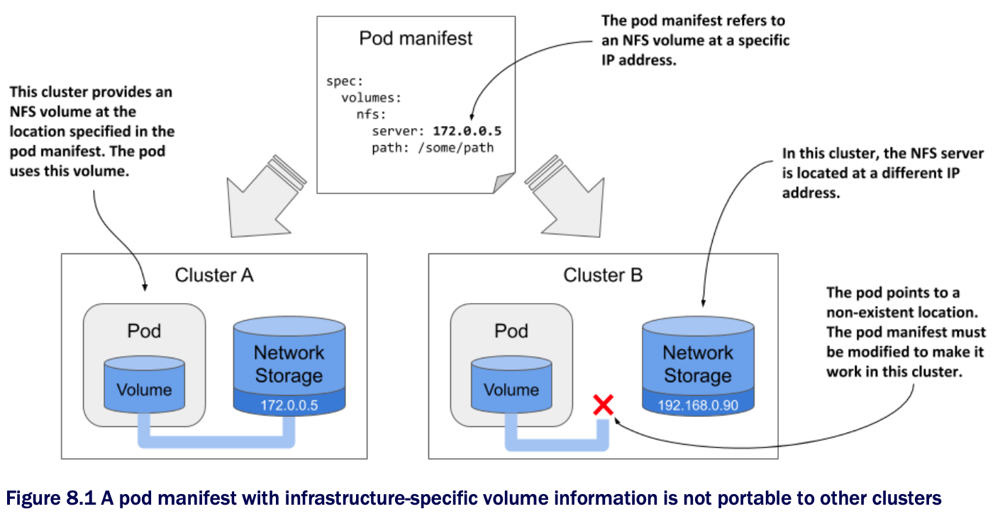

# Decoupling pods from the underlying storage technology

* Ideally a developer who deploys their applications on Kubernetes shouldn't need to know what storage technology the cluster provides, just as they don't need to know the characteristics of the physical servers used to run the pods

  * Details of the infrastructure should be handled by the people who run the cluster

* For this reason, when you deploy an application to Kubernetes, you typically don't refer directly to the external storage in the pod manifest, as you did in the previous chapter

  * Instead, you use an indirect approach that is explained in the following section

* One of the examples in the previous chapter shows how to use an NFS file share in a pod

  * The volume definition in the pod manifest contains the IP address of the NFS server and the file path exported by that server

  * This ties the pod definition to a specific cluster and prevents it from being used elsewhere

* As illustrated in the following figure, if you were to deploy this pod to a different cluster, you would typically need to change at least the NFS server IP

  * This means that the pod definition isn't portable across clusters

  * It must be modified each time you deploy it in a new Kubernetes cluster

  * A pod manifest w/ infrastructure-specific volume information is not portable to other clusters:

## Introducing persistent volumes and claims

▶︎ See [8.1.1](persistent-volumes-and-claims/README.md)

## Understanding the benefits of using persistent volumes and claims

▶︎ See [8.1.2](benefits-of-using-persistent-volumes-and-claims/README.md)
