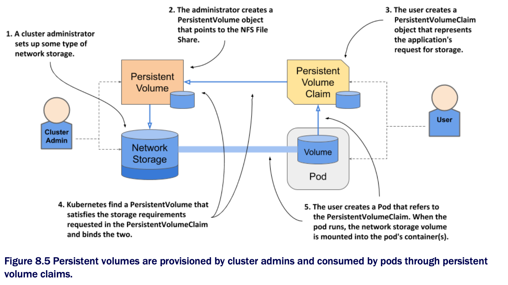

# Understanding the benefits of using persistent volumes and claims

* A system where you must use two additional objects to let a pod use a storage volume is more complex than the simple approach explained in the previous chapter, where the pod simply referred to the storage volume directly

  * Why is this new approach better?

* The biggest advantage of using persistent volumes and claims is that the infrastructure-specific details are now decoupled from the application represented by the pod

  * Cluster administrators, who know the data center better than anyone else, can create the PersistentVolume objects w/ all their infrastructure-related low-level details, while software developers focus solely on describing the applications and their needs via the Pod and PersistentVolumeClaim objects

* The following figure shows how the two user roles and the objects they create fit together

* Instead of the developer adding a technology-specific volume to their pod, the cluster administrator sets up the underlying storage and then registers it in Kubernetes by creating a PersistentVolume object through the Kubernetes API

* When a cluster user needs persistent storage in one of their pods, they first create a PersistentVolumeClaim object in which they either refer to a specific persistent volume by name, or specify the minimum volume size and access mode required by the application, and let Kubernetes find a persistent volume that meets these requirements

  * In both cases, the persistent volume is then bound to the claim and is given exclusive access

  * The claim can then be referenced in a volume definition within one or more pods

  * When the pod runs, the storage volume configured in the PersistentVolume object is attached to the worker node and mounted into the pod's containers

* It's important to understand that the application developer can create the manifests for the Pod and the PersistentVolumeClaim object w/o knowing anything about the infrastructure on which the application will run

  * Similarly, the cluster administrator can provision a set of storage volumes of varying sizes in advance w/o knowing much about the applications that will use them

* Furthermore, by using a dynamic provisioning of persistent volumes, as discussed later in this chapter, administrators don't need to pre-provision volumes at all
  
  * If an automated volume provisioner is installed in the cluster, the physical storage volume and the PersistentVolume object are created on demand for each PersistentVolumeClaim object that users create
