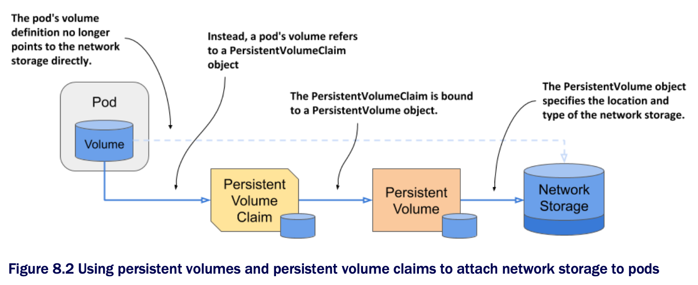
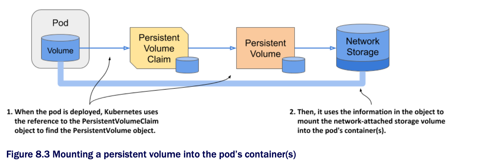
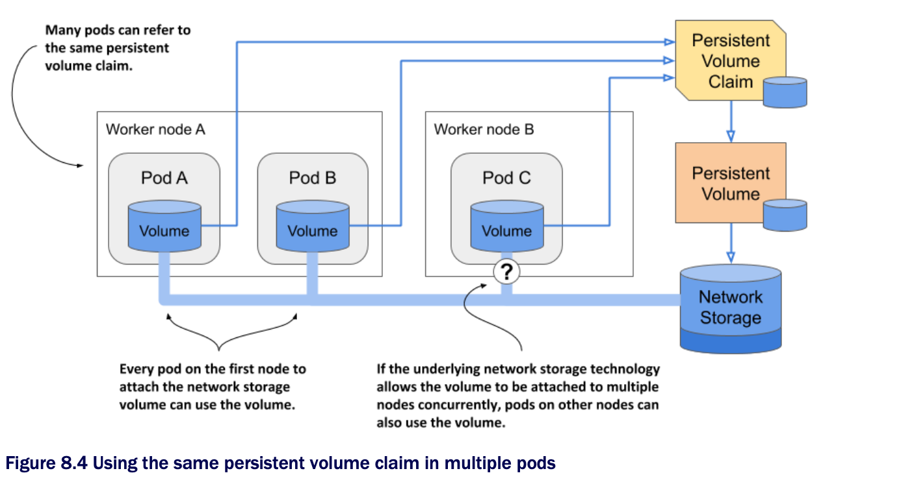

# Introducing persistent volumes and claims

* To make pod manifests portable across different cluster environments, the environment-specific information about the actual storage volume is moved to a PersistentVolume object, as shown in the next figure

  * A PersistentVolumeClaim object connects the pod to this PersistentVolume object

* These two objects are explained next

## Introducing persistent volumes

* As the name suggests, a PersistentVolume object represents a storage volume that is used to persist application data

  * As shown in the previous figure, the PersistentVolume object stores the information about the underlying storage and decouples this information from the pod

* When this infrastructure-specific information isn't in the pod manifest, the same manifest can be used to deploy pods in different clusters

  * Of course, each cluster must now contain a PersistentVolume object w/ this information

## Introducing persistent volume claims

* A pod doesn't refer directly to the PersistentVolume object

  * Instead, it points to a PersistentVolumeClaim object, which then points to the PersistentVolume

* As its name suggests, a PersistentVolumeClaim object represents a user's claim on the persistent volume

  * B/c its lifecycle is not tied to that of the pod, it allows the ownership of the persistent volume to be decoupled from the pod

  * Before a user can use a persistent volume in their pods, they must first claim the volume by creating a PersistentVolumeVlaim object

  * After claiming the volume, the user has exclusive rights to it and can use it in their pods

  * They can delete the pod at any time, and they won't lose ownership of the persistent volume

  * When the volume is no longer needed, the user releases it by deleting the PersistentVolumeClaim object

## Using a persistent volume claim in a pod

* To use the persistent volume in a pod, in its manifest you simply refer to the name of the persistent volume claim that the volume is bound to

* For example, if you create a persistent volume claim that gets bound to a persistent volume that represents an NFS file share, you can attach the NFS file share to your pod by adding a volume definition that points to the PersistentVolumeClaim object

  * The volume definition in the pod manifest only needs to contain the name of the persistent volume claim and no infrastructure-specific information, such as the IP address of the NFS server

* As the following figure shows, when this pod is scheduled to a worker node, Kubernetes finds the persistent volume that is bound to the claim referenced in the pod, and uses the information in the PersistentVolume object to mount the network storage volume in the pod's container

## Using a claim in multiple pods

* Multiple pods can use the same storage volume if they refer to the same persistent volume claim and therefore transitively to the same persistent volume, as shown in the following figure:

* Whether these pods must all run on the same cluster node or can access the underlying storage from different nodes depends on the technology that provides that storage

  * If the underlying storage technology supports attaching the storage to many nodes concurrently, it can be used by pods on different nodes

  * If not, the pods must all be scheduled to the node that attached the storage volume first
