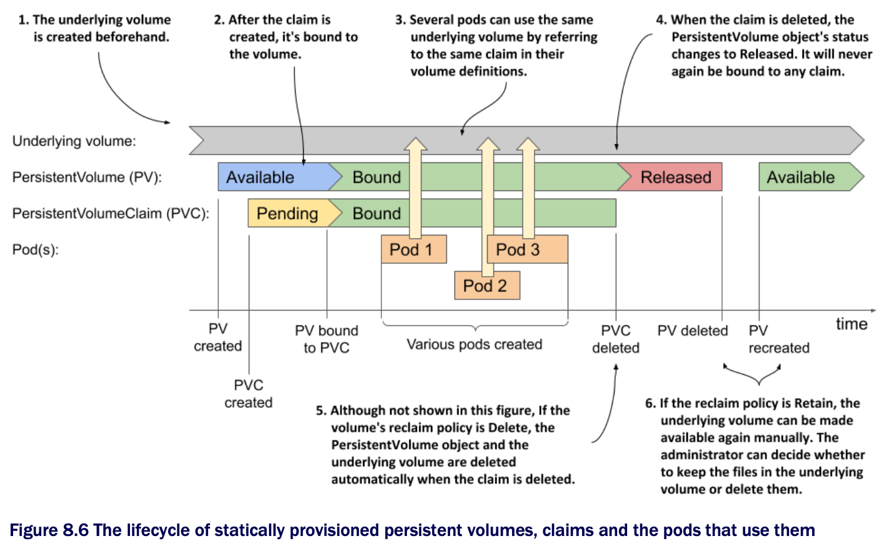

# Understanding the lifecycle of manually provisioned persistent volumes

* You used the same GCE Persistent Disk throughout several exercises in this chapter, but you created multiple volumes, claims, and pods that used the same GCE PD

  * To understand the lifecycles of these four objects, take a look at the following figure:

* When using manually provisioned persistent volumes, the lifecycle of the underlying storage volume is not coupled to the lifecycle of the PersistentVolume object

  * Each time you create the object, its initial status is `Available`

  * When a PersistentVolumeClaim object appears, the persistent volume is bound to it, if it meets the requirements set forth in the claim

  * Until the claim is bound to the volume, it has the status `Pending`; then both the volume and the claim are displayed as `Bound`

* At this point, one or many pods may use the volume by referring to the claim

  * When each pod runs, the underlying volume is mounted in the pod's containers

  * After all the pods are finished w/ the claim, the PersistentVolumeClaim object can be deleted

* When the claim is deleted, the volume's reclaim policy determines what happens to the PersistentVolume object and the underlying volume

  * If the policy is `Delete`, both the object and the underlying volume are deleted

  * If it's `Retain`, the PersistentVolume object and the underlying volume are preserved

  * The object's status changes to `Released` and the object can't be bound until additional steps are taken to make it `Available` again

* If you delete the PersistentVolume object manually, the underlying volume and its files remain intact

  * They can be accessed again by creating a new PersistentVolume object that references the same underlying volume

> [!NOTE]
> 
> The sequence of events described in this section applies to the use of statically provisioned volumes that exist before the claims are created. When persistent volumes are dynamically provisioned, as described in the next section, the situation is different. Look for a similar diagram at the end of the next section.
