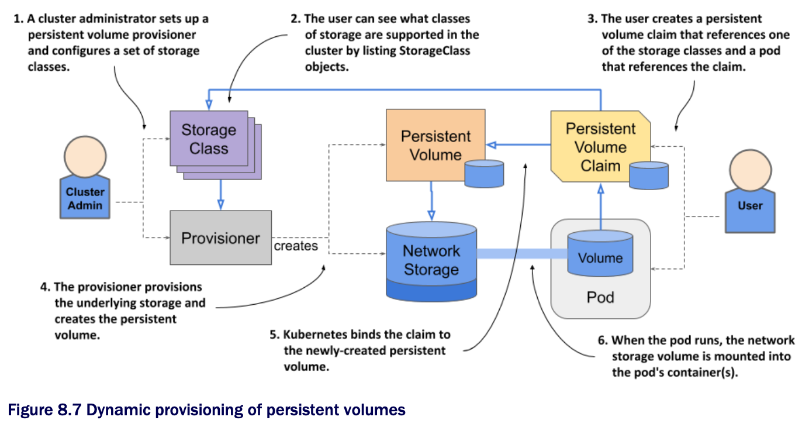

# Dynamic provisioning of persistent volumes

* So far in this chapter you've seen how developers can claim pre-provisioned persistent volumes as a place for their pods to store data persistently w/o having to deal w/ the details of the underlying storage technology

  * However, a cluster administrator must pre-provision the physical volumes and create a PersistentVolume object for each of these volumes

  * Then each time the volume is bound and released, the administrator must manually delete the data on the volume and recreate the object

* To keep the cluster running smoothly, the administrator may need to pre-provision dozens, if not hundreds, of persistent volumes, and constantly keep track of the number of available volumes to ensure the cluster never runs out

  * All this manual work contradicts the basic idea of Kubernetes, which is to automate the management of large clusters

  * As one might expect, a better way to manage volumes exists

  * It's called _dynamic provisioning of persistent volumes_

* W/ dynamic provisioning, instead of provisioning persistent volumes in advance (and manually), the cluster admin deploys a persistent volume provisioner to automate the just-in-time provisioning process, as shown in the following figure:

* In contrast to static provisioning, the order in which the claim and the volume arise is reversed

  * When a user creates a persistent volume claim, the dynamic provisioner provisions the underlying storage and creates the PersistentVolume object for that particular claim

  * The two objects are then bound

* If your K8s cluster is managed by a cloud provider, it probably already has a persistent volume provisioner configured

  * If you are running K8s on-premises, you'll need to deploy a custom provisioner, but this is outside the scope of this chapter

  * Clusters that are provisioned w/ Minikube or kind usually also come w/ a provisioner out of the box 

## Introducing the StorageClass object

▶︎ See [8.3.1](storageclass-object/README.md)

## Dynamic provisioning using the default storage class

▶︎ See [8.3.2](default-storage-class/README.md)

## Creating a storage class and provisioning volumes of that class

▶︎ See [8.3.3](create-storage-class-and-provision-volumes/README.md)

## Resizing persistent volumes

▶︎ See [8.3.4](resize-persistent-volumes/README.md)

## Understanding the benefits of dynamic provisioning

▶︎ See [8.3.5](benefits-of-dynamic-provisioning/README.md)

## Understanding the lifecycle of dynamically provisioned persistent volumes

▶︎ See [8.3.6](lifecycle-of-dynamically-provisioned-persistent-volumes/README.md)
