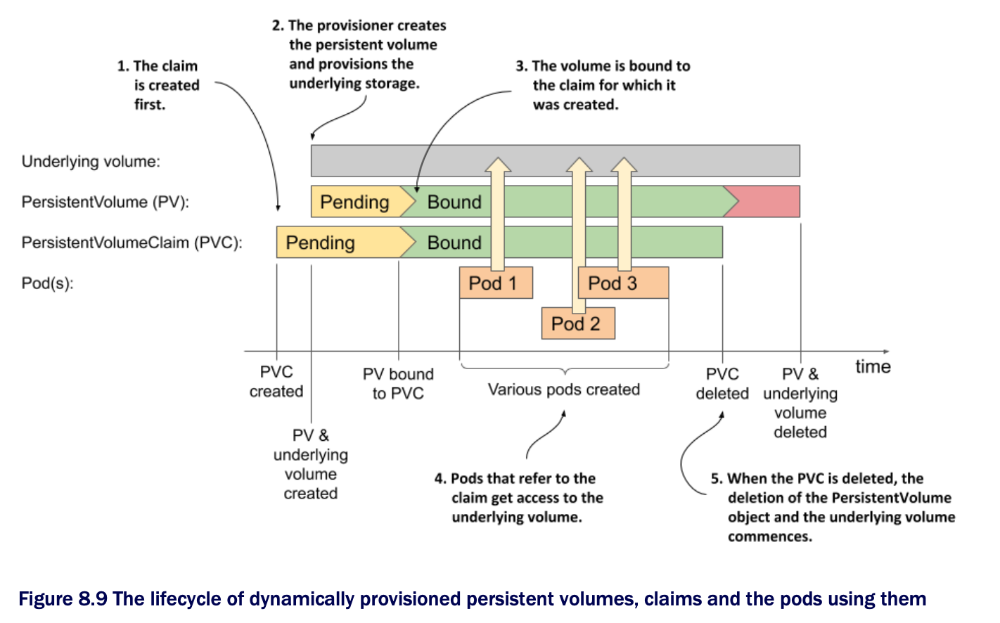

# Understanding the lifecycle of dynamically provisioned persistent volumes

* To conclude this section on dynamic provisions, let's take one final look at the lifecycles of the underlying storage volume, the PersistentVolume object, the associated PersistentVolumeClaim object, and the pods that use them, like we did in the previous section on statically provisioned volumes:

* Unlike statically provisioned persistent volumes, the sequence of events when using dynamic provisioning begins w/ the creation of the PersistentVolumeClaim object

  * As soon as one such object appears, Kubernetes instructs the dynamic provisioner configured in the storage class referenced in this claim to provision a volume for it

  * The provisioner creates both the underlying storage, typically through the cloud provider's API, and the PersistentVolume object that references the underlying volume

* The underlying volume is typically provisioned asynchronously

  * When the process completes, the status of the PersistentVolume object changes to Available; at this point, the volume is bound to the claim

* Users can then deploy pods that refer to the claim to gain access to the underlying storage volume

* This entire process is repeated for each new claim that the user creates

  * A new PersistentVolume object is created for each claim, which means that the cluster can never run out of them

  * Obviously, the datacenter itself can run out of available disk space, but at least there is no need for the administrator to keep recycling old PersistentVolume objects
