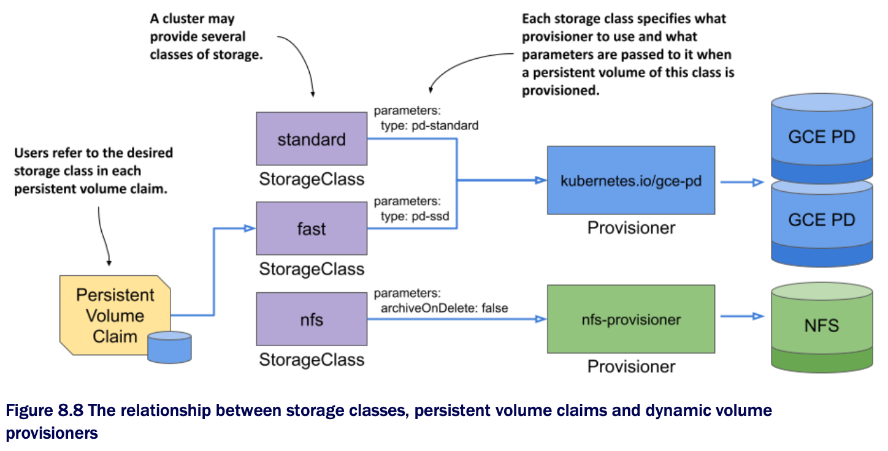

# Introducing the StorageClass object

* The persistent volume claim definition you created in the previous section specifies the minimum size and the required access modes of the volume, but it also contains a field named `storageClassName`, which wasn't discussed yet

* A K8s cluster can run multiple persistent volume provisioners, and a single provisioner may support several different types of storage volumes

  * When creating a claim, use the `storageClassName` field to specify which storage class you want

## Listing storage classes

* The storage classes available in the cluster are represented by _StorageClass_ API objects

  * You can list them w/ the `kubectl get sc` command

  * In a GKE cluster, this is the result:

```zsh
$ kubectl get sc
NAME                PROVISIONER           AGE
standard (default)  kubernetes.io/gce-pd  1d  # ← The standard storage class in a GKE cluster
```

> [!NOTE]
> 
> The shorthand for `storageclass` is sc.

* In a kind-provisioned cluster, the result is similar:

```zsh
$ kubectl get sc
NAME                  PROVISIONER             RECLAIMPOLICY   ...
standard (default)    rancher.io/local-path   Delete          ... # ← The standard storage class in a cluster created with the kind tool
```

* Clusters created w/ Minikube also provide a storage class w/ the same name:

```zsh
$ kubectl get sc
NAME                  PROVISIONER               RECLAIMPOLICY   VOLUMEBINDINGMODE   ...
standard (default)    k8s.io/minikube-hostpath  Delete          Immediate           ... # ← A

# ← A ▶︎ The standard storage class in a cluster created with the kind tool
```

* In many clusters, as in these three examples, only one storage class called `standard` is configured

  * It's also marked as the default, which means that this is the class that is used to provision the persistent volume when the persistent volume claim doesn't specify the storage class

> [!NOTE]
> 
> Remember that omitting the `storageClassName` field causes the default storage class to be used, whereas explicitly setting the field to "" disables dynamic provisioning and causes an existing persistent volume to be selected and bound to the claim.

## Inspecting the default storage class

* Let's get to know the StorageClass object kind by inspecting the YAML definition of the `standard` storage class w/ the `kubectl get` command

  * In GKE, you'll find the following definition:

```zsh
$ kubectl get sc standard -o yaml                         # ← A
allowVolumeExpansion: true
apiVersion: storage.k8s.io/v1
kind: StorageClass
metadata:
  annotations:
    storageclass.kubernetes.io/is-default-class: "true"   # ← B
  name: standard
  ...
parameters:                                               # ← C
  type: pd-standard                                       # ← C
provisioner: kubernetes.io/gce-pd                         # ← D
reclaimPolicy: Delete                                     # ← E
volumeBindingMode: Immediate                              # ← F

# ← A ▶︎ This command was run against a GKE cluster.
# ← B ▶︎ This marks the storage class as default.
# ← C ▶︎ The parameters for the provisioner
# ← D ▶︎ The name of the provisioner that gets called to provision persistent volumes of this class
# ← E ▶︎ The reclaim policy for persistent volumes of this class
# ← F ▶︎ When persistent volumes of this class are provisioned and bound
```

* The storage class definition in a kind-provisioned cluster is not much different

  * The main differences are highlighted in bold:

```zsh
$ kubectl get sc standard -o yaml                         # ← A
apiVersion: storage.k8s.io/v1
kind: StorageClass
metadata:
  annotations:
    storageclass.kubernetes.io/is-default-class: "true"   # ← B
  name: standard
  ...
provisioner: rancher.io/local-path                        # ← C
reclaimPolicy: Delete
volumeBindingMode: WaitForFirstConsumer                   # ← D

# ← A ▶︎ This command was run against a kind-provisioned cluster.
# ← B ▶︎ Again, this is storage class is the default.
# ← C ▶︎ Kind uses a different provisioner than GKE. There are no parameters defined for the provisioner.
# ← D ▶︎ Kind uses a different volume binding mode than GKE.
```

* In clusters created w/ Minikube, the standard storage class looks as follows:

```zsh
$ kubectl get sc standard -o yaml                         # ← A
apiVersion: storage.k8s.io/v1
kind: StorageClass
metadata:
  annotations:
    storageclass.kubernetes.io/is-default-class: "true"   # ← B
  name: standard                                          # ← A
  ...
provisioner: k8s.io/minikube-hostpath                     # ← C
reclaimPolicy: Delete
volumeBindingMode: Immediate                              # ← D

# ← A ▶︎ This command was run against a Minikube cluster.
# ← B ▶︎ This storage class is the default.
# ← C ▶︎ Minikube uses its own provisioner.
# ← D ▶︎ The volume binding mode is the same as in GKE.
```

> [!NOTE]
> 
> You'll notice that StorageClass objects have no `spec` or `status` sections. This is b/c the object only contains static information. Since the object's fields aren't organized in the two sections, the YAML manifest may be more difficult to read. This is also compounded by the fact that fields in YAML are typically sorted in alphabetical order, which means that some fields may appear above the `apiVersion`, `kind`, or `metadata` fields. Be careful not to overlook these.

* If you look closely at the top of the storage class definitions, you'll see that they all incude an annotation that marks the storage as default

> [!NOTE]
> 
> You'll learn about what an object annotation is in chapter 10

* As specified in GKE's storage class definition, when you create a persistent volume claim that references the `standard` class in GKE, the provisioner `kubernetes.io/gce-pd` is called to provision the persistent volume

  * In kind-provisioned clusters, the provisioner is `rancher.io/local-path`, whereas in Minikube it's `k8s.io/minikube-hostpath`

  * GKE's default storage class also specifies a parameter that is provided to the provisioner

* Regardless of what provisioner is used, the volume's reclaim policy is set to whatever is specified in the storage class, which in all of the previous examples is `Delete`

  * As you have already learned, this means that the volume is deleted when you release it by deleting the claim

* The last field in the storage class definition is `volumeBindingMode`

  * Both GKE and Minikube use the volume binding mode `Immediate`, whereas kind uses `WaitForFirstConsumer`

  * You'll learn what the difference is later in this chapter

* StorageClass objects also support several other fields that are not shown in the above listing

  * You can use `kubectl explain` to see what they are

  * You'll learn about some of them in the following sections

* In summary, a StorageClass object represents a class of storage that can be dynamically provisioned

  * As shown in the following figure, each storage class specifies what provisioner to use and the parameters that should be passed to it when provisioning the volume

  * The user decides which storage class to use for each of their persistent volume claims


