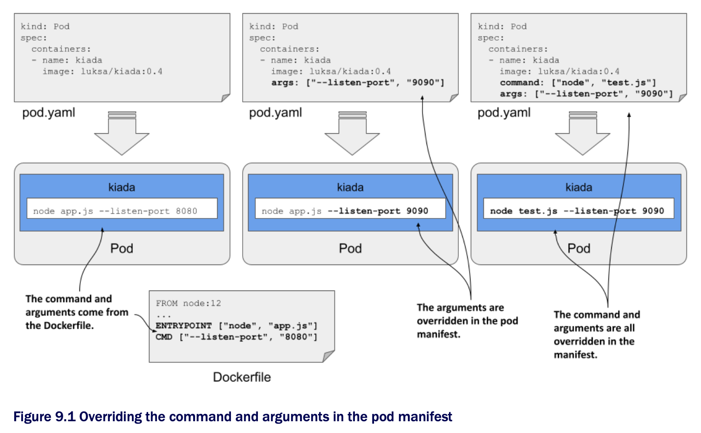

# Setting the command and arguments

* When creating a container image, the command and its arguments are specified using the `ENTRYPOINT` and `CMD` directives in the Dockerfile

  * Since both directives accept array values, you can specify both the command and its arguments w/ one of these directives or split them between the two

  * When the container is executed, the two arrays are concatenated to produce the full command

* K8s provides two fields that are analogous to Docker's `ENTRYPOINT` and `CMD` directives

  * The two fields are called `command` and `args`, respectively

  * You specify these fields in the container definition in your pod manifest

  * As w/ Docker, the two fields accept array values, and the resulting command executed in the container is derived by concatenating the two arrays



* Normally, you use the `ENTRYPOINT` directive to specify the bare command, and the `CMD` directive to specify the arguments

  * This allows you to override the arguments in the pod manifest w/o having to specify the command again

  * If you want to override the command, you can still do so

  * And you can do it w/o overriding the arguments

* The following table shows the equivalent pod manifest field for each of the two Dockerfile directives ▶︎ Specifying the command and arguments in the Dockerfile vs the pod manifest:

| **Dockerfile** | **Pod manifest** | **Description**                                                                                            |
|----------------|------------------|------------------------------------------------------------------------------------------------------------|
| `ENTRYPOINT`   | `command`        | The executable file that runs in the container. This may contain arguments in addition to the executable.  |
| `CMD`          | `args`           | Additional arguments passed to the command specified w/ the `ENTRYPOINT` directive or the `command` field. |

* Let's look at two examples of setting the `command` and `args` fields

## Setting the command

* Imagine you want to sun the Kiada application w/ CPU and heap profiling enabled

  * W/ Node.js, you can enable profiling by passing the `--cpu-proof` and `--heap-prof` arguments to the `node` command

  * Instead of modifying the Dockerfile and rebuilding the image, you can do this by modifying the pod manifest, as shown in the following listing ▶︎ A container definition w/ the command specified:

```yaml
kind: Pod
spec:
  containers:
  - name: kiada
    image: luksa/kiada:0.4
    command: ["node", "--cpu-prof", "--heap-prof", "app.js"]    # ← A

# ← A ▶︎ When the container is started, this command is executed instead of the one defined in the container image
```

* When you deploy the pod in the listing, the `node --cpu-prof --heap-prof app.js` command is run instead of the default command specified in the Dockerfile, which is `node app.js`

* As you can see in the listing, the `command` field, just like its Dockerfile counterpart, accepts and array of strings representing the command to be executed

  * The array notation used in the listing is great when the array contains only a few elements, but becomes difficult to read as the number of elements increases

  * In this case, you're better off using the following notation:

```yaml
  command:
  - node
  - --cpu-prof
  - --heap-prof
  - app.js
```

> [!TIP]
> 
> Values that the YAML parser might interpret as something other than a string must be enclosed in quotes. This includes numeric values such as `1234`, and Boolean values such as `true` and `false`. Some other special strings must also be quoted, otherwise they would also be interpreted as Boolean or other types. These include the values `true`, `false`, `yes`, `no`, `on`, `off`, `y`, `n`, `t`, `f`, `null`, and others.

## Setting command arguments

* Command line arguments can be overridden w/ the `args` field, as shown in the following listing ▶︎ A container definition w/ the args fields set:

```yaml
kind: Pod
spec:
  containers:
  - name: kiada
    image: luksa/kiada:0.4
    args: ["--listen-port", "9090"]   # ← A

# ← A ▶︎ This overrides the arguments set in the container image
```

* The pod manifest in the listing overrides the default `--listen-port 8080` arguments set in the Dockerfile w/ `--listen-port 9090`

  * When you deploy this pod, the full command that runs in the container is `node app.js --listen-port 9090`

  * The command is a concatenation of the `ENTRYPOINT` in the Dockerfile and the `args` field in the pod manifest
