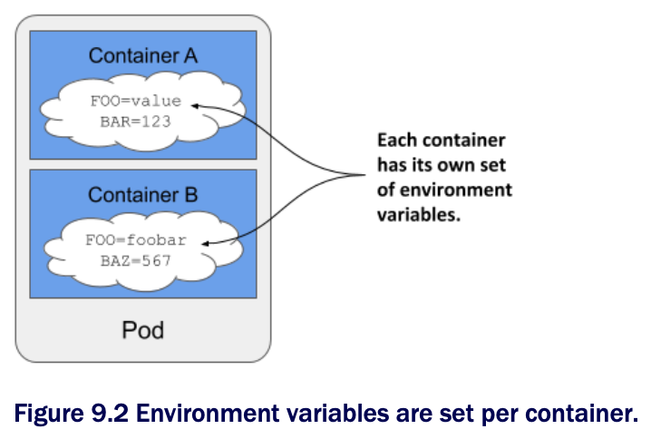

# Setting environment variables in a container

* Containerized applications are often configured using environment variables

  * Just like the command and arguments, you can set environment variables for each of the pod's containers



> [!NOTE]
> 
> As I write this, environment variables can only be set for each container individually. It isn't possible to set a global set of environment variables for the entire pod and have them inherited by all its containers.

* You can set an environment variable to a literal value, have it reference another environment variable, or obtain the value from an external source

  * Let's see how

## Setting a literal value to an environment variable

* Version 0.4 of the Kiada application displays the name of the pod, which it reads from the environment variable `POD_NAME`

  * It also allows you to set the status message using the environment variable `INITIAL_STATUS_MESSAGE`

  * Let's set these two variables in the pod manifest

* To set the environment variable, you could add the `ENV` directive to the Dockerfile and rebuild the image, but the faster way is to add the `env` field to the container definition in the pod manifest, as I've done in the following list (file [`pod.kiada.env-value.yaml`](pod.kiada.env-value.yaml)) ▶︎ Setting environment variables in the pod manifest:

```yaml
kind: Pod
metadata:
  name: kiada
spec:
  containers:
  - name: kiada
    image: luksa/kiada:0.4
    env:                                                  # ← A
    - name: POD_NAME                                      # ← B
      value: kiada                                        # ← B
    - name: INITIAL_STATUS_MESSAGE                        # ← C
      value: This status message is set in the pod spec.  # ← C
...

# ← A ▶︎ The env field contains a list of environment variables for the container
# ← B ▶︎ The environment variable `POD_NAME` is set to "kiada"
# ← C ▶︎ Another environment variable is set here.
```

* As you can see in the listing, the `env` field takes an array of values

  * Each entry in the array specified the name of the environment variable and its value

> [!NOTE]
> 
> Since environment variables values must be strings, you must enclose values that aren't strings in quotes to prevent the YAML parser from treating them as anything other than a string. As explained in section 9.1.1, this also applied to strings such as `yes`, `no`, `true`, `false`, and so on.

* When you deploy the pod in the listing and send an HTTP request to the application, you should see the pod name and the status message that you specified using the environment variables

  * You can also run the following command to examine the environment variables in the container

  * You'll find the two environment variables in the following output:

```zsh
$ kubectl exec kiada -- env
PATH=/usr/local/sbin:/usr/local/bin:/usr/sbin:/usr/bin:/sbin:/bin   # ← A
HOSTNAME=kiada                                                      # ← A
NODE_VERSION=12.19.1                                                # ← B
YARN_VERSION=1.22.5                                                 # ← B
POD_NAME=kiada                                                      # ← C
INITIAL_STATUS_MESSAGE=This status message is set in the pod spec.  # ← C
KUBERNETES_SERVICE_HOST=10.96.0.1                                   # ← D
...                                                                 # ← D
KUBERNETES_SERVICE_PORT=443                                         # ← D

# ← A ▶︎ Set by the system
# ← B ▶︎ Set in the container image
# ← C ▶︎ Set in the pod manifest
# ← D ▶︎ Set by Kubernetes
```

* As you can see, there are a few other variables set in the container

  * They come from different sources-some are defined in the container image, some are added by Kubernetes, and the rest come from elsewhere

  * While there is no way to know where each of the variables comes from, you'll learn to recognize some of them

  * For example, the ones added by Kubernetes relate to the Service object, which is covered in chpt 11

  * To determine where the rest come from, you can inspect the pod manifest and the Dockerfile of the container image

## Using variable references in environment variable values

* In the previous example, you set a fixed value for the environment variable `INITIAL_STATUS_MESSAGE`, but you can also reference other environment variables in the value by using the syntax `$(VAR_NAME)`

  * For example, you can reference the variable `POD_NAME` within the status message variable as in the following listing, which shows part of the file [`pod.kiada.env-value-ref.yaml`](pod.kiada.env-value-ref.yaml) ▶︎ Refurring to an environment variable in another variable:

```yaml
env:
- name: POD_NAME
  value: kiada
- name: INITIAL_STATUS_MESSAGE
  value: My name is $(POD_NAME). I run NodeJS version $(NODE_VERSION). # ← A

# ← A ▶︎ The value includes a reference to the POD_NAME and NODE_VERSION environment variables
```

* Notice that one of the references points to the environment variable `POD_NAME` defined above, whereas the other points to the variable `NODE_VERSION` set in the container image

  * You saw this variable when you ran the `env` command in the container earlier

  * When you deploy the pod, the status message it returns is the following:

```zsh
My name is kiada. I run NodeJS version $(NODE_VERSION).
```

* As you can see, the reference to `NODE_VERSION` isn't resolved

  * This is b/c you can only use the `$(VAR_NAME)` syntax to refer to variables defined in the same manifest
  
  * The referenced variable must be defined _before_ the variable that references it

  * Since `NODE_VERSION` is defined in the NodeJS image's Dockerfile and not in the pod manifest, it can't be resolved

> [!NOTE]
> 
> If a variable reference can't be resolved, the reference string remains unchanged.

> [!NOTE]
> 
> When you want a variable to contain the literal string `$(VAR_NAME)` and don't want Kubernetes to resolve it, use a double dollar sign as in `$$(VAR_NAME)`. Kubernetes will remove one of the dollar signs and skip resolving the variable.

## Using variable references in the command and arguments

* You can refer to environment variables defined in the manifest not only in other variables but also in the `command` and `args` fields you learned about in the previous section

  * For example, the file [`pod.kiada.env-value-ref-in-args.yaml`](pod.kiada.env-value-ref-in-args.yaml) defines an environment variable named `LISTEN_PORT` and references it in the `args` field

  * The following listing shows the relevant part of this file ▶︎ Referring to an environment variable in the args field:

```yaml

spec:
  containers:
  - name: kiada
    image: luksa/kiada:0.4
    args:
      - --listen-port
      - $(LISTEN_PORT)      # ← A
    env:
    - name: LISTEN_PORT
    - value: "8080"

# ← A ▶︎ Resolved to the LISTEN_PORT variableset below
```

* This isn't the best example, since there's no goof reason to use a variable reference instead of just specifying the port number directly

  * But later you'll learn how to get the environment variable value from an external source

  * You can then use a reference as shown in the listing to inject that value into the container's command or arguments

## Referring to environment variables that aren't in the manifest

* Just like using references in environment variables, you can only use the `$(VAR_NAME)` syntax in the `command` and `args` fields to reference variables that are defined in the pod manifest

  * You can't reference environment variables defined in the container image, for example

* However, you can use a different approach

  * If you run the command through a shell, you can have the shell resolve the variable

  * If you are using the bash shell, you can do this by referring to the variable using the syntax `$VAR_NAME` or `${VAR_NAME}` instead of `$(VAR_NAME)`

* For example, the command in the following listing correctly prints the value of the `HOSTNAME` environment variable even though it's not defined in the pod manifest but is initialized by the operating system

  * You can find this example in the file [`pod.env-var-references-in-shell.yaml`](pod.env-var-references-in-shell.yaml)

```yaml
containers:
- name: main
  image: alpine
  command:
  - sh                                                # ← A
  - -c                                                # ← A
  - 'echo "Hostname is $HOSTNAME."; sleep infinity'   # ← B
  
# ← A ▶︎ The top command executed in this container is the shell
# ← B ▶︎ The shell resolves the reference to the HOSTNAME environment variable before executing the commands echo and sleep
```

> ## Setting the pod's fully qualified domain name
> 
> * While we're on the subject of the pod's hostname, this is a good time to explain that the pod's hostname and subdomain are configurable in the pod manifest
> 
>   * By default, the hostname is the same as the pod's name, but you can override it using the `hostname` field in the pod's `spec`
>
>   * You can also set the `subdomain` field so that the fully qualified domain name (FQDN) of the pod is as follows: `<HOSTNAME>.<SUBDOMAIN>.<POD_NAMESPACE>.svc.<CLUSTER_DOMAIN>`
>
> * This is only the internal FQDN of the pod
> 
>   * It isn't resolvable via DNS w/o additional steps, which are explained in chapter 11
> 
>   * You can find a sample pod that specifies a custom hostname for the pod in the file [`pod.kiada.hostname.yaml`](pod.kiada.hostname.yaml)
