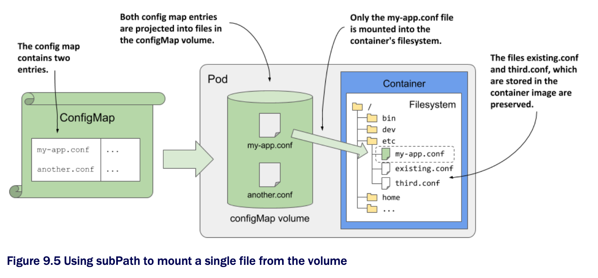

# Understanding how configMap volumes work

* Before you start using `configMap` volumes in your own pods, it's important that you understand how they work, or you'll spend a lot of time fighting them

* You might think that when you mount a configMap volume in a directory in the container, K8s merely creates some files in that directory, but things are more complicated than that

  * There are two caveats that you need to keep in mind

  * One is how volumes are mounted in general, and the other is how Kubernetes uses symbolic links to ensure that files are updated automatically

## Mounting a volume hides existing files in the file directory

* If you mount any volume to a directory in the container's filesystem, the files that are in the container image in that directory can no longer be accessed

  * For example, if you mount a `configMap` volume into the `/etc` directory, which in a Unix system contains important configuration files, the applications running in the container will only see the files defined in the config map

  * This means that all other files that should be in `/etc` are no longer present and the application may not run

  * However, this problem can be mitigated by using the `subPath` field when mounting the volume

* Imagine you have a `configMap` volume that contains the file `my-app.conf`, and you want to add it to the `/etc` directory w/o losing any existing files in that directory

  * Instead of mounting the entire volume in `/etc`, you mount only the specific file using a combination of the `mountPath` and `subPath` fields, as shown in the following listing

  * Mounting an individual file into a container:

```yaml
spec:
containers:
- name: my-container
    volumeMounts:
    - name: my-volume
      subPath: my-app.conf          # ← A
      mountPath: /etc/my-app.conf   # ← B

# ← A ▶︎ Instead of mounting the entire volume, you mount only the my-app.conf file.
# ← B ▶︎ You’re mounting a single file instead of the entire directory.
```

* To make it easier to understand how all this works, inspect the following figure:



* The `subPath` property can be used when mounting any type of volume, but when you use it w/ a `configMap` volume, please note the following warning:

> [!WARNING]
> 
> If you use the `subPath` field to mount individual files instead of the entire `configMap` volume, the file won't be updated when you modify the config map.

* To get around this problem, you can mount the entire volume in another directory and create a symbolic link in the desired location pointing to the file in the other directory

  * You can create this symbolic link beforehand in the container image itself

## ConfigMap volumes use symbolic links to provide atomic updates

* Some applications watch for changes to their configuration files and reload them when this happens

  * However, if the application is using a large file or multiple files, the application may detect that a file has changed before all file updates are complete

  * If the application reads the partially updated files, it may not function properly

* To prevent this, Kubernetes ensures that all files in a `configMap` volume are updated automatically, meaning that all updates are done instantaneously

  * This is achieved w/ the use of symbolic file links, as you can see if you list all the files in the `/etc/envoy` directory:

```zsh
$ kubectl exec kiada-ssl -c envoy -- ls -lA /etc/envoy
total 4
drwxr-xr-x  ...   ..2020_11_14_11_47_45.728287366            # ← A
lrwxrwxrwx  ...   ..data -> ..2020_11_14_11_47_45.728287366  # ← B
lrwxrwxrwx  ...   envoy.yaml -> ..data/envoy.yaml            # ← C

# ← A ▶︎ Sub-directory that contains the actual files
# ← B ▶︎ A symbolic link to the subdirectory
# ← C ▶︎ A symbolic link for each config map entry
```

* As you can see in the listing, the config map entries that are projected as files into the volume are symbolic links that point to file paths within the directory named `..data`, which is also a symbolic link

  * It points to a directory whose name clearly represents a timestamp

  * So the file paths that the application reads point to actual files via two successive symbolic links

* This may look unnecessary, but it allows you to update all files atomically

  * Every time you change the config map, Kubernetes creates a new timestamped directory, writes the files to it, and then associates the `..data` symbolic link w/ this new directory, replacing all files instantaneously

> [!NOTE]
> 
> If you use `subPath` in your volume mount definition, this mechanism isn't used. Instead, the file is written directly to the target directory and the file isn't updated when you modify the config map.
