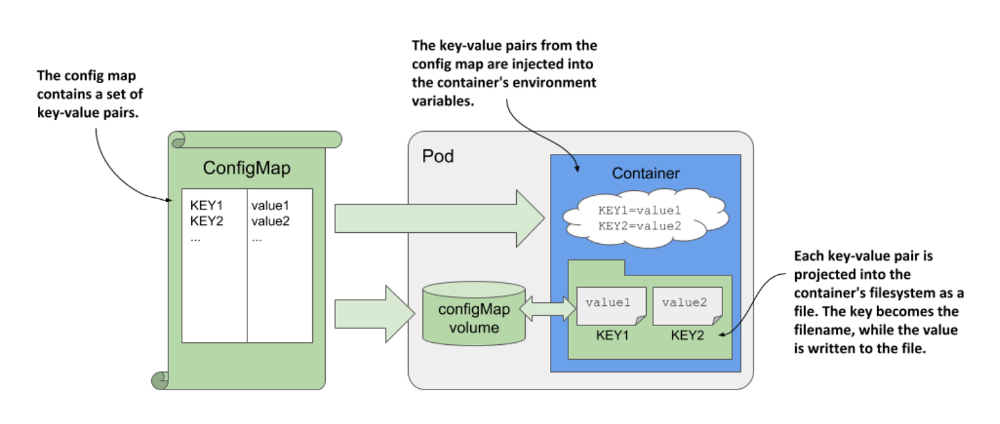
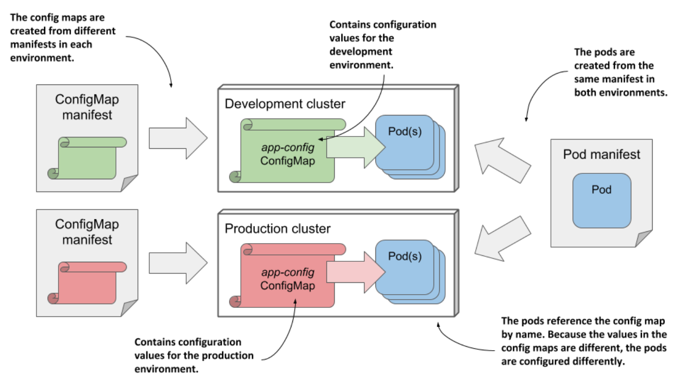

# Introducing ConfigMaps

* A ConfigMap is a K8s API object that simply contains a list of key/value pairs

  * The values can range from short strings to large blocks of structured text that you typically find in an application configuration file

  * Pods can reference one or more of these key/value entries in the config map

  * A pod can refer to multiple config maps, and multiple pods can use the same config map

* To keep applications Kubernetes-agnostic, they typically don't read the ConfigMap object via the Kubernetes REST API

  * Instead, the key/value pairs in the config map are passed to containers as environment variables or mounted as files in the container's filesystem via a `configMap` volume, as shown in the following figure:

* In the previous section you learned how to reference environment variables in command-line arguments

  * You can use this technique to pass a config map entry that you've exposed as an environment variable into a command-line argument

* Regardless of how an application consumes config maps, storing the configuration in a separate object instead of the pod allows you to keep the configuration separate for different environments by simply keeping separate config map manifests and applying each to the environment for which it is intended

  * B/c pods reference the config map by name, you can deploy the same pod manifest across all your environments and still have a different configuration for each environment by using the same config map name, as shown in the following figure

