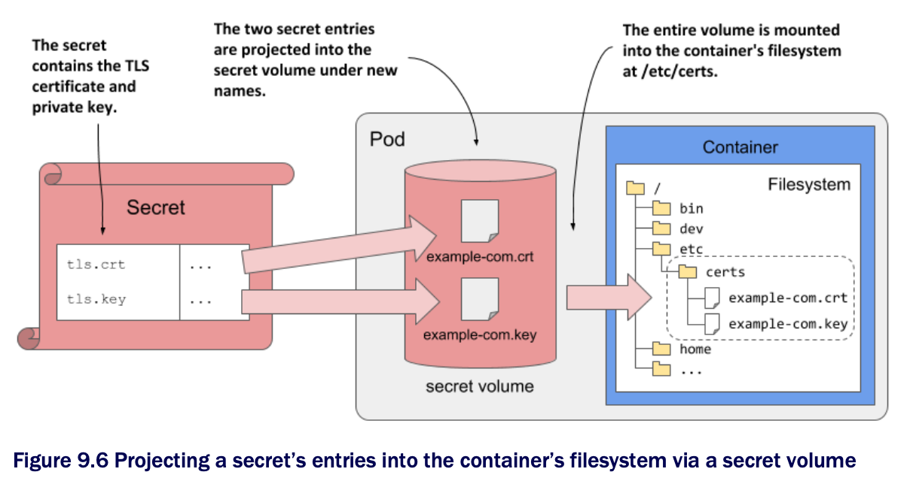

# Using secrets in containers

* As explained earlier, you can use secrets in containers the same way you use config maps-you can use them to set environment variables or create files in the container's filesystem

  * Let's look at the latter first

## Using a secret volume to project secret entries into files

* In one of the previous sections, you created a secret called `kiada-tls`

  * Now you will project the two entries it contains into files using a `secret` volume

  * A `secret` volume is analogous to the `configMap` volume used before, but points to a secret instead of a config map

* To project the TLS certificate and private key into the `envoy` container of the `kiada-ssl` pod, you need to define a new `volume` and a new `volumeMount`, as shown in the next listing, which contains the important parts of the `pod.kiada-ssl.secret-volume.yaml` file

  * Using a secret volume in a pod:

```yaml
apiVersion: v1
kind: Pod
metadata:
  name: kiada-ssl
spec:
  volumes:
  - name: cert-and-key                # ← A
    secret:                           # ← A
      secretName: kiada-tls           # ← A
      items:                          # ← B
      - key: tls.crt                  # ← B
        path: example-com.crt         # ← B
      - key: tls.key                  # ← B
        path: example-com.key         # ← B
        mode: 0600                    # ← C
  ...
  containers:
  - name: kiada
    ...
  - name: envoy
    image: envoyproxy/envoy:v1.14.1
    volumeMounts:                     # ← D
    - name: cert-and-key              # ← D
      mountPath: /etc/certs           # ← D
      readOnly: true                  # ← D
    ...
    ports:
    ...

# ← A ▶︎ This defines a secret volume that projects the entries of the kiada-tls secret into files.
# ← B ▶︎ The keys in the secret need to be mapped to the correct filenames that are configured in the Envoy configuration file.
# ← C ▶︎ The example-com.key file's permissions are set to 0600 or rw-so only the file owner can read the file.
# ← D ▶︎ The secret volume is mounted in /etc/certs.
```

* If you've read section 9.2 on config maps, the definitions of the `volume` and `volumeMount` in this listing should be straightforward since they contain the same fields as you'd find if you were using a config map

  * The only two differences are that the volume type is `secret` instead of `configMap`, and that the name of the referenced secret is specified in the `secretName` field, whereas in a `configMap` volume definition the config map is specified in the `name` field

> [!NOTE]
> 
> As w/ `configMap` volumes, you can set the file permissions on `secret` volumes w/ the `defaultMode` and `mode` fields. Also, you can set the `optional` field to `true` if you want the pod to start even if the referenced secret doesn't exist. If you omit the field, the pod won't start until you create the secret.

* Given the sensitive nature of the `example-com.key` file, the `mode` field is used to set the file permissions to `0600` or `rw-------`

  * The file `example-com.crt` is given the default permissions

* To illustrate the pod, its secret volume and the referenced secret and its entries, see the following figure



## Reading the files in the secret volume

* After you deploy the pod from the previous listing, you can use the following command to inspect the certificate file in the secret volume:

```zsh
$ kubectl exec kiada-ssl -c envoy -- cat /etc/certs/example-com.crt
-----BEGIN CERTIFICATE-----
MIIFkzCCA3ugAwIBAgIUQhQiuFP7vEplCBG167ICGxg4q0EwDQYJKoZIhvcNAQEL
BQAwWDELMAkGA1UEBhMCWFgxFTATBgNVBAcMDERlZmF1bHQgQ2l0eTEcMBoGA1UE
...
```

* As you can see, when you project the entries of a secret into a container via a `secret` volume, the projected file is not Base64-encoded

  * The application doesn't need to decode the file

  * The same is true if the secret entries are injected into environment variables

> [!NOTE]
> 
> The files in a secret volume are stored in an in-memory filesystem (tmpfs), so they are less likely to be compromised.

## Injecting secrets into environment variables

* As w/ config maps, you can also inject secrets into the container's environment variables

  * For example, you can inject the TLS certificate into the `TLS_CERT` environment variable as if the certificate were stored in a config map

  * The following listing shows how you'd do this ▶︎ Exposing a secret's key-value pair as an environment variable:

```yaml
containers:
- name: my-container
  env:
  - name: TLS_CERT
    valueFrom:            # ← A
      secretKeyRef:       # ← A
        name: kiada-tls   # ← B
        key: tls.crt      # ← C

# ← A ▶︎ The value is obtained from a secret.
# ← A ▶︎ The value is obtained from a secret.
# ← B ▶︎ The name of the secret that contains the key.
# ← C ▶︎ The key that contains the value.
```

* This is not unlike setting the `INITIAL_STATUS_MESSAGE` environment variable, except that you're now referring to a secret by using `secretKeyRef` instead of `configMapKeyRef`

* Instead of using `env.valueFrom`, you could also use `envFrom` to inject the entire secret instead of injecting its entries individually, as you did in section 9.2.3

  * Instead of `configMapRef`, you'd use the `secretRef` field

## Should you inject secrets into environment variables?

* As you can see, injecting secrets into environment variables is no different from injecting config maps

  * But even if K8s allows you to expose secrets in this way, it may not be the best idea, as it can pose a security risk

  * Applications typically output environment variables in error reports or even write them to the application log at startup, which can inadvertently expose secrets if you inject them into environment variables

  * Also, child processes inherit all environment variables from the parent process

    * So, if your application calls a third-part child process, you don't know where your secrets end up

> [!TIP]
> 
> Instead of injecting secrets into environment variables, project them into the container as files in a secret volume. This reduces the likelihood that the secrets will be inadvertently exposed to attackers.
