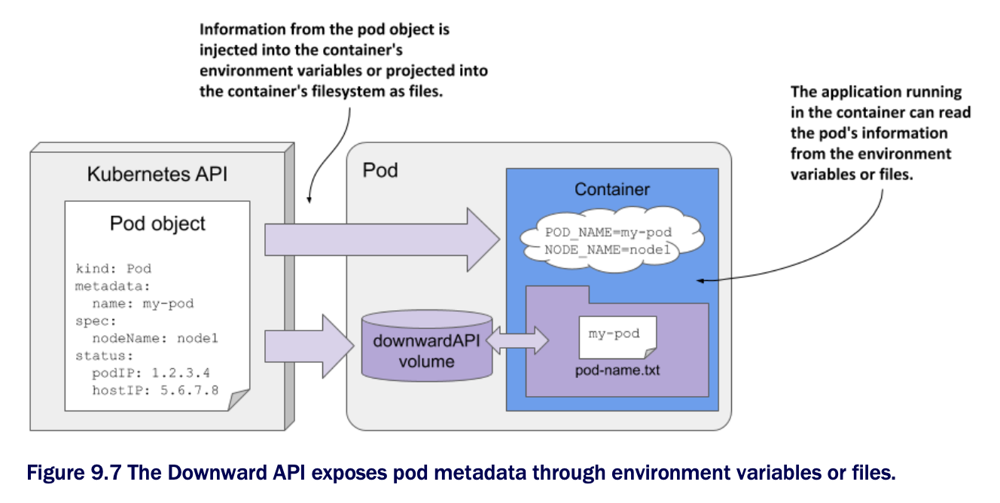

# Passing pod metadata to the application via the Downward API

* So far in this chapter, you've learned how to pass configuration data to your application

  * But that data was always static

  * The values were known before you deployed the pod, and if you deployed multiple pod instances, they would all use the same values

* But what about data that isn't known until the pod is created and scheduled to a cluster node, such as the IP of the pod, the name of the cluster node, or even the name of the pod itself?

  * And what about data that is already specified elsewhere in the pod manifest, such as the amount of CPU and memory that is allocated to the container?

> [!NOTE]
> 
> You'll learn how to specify the container's CPU and memory limits in chapter 20.

## 9.4.1 Introducing the Downward API

* In the remaining chapters of the book, you'll learn about many additional configuration options that you can set in your pods

  * There are cases where you need to pass the same information to your application

  * You could repeat this information when defining the container's environment variable, but a better option is to use what's called the Kubernetes _Downward API_, which allows you to expose pod and container metadata via environment variables or files

### Understanding what the Downward API is

* The Downward API isn't a REST endpoint that your app needs to call to get the data

  * It's simply a way to inject values from the pod's `metadata`, `spec`, or `status` fields down into the container

  * An illustration of the Downward API is shown in the following figure:

* As you can see, this is no different from setting environment variables or projecting files from config maps and secrets, except that the values come from the pod object itself

### Understanding how the metadata is injected

* Earlier in the chapter, you learned that you initialize environment variables from external sources using the `valueFrom` field

  * To get the value from a config map, use the `configMapKeyRef` field, and to get it from a secret, use `secretKeyRef`

  * To instead use the Downward API to source the value from the pod object itself, use either the `fieldRef` or the `resourceFieldRef` field, depending on what information you want to inject

  * The former is used to refer to the pod's general metadata, whereas the latter is used to refer to the container's compute resource constraints

* Alternatively, you can project the pod's metadata as files into the container's filesystem by adding a `downwardAPI` volume to the pod, just as you'd add a `configMap` or `secret` volume

  * You'll learn how to do this soon, but first let's see what information you can inject

### Understanding what metadata can be injected

* You can't use the Downward API to inject any field from the pod object

  * Only certain fields are supported

  * The following table shows the fields you can inject via `fieldRef`, and whether they can only be exposed via environment variables, files, or both

    * Downward API fields injected via the `fieldRef` field:

| **Field**                     | **Description**                                                       | **Allowed in env** | **Allowed in volume** |
|-------------------------------|-----------------------------------------------------------------------|--------------------|-----------------------|
| `metadata.name`               | The pod's name.                                                       | Yes                | Yes                   |
| `metadata.namespace`          | The pod's namespace.                                                  | Yes                | Yes                   |
| `metadata.uid`                | The pod's UID.                                                        | Yes                | Yes                   |
| `metadata.labels`             | All the pod's labels, one label per line, formatted as `key="value"`. | No                 | Yes                   |
| `metadata.labels['key']`      | The value of the specified label.                                     | Yes                | Yes                   |
| `metadata.annotations`        | All the pod's annotations, one per line, formatted as `key="value"`.  | No                 | Yes                   |
| `metadata.annotations['key']` | The value of the specified annotation.                                | Yes                | Yes                   |
| `spec.nodeName`               | The name of the worker node the pod runs on.                          | Yes                | No                    |
| `spec.serviceAccountName`     | The name of the pod's service account.                                | Yes                | No                    |
| `status.podIP`                | The pod's IP address.                                                 | Yes                | No                    |
| `status.hostIP`               | The worker node's IP address.                                         | Yes                | No                    |

* You may not know most of these fields yet, but you will in the remaining chapters of this book

  * As you can see, some fields can only be injected into environment variables, whereas others can only be projected into files

  * Some allow doing both

* Information about the container's computational resource constraints is injected via the `resourceFieldRef` field

  * They can all be injected into environment variables and via a downwardAPI volume

  * The following table lists them ▶︎ Downward API resource fields injected via the `resourceFieldRef` field:

| **Resource Field**           | **Description**                            | **Allowed in env** | **Allowed in vol** |
|------------------------------|--------------------------------------------|--------------------|--------------------|
| `requests.cpu`               | The container's CPU request.               | Yes                | Yes                |
| `requests.memory`            | The container's memory request.            | Yes                | Yes                |
| `requests.ephemeral-storage` | The container's ephemeral storage request. | Yes                | Yes                |
| `limits.cpu`                 | The container's CPU limit.                 | Yes                | Yes                |
| `limits.memory`              | THe container's memory limit.              | Yes                | Yes                |
| `limits.ephemeral-storage`   | The container's ephemeral storage limit.   | Yes                | Yes                |

* You'll learn what resource requests and limits are in chapter 20, which explains how to constrain the compute resources available to a container

* The file [`pod.kiada-ssl.downward-api.yaml`](inject-pod-metadata-into-env-vars/pod.kiada-ssl.downward-api.yaml) defines a pod that uses the Downward API to inject each supported field into both environment variables and files

  * You can deploy the pod and then look in its container log to see what was injected

* A practical example of using the Downward API in the Kiada application is presented next

## Injecting pod metadata into environment variables

▶︎ See [9.4.2](inject-pod-metadata-into-env-vars/README.md)

## Using a downwardAPI volume to expose pod metadata as files 

▶︎ See [9.4.3](expose-pod-metadata-as-files/README.md)
