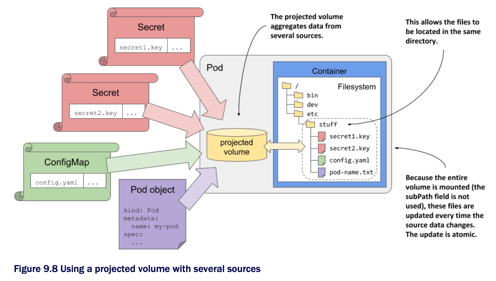

# Using projected volumes to combine volumes into one

* In this chpt, you learned how to use three special volume types to inject values from config maps, secrets, and the Pod object itself

  * Unless you use the `subPath` field in your `volumeMount` definition, you can't inject the files from these different sources, or even multiple sources of the same type, into the same file directory

  * For example, you can't combine the keys from different secrets into a single volume and mount them into a single file directory

  * While the `subPath` field allows you to inject individual files from multiple volumes, it isn't the final solution b/c it prevents the files from being updated when the source values change

* If you need to populate a single volume from multiple sources, you can use the `projected` volume type

## 9.5.1 Introducing the projected volume type

* Projected volumes allow you to combine information from multiple config maps, secrets, and the Downward API into a single pod that you can then mount in the pod's containers

  * They behave exactly like the `configMap`, `secret`, and `downwardAPI` volumes you learned about in the previous sections of this chapter

  * They provide the same features and are configured in almost the same way as the other volume types

* The following figure shows a visualization of a projected volume:

* In addition to the three volume types described earlier, you can also use projected volumes to expose the service account token to your application

  * You'll learn what those are in chpt 23

## Using a projected volume in a pod

▶︎ See [9.5.2](projected-volume-in-pod/README.md)
