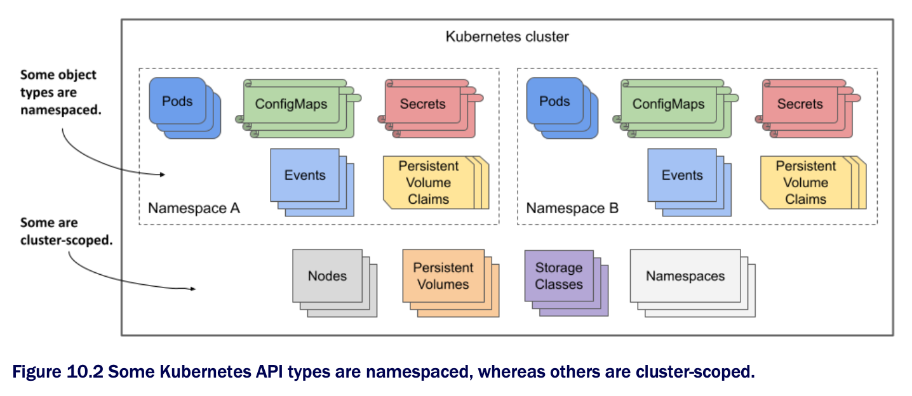
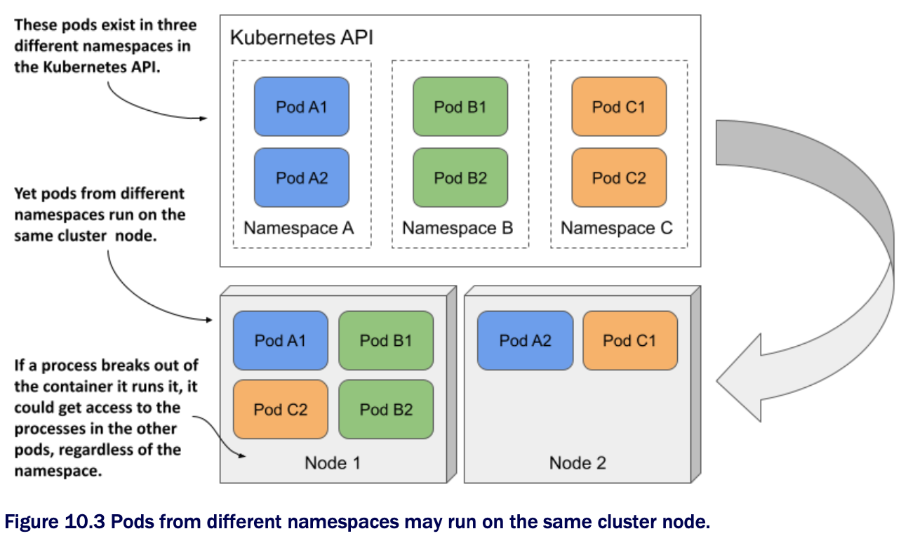

# Organizing objects into namespaces

* Use namespaces to divide a single physical K8s cluster into many virtual clusters

  * By creating objects in separate K8s namespaces, each team deals w/ their own instance of the Kiada application suite-each team sees the objects they've created

> [!NOTE]
> 
> Namespaces in K8s help organizes K8s API objects into non-overlapping groups. They have nothing to do w/ Linux namespaces, which help isolate processes running in one container from those in another.

* Namespaces provide a scope for object names

## Understanding when to organize objects into namespaces

* Namespaces can also be used to separate objects in a multi-tenant environment
  
  * For example, you can create a separate namespace (or a group of namespaces) for each client and deploy the entire application suite for that client in that namespace (or group)

> [!NOTE]
> 
> Most K8s API object types are namespaced, but a few are not. Pods, ConfigMaps, Secrets, PersistentVolumeClaims, and Events are all namespaced. Nodes, PersistentVolumes, StorageClasses, and Namespaces themselves are not. To see if a resource is namespaced or cluster-scoped, check the `NAMESPACED` column when running `kubectl api-resources`.



* Namespaces also provide a scope for user privileges

  * A user may have permission to manage objects in one namespace but not in others

## List namespaces and the objects they contain

```zsh
$ kubectl get namespaces

NAME                STATUS   AGE
default             Active   1h
kube-node-lease     Active   1h
kube-public         Active   1h
kube-system         Active   1h
local-path-storage  Active   1h
```

> [!NOTE]
> 
> The short form for `namespace` is `ns`. You can also list namespaces w/ `kubectl get ns`.

> [!NOTE]
> 
> Namespaces prefixed w/ `kube-` are reserved for K8s system namespaces.

* List all objects (config maps in this example) across all namespaces:

```zsh
$ kubectl get cm --all-namespaces
```

> [!TIP]
> 
> You can also type `-A` instead of `--all-namespaces`

## Create namespaces

### Create a namespace w/ `kubectl create namespace`

* The fastest way to create a namespace is to use the `kubectl create namespace` command

  * Create a namespace named `kiada-test` as follows:

```zsh
$ kubectl create namespace kiada-test1
namespace/kiada-test1 created
```

> [!NOTE]
> 
> The names of most objects must conform to the naming conventions for DNS subdomain names, as specified in RFC 1123, that is, they may contain only lowercase alphanumeric characters, hyphens, and dots, and must start and end w/ an alphanumeric character. The same applies to namespaces, but they may not contain dots.

### Create a namespace from a manifest file

* K8s namespaces are represented by Namespace objects

  * As such, you can list them w/ the `kubectl get` command && create them from a YAML or JSON manifest file that you post to the K8s API

    * Developers don't usually create namespaces this way, but operators do

1. Create a file named [`ns.kiada-test2.yaml`](ns.kiada-test2.yaml):

```yaml
apiVersion: v1
kind: Namespace       # ← A
metadata:
  name: kiada-test2   # ← B

# ← A ▶︎ This manifest contains a Namespace object.
# ← B ▶︎ This is the name of the namespace.
```

2. Now, use `kubectl apply` to post the file to the K8s API:

```zsh
$ kubectl apply -f ns.kiada-test2.yaml
namespace/kiada-test2 created
```

## Managing objects in other namespaces

* If you create an object such as a pod w/o explicitly specifying the namespace, the object is created in the `default` namespace

### Specifying the namespace in the object manifest

* The object manifest can specify the namespace of the object in the `namespace` field in the manifest's `metadata` section

  * You don't need to specify the namespace w/ the `--namespace` option

```yaml
apiVersion: v1
kind: Pod
metadata:
  name: kiada-ssl
namespace: kiada-test2  # ← A
spec:
  volumes: ...
...

# ← A ▶︎ This Pod object specifies the namespace. When you apply the manifest, this Pod is created in the kiada-test2 namespace.
```

* When you apply this manifest w/ the following command, the pod, config map, and secret are created in the `kiada-test2` namespace:

```zsh
$ kubectl apply -f pod.kiada-ssl.kiada-test2-namespace.yaml
pod/kiada-ssl created
configmap/kiada-envoy-config created
secret/kiada-tls created
```

### Making Kubectl default to a different namespace

* To switch to a different namespace, update the current context

  * For example, to switch to the `kiada-test1` namespace, run the following command:

```zsh
$ kubectl config set-context --current --namespace kiada-test1
Context "kind-kind" modified.
```

> [!TIP]
> 
> To quickly switch to a different namespace, you can set up the following alias: `alias kns='kubectl config set-context --current --namespace '`. You can then switch between namespaces with `kns some-namespace`. Alternatively, you can install a kubectl plugin that does the same thing. You can find it at https://github.com/ahmetb/kubectx

## Understanding the (lack of) isolation between namespaces



* When two pods crated in different namespaces are scheduled to the same cluster node, they both run in the same OS kernel

  * Although they are isolated from each other w/ container technologies, an application that breaks out of its container or consumes too much of the node's resources can affect the operation of the other application

  * K8s namespaces play no role here

### Understanding network isolation btwn namespaces

* By default, there is no network isolation btwn namespaces

* But, you can use the NetworkPolicy object to configure which applications in which namespaces can connect to which applications in other namespaces

## Delete a namespace

* When you delete the Namespace object, all objects in that namespace are automatically deleted

```zsh
$ kubectl delete ns <NAMESPACE>
namespace "<NAMESPACE>" deleted
```

* The command blocks until everything in the namespace and the namespace itself are deleted

### Diagnosing why namespace termination is stuck

> [!NOTE]
> 
> `kubectl get all` command lists only some types of objects. For example, it doesn't list secrets. Even though the command doesn't return anything, this doesn't mean that the namespace is empty.

* In most cases, when a namespace is stuck in `terminating`, the problem was caused by a custom object and its custom controller not processing the object's deletion and removing a finalizer from the object

* How to figure out which object is causing the namespace to be stuck

  * Namespace objects have a `status` field

  * Check the namespace w/ `kubectl desribe` or w/:

```zsh
$ kubectl get ns kiada-test2 -o yaml
...
status:
  conditions:
  - lastTransitionTime: "2021-10-10T08:35:11Z"
    message: All resources successfully discovered
    reason: ResourcesDiscovered
    status: "False"
    type: NamespaceDeletionDiscoveryFailure
  - lastTransitionTime: "2021-10-10T08:35:11Z"
    message: All legacy kube types successfully parsed
    reason: ParsedGroupVersions
    status: "False"
    type: NamespaceDeletionGroupVersionParsingFailure
  - lastTransitionTime: "2021-10-10T08:35:11Z"                                  # ← A
    message: All content successfully deleted, may be waiting on finalization   # ← A
    reason: ContentDeleted                                                      # ← A
    status: "False"                                                             # ← A
    type: NamespaceDeletionContentFailure                                       # ← A
  - lastTransitionTime: "2021-10-10T08:35:11Z"                                  # ← B
    message: 'Some resources are remaining: pods. has 1 resource instances'     # ← B
    reason: SomeResourcesRemain                                                 # ← B
    status: "True"                                                              # ← B
    type: NamespaceContentRemaining                                             # ← B
  - lastTransitionTime: "2021-10-10T08:35:11Z"                                  # ← C
    message: 'Some content in the namespace has finalizers remaining:           # ← C
              xyz.xyz/xyz-finalizer in 1 resource instances'                    # ← C
    reason: SomeFinalizersRemain                                                # ← C
    status: "True"                                                              # ← C
    type: NamespaceFinalizersRemaining                                          # ← C
    phase: Terminating
      
# ← A ▶︎ All objects in the namespace were marked for deletion, but some haven’t been fully deleted yet.
# ← B ▶ ︎One pod remains in the namespace.
# ← C ▶︎ The pod hasn’t been fully deleted because a controller has not removed the specified finalizer from the object.
```
