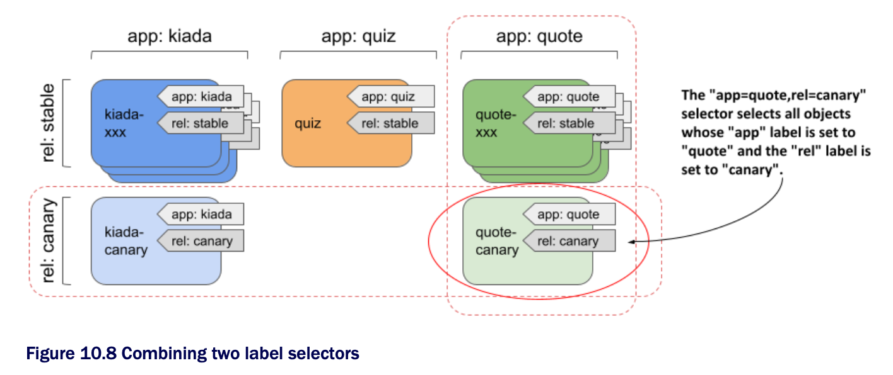

# Filtering objects with label selectors

* Label selectors allow you to select a subset of pods or other objects that contain a particular label and perform an operation on those objects

  * A label selector is a criterion that filters objects based on whether they contain a particular label key w/ a particular value
  
  * There are two types of label selectors:

    * _equality-base_ selectors, and

    * _set-based_ selectors

## Introducing equality-based selectors

* An equality-based selector can filter objects based on whether the value of a particular label is equal to or not equal to a particular value

  * For example, applying the label selector `app=quote` to all pods selects all quite pods

  * Similarly, the label selector `app!=quote` selects all pods except the quote pods

## Introducing set-based selectors

* Set-based selectors are more powerful and allow you to specify:

  * a set of values that a particular label must have; for example: `app in (quiz, quote)`,

  * a set of values that a particular label must not have; for example: `app notin (kiada`,

  * a particular label key that should be present in the object's labels; for example, to select objects that have the `app` label, the selector is simply `app`

  * a particular label key that should not be present in the object's label; for example, to select objects that do not have the `app` label, the selector is `!app`

## Combining multiple selectors

* As shown in the following figure, the selector `app=quote,rel=canary` selects the pod `quote-canary`



## Using label selectors for object management with kubectl

### Filtering the list of objects using label selectors

* To apply a label selector to `kubectl get`, specify it w/ the `--selector` argument (or the short equivalent `-l`):

```zsh
$ kubectl get pods -l app=quote
```

* Combine two selectors `app=quote` and `rel=canary`

```zsh
$ kubectl get pods -l app=quote,rel=canary
```

* Set-based selector ▶︎ to display all quiz and quote pods, use the selector `app in (quiz, quote)`:

```zsh
$ kubectl get pods -l 'app in (quiz, quote)' -L app
```

* You'd get the same result if you used the equality-based selector `'app!=kiada'` or the set-based selector `'app notin (kiada)'`

  * The `-L app` option in the command displays the value of the `app` label for each pod (see the `APP` column in the output)

* List pods that do not have the `rel` label:

```zsh
$ kubectl get pods -l '!rel'
```

> [!NOTE]
> 
> Make sure to use single quotes around `!rel`, so your shell doesn't evaluate the exclamation mark.

* To list all the pods that do have the `rel` label:

```zsh
$ kubectl get pods -l rel
```

### Deleting objects using a label selector

* Delete all canary pods using a label selector:

```zsh
$ kubectl delete pods -l rel=canary
```

## Utilizing label selectors within Kubernetes API objects

### Using label selectors to schedule pods to specific nodes

* There are scenarios where you may want to deploy certain pods only on a specific subset of nodes

  * A good example is when your hardware infrastructure isn't homogenous

    * If some worker nodes use spinning disks while others use SSDs, you may want to schedule pods that require low-latency storage only to the nodes that can provide it

  * Another example is if you want to schedule front-end pods to some nodes and back-end pods to others

  * Or if you want to deploy a separate set of application instances for each cuxtomer and want each set to run its own set of nodes for security reasons

### Attaching labels to nodes

* List all the nodes in your cluster and select one of the worker nodes

```zsh
$ kubectl get node
NAME                STATUS  ROLES                 AGE   VERSION
kind-control-plane  Ready   control-plane,master  1d    v1.21.1
kind-worker         Ready   <none>                1d    v1.21.1
kind-worker2        Ready   <none>                1d    v1.21.1
```

* After selecting your node, add the `node-role: front-end` label to it:

```zsh
$ kubectl label node kind-worker node-role=front-end
node/kind-worker labeled
```

### Scheduling pods to nodes w/ specific labels

* The following listing shows the contents of the [`pod.kiada-front-end.yaml`](pod.kiada-front-end.yaml), which uses a node selector to schedule a pod to a specific node:

```yaml
apiVersion: v1
kind: Pod
metadata:
  name: kiada-front-end
spec:
  nodeSelector:             # ← A
    node-role: front-end    # ← A
  volumes:

# ← A ▶︎ This pod may only be scheduled to nodes w/ the node-role=front-end label.
```

* In the `nodeSelector` field, you can specify one or more label keys and vales that the node must match to be eligible to run the pod

  * You can't use a not-equal or set-based selector in the `nodeSelector` field

### Using label selectors in persistent volume claims

* A persistent volume usually represents a network storage volume, and the persistent volume claim allows you to reserve one of the persistent volumes so that you can use it in your pods

* You can specify a label selector in the PersistentVolumeClaim object definition to indicate which persistent volumes K8s should consider for binding

  * Unlike the node selector in the Pod object, the label selector in the PersistentVolumeClaim object supports both equality-based and set-based selectors and uses a slightly different syntax

  * A PersistentVolumeClaim definition w/ an equality-based selector:

```yaml
apiVersion: v1
kind: PersistentVolumeClaim
metadata:
  name: ssd-claim
spec:
  selector:                   # ← A
    matchLabels:              # ← B
      type: ssd               # ← C

# ← A ▶︎ The label selector that the eligible PersistentVolume object must match.
# ← B ▶︎ The selector is equality-based.
# ← C ▶︎ Only PersistentVolume with the “type: ssd” label are eligible.
```

  * Using a set-based selector in a PersistentVolumeClaim, matching PersistentVolumes w/ the `type` label set to anything other than `ssd`, and the `age` label set to `old` or `very-old`:

```yaml
spec:
  selector:
    matchExpressions:   # ← A
    - key: type         # ← B
      operator: NotIn   # ← B
      values:           # ← B
      -ssd              # ← B
    - key: age          # ← C
      operator: In      # ← C
      values:           # ← C
      -old              # ← C
      - very-old        # ← C

# ← A ▶︎ A set-based selector is defined. The PersistentVolume’s labels must match the following expressions.
# ← B ▶︎ The “type” label must not match the value “ssd”.
# ← C ▶︎ The “age” label must be either “old” or “very-old”.
```

* As you can see in the listing, you can specify multiple `matchExpressions` in the selector

  * To match the selector, the PersistentVolume's labels must match all the expressions

* You must specify the `key`, `operator`, and `values` for each expression

  * The `key` is the label key to which the selector is applied

  * The `operator` must be one of `In`, `NotIn`, `Exists`, and `DoesNotExist`

    * When you use the `In` or `NotIn` operators, the `values` array must not be empty

    * However, you must omit it when using the `Exists` or `DoesNotExist operators

> [!NOTE]
> 
> The `NotIn` operator matches objects that don't contain the specified label. A PersistentVolumeClaim w/ the label selector `type NotIn [ssd]`, `age In [old, very-old]` can therefore bind to a PersistentVolume w/ the label `age: old`, evn though it has no `type` label. To change this, you must add a selector expression w/ the `Exists` operator.

> ### Filtering objects w/ field selectors
> 
> * Unlike label selectors, you only use field selectors w/ kubectl or other K8s API clients
>
>   * No object uses field selectors internally
>
> * The set of fields you can use in a field selector depends on the object kind
> 
>   * The `metadata.name` and `metadata.namespace` fields are always supported
> 
>   * Like equality-based selectors, field selectors support the equal (`=` or `==`) and not equal (`!=`) operator, and you can combine multiple field selectors by separating them w/ a comma
>
> * As an example of using field selectors, run the following comand to list pods on the `kind-worker` node (if your cluster wasn't provisioned w/ the kind tool, you must specify a different node name):
>
>   ```zsh
>   $ kubectl get pods --field-selector spec.nodeName=kind-worker
>   ```
>   
> * Instead of displaying all pods in the current namespace, the filter selected only those pods whose `spec.nodeName` field is set to `kind-worker`
> 
> * How do you know which field to use in the selector?
> 
>   * By looking up the field names w/ `kubectl explain`, of course
> 
>   * For example: `kubectl explain pod.spec` shows the fields in the `spec` section of Pod objects
> 
>   * It doesn't show which fields are supported in field selectors, but you can try to use a field and kubectl will tell you if it isn't supported
>
> #### Finding pods that aren't running
> 
> * Another example of using field selectors is to find pods that aren't currently running
> 
>   * You can accomplish this by using the `status.phase!=Running` field selector as follows:
> 
>   ```zsh
>   $ kubectl get pods --field-selector status.phase!=Running
>   ```
>   
> * Since all pods in your namespace are running, this command won't produce any results, but it can be useful in practice, especially if you combine it w/ the `--all-namespaces` option to list non-running pods in all namespaces
>
>   * The full command is as follows:
> 
>   ```zsh
>   $ kubectl get pods --field-selector status.phase!=Running --all-namespaces
>   ```
>   
> * The `--all-namespaces` option is also useful when you use the `metadata.name` or `metadata.namespace` fields in the field selector
