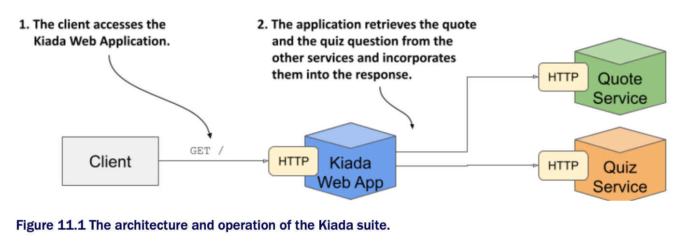
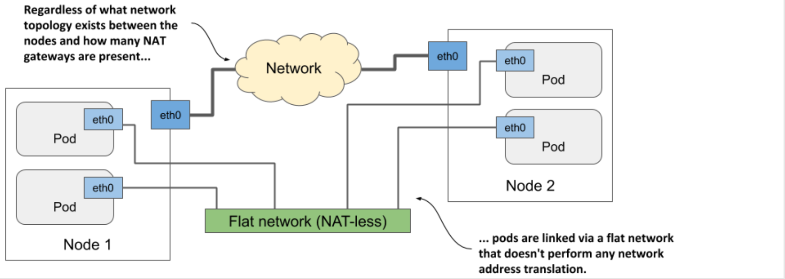

# Chapter 11. Exposing Pods w/ Services

## Learning objectives

- [ ] Communication between pods

- [ ] Distributing client connections over a group of pods providing the same service

- [ ] Discovering services in the cluster through DNS and environment variables

- [ ] Exposing services to clients outside the cluster

- [ ] Using readiness probes to add or remove individual pods from services

* The Kiada suite you're building in this book consists of three services-the Kiada service, the Quiz service, and the Quote service

  * So far, these are three isolated services that you interact w/ individually, but the plan is to connect them



* The Kiada service will call the other two services and integrate the information they return into the response it sends to the client

  * Multiple pod replicas will provide each service, so you'll need to use Service objects to expose them

* Before you create the Service object, deploy the pods and the other objects by applying the manifests in the [`/SETUP/`](SETUP) directory as follows:

```zsh
$ kubectl apply -f SETUP/ --recursive
```

* You may recall from the previous chapter that this command applies all manifests in the specified directory and its subdirectories

  * After applying these manifests, you should have multiple pods in your current K8s namespace

> ### Understanding how pods communicate
> 
> * Each pod has its own network interface w/ its own IP address
> 
>   * All pods in the cluster are connected by a single private network w/ a flat address space
> 
>   * As shown in the following figure, even if the nodes hosting the pods are geographically dispersed w/ many network routers in between, the pods can communicate over their own flat network where no _NAT_ (Network Address Translation) is required
>
>   * This pod network is typically a software-defined network that's layered on top of the actual network that connects the nodes
> 
> 
> 
> * When a pod sends a network packet to another pod, neither SNAT (Source NAT) nor DNAT (Destination NAT) is performed on the packet
> 
>   * This means that the source IP and port, and the destination IP and port, of packets exchanged directly between pods are never changed
> 
>   * If the sending pod knows the IP address of the receiving pod, it can send packets to it
> 
>   * The receiving pod can see the sender's IP as the source IP address of the packet
> 
> * Although there are many Kubernetes network plugins, they must all behave as described above
> 
>   * Therefore, the communication between two pods is always the same, regardless of whether the pods are running on the same node or on nodes located in different geographic regions
> 
>   * The containers in the pods can communicate w/ each other over the flat NAT-less network, like computers on a local area network (LAN) connected to a single network switch
> 
>   * From the perspective of the applications, the actual network topology between the nodes isn't important

## Sections

* 11.1 [Exposing pods via services](sect01/services/README.md)

* 11.2 [Exposing services externally](sect02/expose-services-externally/README.md)

* 11.3 [Managing service endpoints](sect03/manage-service-endpoints/README.md)

* 11.4 [Understanding DNS records for Service objects](sect04/dns-records-for-service-objects/README.md)

* 11.5 [Configuring services to route traffic to nearby endpoints](sect05/route-traffic-to-nearby-endpoints/README.md)

* 11.6 [Managing the inclusion of a pod in service endpoints](sect06/inclusion-of-pod-in-service-endpoints/README.md)

## Learning summary

* In this chapter, you finally connected the Kiada pods to the Quiz and Service pods

* You learned that:

  * Pods communicate over a flat network that allows any pod to reach any other pod in the cluster, regardless of the actual network topology connecting the cluster nodes

  * A K8s service makes a group of pods available under a single IP address

    * While the IPs of the pods may change, the IP of the service remains constant

  * The cluster IP of the service is reachable from inside the cluster, but NodePort and LoadBalancer services are also accessible from outside the cluster

  * Service endpoints are either determined by a label selector specified in the Service object or configured manually

    * These endpoints are stored in the Endpoints and EndpointSlice objects

  * Client pods can find services using the cluster DNS or environment variables

    * Depending on the type of Service, the following DNS records may be created: `A`, `AAAA`, `SRV`, and `CNAME`

  * Services can be configured to forward external traffic only to pods on the same node that received the external traffic, or to pods anywhere in the cluster

    * They can also be configured to route internal traffic only to pods on the same node as the pod from which the traffic originates from

    * Topology-aware routing ensures that traffic isn't routed across availability zones when a local pod can provide the requested service

  * Pods don't become service endpoints until they're ready

    * By implementing a readiness probe handler in an application, you can define what readiness means in the context of that particular application

* In the next chapter, you'll learn how to use Ingress objects to make multiple services accessible through a single external IP address
