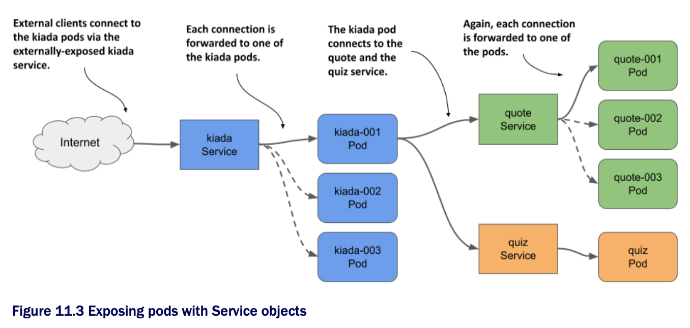

# Exposing pods via services

* If an application running in one pod needs to connect to another application running in a different pod, it needs to know the address of the other pod

  * This is easier said than done for the following reasons:

    1. Pods are _ephemeral_

      * A pod can be removed and replaced w/ a new one at any time

      * This happens when the pod is evicted from a node to make room for other pods, when the node fails, when the pod is no longer needed b/c a smaller number of pod replicas can handle the load,and for many other reasons

    2. A pod gets its IP address when it's assigned to a node

      * You don't know the IP address of the pod in advance, so you can't provide it to the pods that will connect to it

    3. In horizontal scaling, multiple pod replicas provide the same service

      * Each of these replicas has its own IP address

      * If another pod needs to connect to these replicas, it should be able to do so using a single IP or DNS name that points to a load balancer that distributes the load across all replicas

* Also, some pods need to be exposed to clients outside the cluster

  * Until now, whenever you wanted to connect to an application running in a pod, you used port forwarding, which is for development only

  * The right way to make a group of pods externally accessible is to use a Kubernetes Service

## 11.1.1 Introducing services

* A K8s Service is an object you create to provide a single, stable access point to a set of pods that provide the same service

  * Each service has a stable IP address that doesn't change for as long as the service exists

  * Clients open connections to that IP address on one of the exposed network ports, and those connections are then forwarded to one of the pods that back that service

  * In this way, clients don't need to know the addresses of the individual pods providing the service, so those pods can be scaled out or in and moved from one cluster node to the other at will

  * A service acts as a load balancer in front of those pods

### Understanding why you need services

* In this chapter, you'll learn how to configure the Kiada application to connect to the other two services, and make it visible to the outside world

  * Since both the number of pods in each service and their IP addresses can change, you'll expose them via Service objects, as shown in the following figure:

* By creating a service for the Kiada pods and configuring it to be reachable from outside the cluster, you create a single, constant IP address throught which external clients can connect to the pods

  * Each connection is forwarded to one of the kiada pods

* By creating a service for the Quote pods, you create a stable IP address through which the Kiada pods can reach the Quote pods, regardless of the number of pod instances behind the service and their location at any given time

* Although there's only one instance of the Quiz pod, it too must be exposed through a service, since the pod's IP address changes every time the pod is deleted and recreated

  * W/o a service, you'd have to reconfigure the Kiada pods each time or make the pods get the Quiz pod's IP from the Kubernetes API

  * If you use a service, you don't have to do that b/c its IP address never changes

### Understanding how pods becomes part of a service

* A service can be backed by more than one pod

  * When you connect to a service, the connection is passed to one of the backing pods

  * But how do you define which pods are part of the service and which aren't?

* Services use labels and label selectors

  * As shown in the next figure, you add labels to Pod objects and specify the label selector in the Service object

  * The pods whose labels match the selector are part of the service

[Fig. 3 Label selectors determine which pods are part of the Service.](../../../../../img/kubernetes-in-action.demo/chpt11/sect01/services/diag03.png)

* The label selector defined in the `quote` service is `app=quote`, which means that it selects all `quote` pods, both stable and canary instances, since they all contain the label key `app` w/ the value `quote`

  * Other labels on the pods don't matter

## 11.1.2 Creating and updating services

* See [create-and-update-services](create-and-update-services/README.md)

## 11.1.3 Accessing cluster-internal services

* See [create-and-update-services](access-cluster-internal-services/README.md)