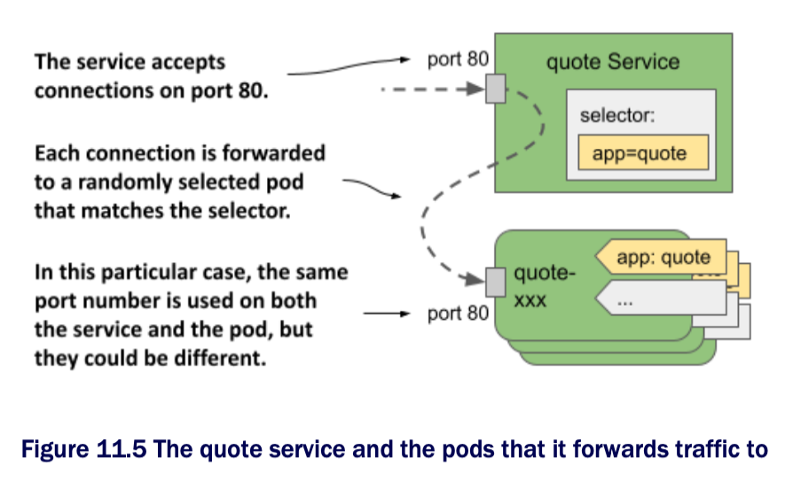

# Creating and updating services

* Kubernetes supports several types of services: `ClusterIP`, `NodePort`, `LoadBalancer`, and `ExternalName`

  * The `ClusterIP` type, which you'll learn about first, is only used internally, within the cluster

  * If you create a Service objects w/o specifying its type, that's the type of service you get

  * The services for the Quiz and Quote pods are of this type b/c they're used by the Kiada pods within the cluster

  * The service for the Kiada pods, on the other hand, must also be accessible to the outside world, so the `ClusterIP` type isn't sufficient

## Creating a service YAML manifest

* [`svc.quote.yaml`](svc.quote.yaml) YAML manifest for the quote service:

```yaml
apiVersion: v1      # ← A
kind: Service       # ← A
  metadata:
    name: quote     # ← B
spec:
  type: ClusterIP   # ← C
  selector:         # ← D
    app: quote      # ← D
  ports:            # ← E
  - name: http      # ← E
    port: 80
    targetPort: 80  # ← E
    protocol: TCP   # ← E

# ← A ▶︎ This manifest describes a Service object.
# ← B ▶︎ The name of this service.
# ← C ▶︎ ClusterIP services are accessible only within the cluster.
# ← D ▶︎ The label selector that specifies which pods are part of this service.
# ← E ▶︎ Port 80 of this service is mapped to port 80 in the pods that back this service.
```

> [!NOTE]
> 
> Since the `quote` Service object is one of the objects that make up the Quote application, you could also add the `app: quote` label to this object. However, b/c this label isn't required for the service to function, it's omitted in this example.

> [!NOTE]
>
> If you create a service w/ multiple ports, you must specify a name for each port. It's best to do the same for services w/ a single port.

> [!NOTE]
>
> Instead of specifying the port number in the `targetPort` field, you can also specify the name of the port as defined in the container's port list in the pod definition. This allows the service to use the correct target port number even if the pods behind the service use different port numbers.

* The manifest defines a `ClusterIP` Service named `quote`

  * The service accepts connections on port `80` and forwards each connection to port `80` of a randomly selected pod matching the `app=quote` label selector, as shown in the following figure:



* To create the service, apply the manifest file to the K8s API using `kubectl apply`

## Creating a service w/ `kubectl expose`

* Normally, you create services like you create other objects, by applying an object manifest using `kubectl apply`

  * However, you can also create services using the `kubectl expose` command, as you did in chapter 3 of this book

```zsh
$ kubectl expose pod quiz --name quiz
service/quiz exposed
```

* The command creates a service named `quiz` that exposes the `quiz` pod

  * To do this, it checks the pod's labels and creates a Service object w/ a label selector that matches all the pod's labels

> [!NOTE]
> 
> In chapter 3, you used `kubectl expose` command to expose a Deployment object. In this case, the command took the selector from the Deployment and used it in the Service object to expose all its pods. You'll learn about Deployments in chapter 13.

* You've now created two services

  * You'll learn how to connect to them in section 11.1.3, but first let's see if they're configured correctly

## Listing services

* When you create a service, it's assigned an internal IP address that any workload running in the cluster can use to connect to the pods that are part of that service

  * You can see it by listing services w/ the `kubectl get services` command

  * If you want to see the label selector of each service, use the `-o wide` option as follows:

```zsh
$ kubectl get svc -o wide
NAME  TYPE        CLUSTER-IP      EXTERNAL-IP   PORT(S)   AGE   SELECTOR
quiz  ClusterIP   10.96.136.190   <none>        8080/TCP  15s   app=quiz,rel=stable
quote ClusterIP   10.96.74.151    <none>        80/TCP    23s   app=quote
```

> [!NOTE]
> 
> The shorthand for `services` is `svc`.

* The output of the command shows the two services you created

  * For each service, the type, IP addresses, exposed ports, and label selector are printed

> [!NOTE]
> 
> You can also view the details of each service w/ the `kubectl describe svc` command.

* You'll notice that the `quiz` service uses a label selector that selects pods w/ the labels `app: quiz` and `rel: stable`

  * This is b/c these are the labels of the `quiz` pod from which the service was created using the `kubectl expose` command

## Changing the service's label selector

* To change the label selector of a service, you can use the `kubectl set selector` command

  * To fix the selector of the `quiz` service, run the following command:

```zsh
$ kubectl set selector service quiz app=quiz
service/quiz selector updated
```

* List the services again w/ the `-o wide` option to confirm the selector change

  * This method of changing the selector is useful if you're deploying multiple versions of an application and want to redirect clients from one version to another

## Changing the ports exposed by the service

* To change the ports that the service forwards to pods, you can edit the Service object w/ `kubectl edit` command or update the manifest file and then apply it to the cluster

* Before continuing, run `kubectl edit svc quiz` and change the port from `8080` to `80`, making sure to only change the `port` field and leaving the `targetPort` set to `8080`, as this is the port that the `quiz` pod listens on

## Configuring basic service properties

* Fields in the Service object's spec for configuring the service's basic properties:

| **Field**   | **Field type**      | **Description**                                                                                                                                                                                                                                           |
|-------------|---------------------|-----------------------------------------------------------------------------------------------------------------------------------------------------------------------------------------------------------------------------------------------------------|
| `type`      | `string`            | Specifies the type of this Service object. Allowed values are `ClusterIP`, `NodePort`, `LoadBalancer`, and `ExternalName`. The default value is `ClusterIP`. The differences between these types are explained in the following sections of this chapter. |
| `clusterIP` | `string`            | The internal IP address within the cluster where the service is available. Normally, you leave this field blank and let Kubernetes assign the IP. If you set it to `None`, the service is a headless service.                                             |
| `selector`  | `map[string]string` | Specifies the label keys and values that the pod must have in order for this service to forward traffic to it. If you don't set this field, you are responsible for managing the service endpoints.                                                       |
| `ports`     | `[]Object`          | List of ports exposed by this service. Each entry can specify the `name`, `protocol`, `appProtocol`, `port`, `nodePort`, and `targetPort`.                                                                                                                |

> ### IPv4/IPv6 dual-stack support
> 
> * Kubernetes supports both IPv4 and IPv6
>
>   * Whether dual-stack networking is supported in your cluster depends on whether the `IPv6DualStack` feature gate is enabled for the cluster components to which it applies
> 
> * When you create a Service object, you can specify whether you want the service to be a single- or dual-stack service through the `ipFamilyPolicy` field
> 
>   * The default value is `SingleStack`, which means that only a single IP family is assigned to the service, regardless of whether the cluster is configured for single-stack or dual-stack networking
> 
>   * Set the value to `PreferDualStack` if you want the service to receive both IP families when the cluster supports dual-stack, and one IP family when it supports single-stack networking
> 
>   * If your service requires both an IPv4 and an IPv6 address, set the value to `RequireDualStack`
> 
>   * The creation of the service will be successful only on dual-stack clusters
> 
> * After you create the Service object, its `spec.ipFamilies` array indicates which IP families have been assigned to it
> 
>   * The two valid values are `IPv4` and `IPv6`
> 
>   * You can also set this field yourself to specify which IP family to assign to the service in clusters that provide dual-stack networking
> 
>   * The `ipFamilyPolicy` must be set accordingly or the creation will fail
> 
> * For dual-stack service, the `spec.clusterIP` field contains only one of the IP addresses, but the `spec.clusterIPs` field contains both the IPv4 and IPv6 addresses
> 
>   * The order of the IPs in the `clusterIPs` field corresponds to the order in the `ipFamilies` field
