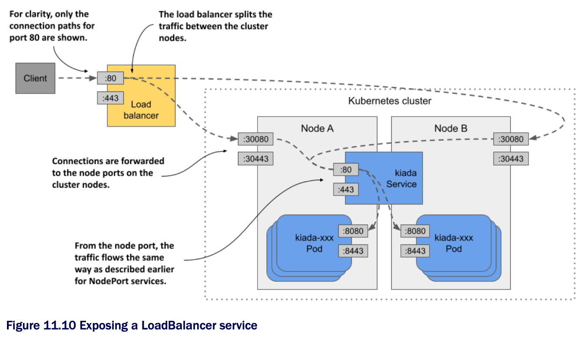

# Exposing a service through an external load balancer

* In the previous section, you created a service of type `NodePort`

  * Another service type is `LoadBalancer`

  * As the name suggests, this service type makes your application accessible through a load balancer

  * While al services act as load balancers, creating a `LoadBalancer` service causes an actual load balancer to be provisioned

* As shown in the following figure, this load balancer stands in front of the nodes and handles the connections coming from the clients

  * It routes each connection to the service by forwarding it to the node port on one of the nodes

  * This is possible b/c the `LoadBalancer` service type is an extension of the `NodePort` type, which makes the service accessible through these node ports

  * By pointing clients to the load balancer rather than directly to the node port of a particular node, the client never attempts to connect to an unavailable node b/c the load balancer forwards traffic only to healthy nodes

  * In addition, the load balancer ensures that connections are distributed evenly across all nodes in the cluster



* Not all K8s clusters support this type of service, but if your cluster runs in the cloud, it almost certainly does

  * If your cluster runs on premises, it'll support `LoadBalancer` services if you install an add-on

  * If the cluster doesn't support this type of service, you can still create services of this type, but the service is only accessible through its node ports

## Creating a LoadBalancer service

* The manifest in the following listing contains the definition of a `LoadBalancer` service:

```yaml
apiVersion: v1
kind: Service
metadata:
  name: kiada
spec:
  type: LoadBalancer    # ← A
  selector:
    app: kiada
  ports:
  - name: http
    port: 80
    nodePort: 30080
    targetPort: 8080
  - name: https
    port: 443
    nodePort: 30443
    targetPort: 8443

# ← A ▶︎ Kubernetes will provision a load balancer for this service.
```

* This manifest differs from the manifest of the `NodePort` service you deployed earlier in only one line-the line that specifies the service `type`

  * The selector and ports are the same as before

  * The node ports are only specified so that they aren't randomly selected by Kubernetes

  * If you don't care about the node ports numbers, you can omit the `nodePort` fields

* Apply the manifest w/ `kubectl apply`

  * You don't have to delete the existing `kiada` service first

  * This ensures that the internal cluster IP of the service remains unchanged

## Connecting to the service through the load balancer

* After you create the service, it may take a few minutes for the cloud infrastructure to create the load balancer and update its IP address in the Service object

  * This IP address will then appear as the external IP address of your service:

```zsh
$ kubectl get svc kiada
NAME    TYPE          CLUSTER-IP      EXTERNAL-IP     PORT(S)                     AGE
kiada   LoadBalancer  10.96.226.212   172.18.255.200  80:30080/TCP,443:30443/TCP  10m
```

* In our case, the IP address of the load balancer is `172.18.255.200` and we can reach the service through port `80` and `443` of this IP

  * Until the load balancer is created, `<pending>` is displayed in the `EXTERNAL-IP` column instead of an IP address

  * This could be b/c the provisioning process isn't yet complete or b/c the cluster doesn't support `LoadBalancer` services

## Adding support for LoadBalancer services w/ MetalLB

* If your cluster runs on bare metal, you can install MetalLB to support `LoadBalancer` services

  * You can find it at metallb.universe.tf

  * If you created your cluster w/ the kind tool, you can install MetalLB using the [`install-metallb-kind.sh`](install-metallb-kind.sh) script

  * If you created your cluster w/ another tool, you can check the MetalLB documentation for how to install it

* Adding support for LoadBalancer services is optional

  * You can always use the node ports directly

  * The load balancer is just an additional layer

## Tweaking LoadBalancer services

* LoadBalancer services are easy to create

  * You just set the `type` to `LoadBalancer`

  * However, if you need more control over the load balancer, you can configure it w/ the additional fields in the Service object's `spec` explained in the following table | Fields in the service spec that you can use to configure LoadBalancer services:

| **Field**                       | **Field type** | **Description**                                                                                                                                                                                      |
|---------------------------------|----------------|------------------------------------------------------------------------------------------------------------------------------------------------------------------------------------------------------|
| `loadBalancerClass`             | `string`       | If the cluster supports multiple classes of load balancers, you can specify which one to use for this service. The possible values depend on the load balancer controllers installed in the cluster. |
| `loadBalancerIP`                | `string`       | If supported by the cloud provider, this field can be used to specify the desired IP for the load balancer.                                                                                          |
| `loadBalancerSourceRanges`      | `[]string`     | Restricts the client IPs that are allowed to access the service through the load balancer. Not supported by all load balancer controllers.                                                           |
| `allocateLoadBalancerNodePorts` | `boolean`      | Specifies whether to allocated node ports for this `LoadBalancer`-type service. Some load balancer implementations can forward traffic to pods w/o relying on node ports.                            |
