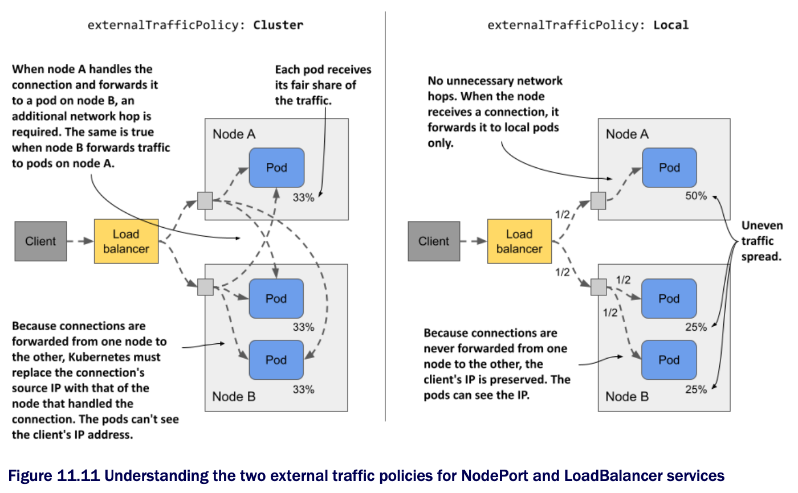

# Configuring the external traffic policy for a service

* You've already learned that when an external client connects to a service through the node port, either directly or through the load balancer, the connection may be forward to a pod that's on a different node than the one that received the connection

  * In this case, an additional network hop must be made to reach the pod, which results in increased latency

* Also, as mentioned earlier, when forwarding the connection from one node to another in this manner, the source IP must be replaced w/ the IP of the node that originally received the connection

  * This obscures the IP address of the client

  * Thus, the application running in the pod can't see where the connection is coming from

  * For example, a web server running in a pod can't record the true client IP in its access log

* The reason the node needs to change the source IP is to ensure that the returned packets are sent back to the node that originally received the connection so that it can return them to the client

## Pros and cons of the local external traffic policy

* Both the additional network hop problem and the source IP obfuscation problem can be solved by preventing nodes from forwarding traffic to pods that aren't running on the same node

  * This is done by setting the `externalTrafficPolicy` field in the Service object's `spec` field to `Local`

  * This way, a node forwards external traffic only to pods running on the node that received the connection

* However, setting the external traffic policy to `Local` leads to other problems

  * First, if there are no local pods on the node that received the connection, the connection hangs

  * You must therefore ensure that the load balancer forwards connections only to nodes that have at least one such pod

  * This is done using the `healthCheckNodePort` field

  * The external load balancer uses this node port to check whether a node contains endpoints for the service or not

  * This allows the load balancer to forward traffic only to nodes that have such a pod

* The second problem you run into when the external traffic policy is set to `Local` is the uneven distribution of traffic across pods

  * If the load balancers distribute traffic evenly among the nodes, but each node runs a different number of pods, the pods on the nodes w/ fewer pods will receive a higher amount of traffic

## Comparing the cluster and the local external traffic policies

* Consider the case presented in the following figure

  * There's one pod running on node A and two on node B

  * The load balancer routes half of the traffic to node A and the other half to node B

* When `externalTrafficPolicy` is set to `Cluster`, each node forwards traffic to all pods in the system

  * Traffic is split evenly between the pods

  * Additional network hops are required, and the client IP is obfuscated

* When the `externalTrafficPolicy` is set to `Local`, all traffic arriving at node A is forwarded to the single pod on that node

  * This means that this pod receives 50% of all traffic

  * Traffic arriving at node B is split between two pods

    * Each pod receives 25% of the total traffic processed by the load balancer

  * There are no unnecessary network hops, and the source IP is that of the client

* As w/ most decisions you make as an engineer, which external traffic policy to use in each service depends on what tradeoffs you're willing to make
