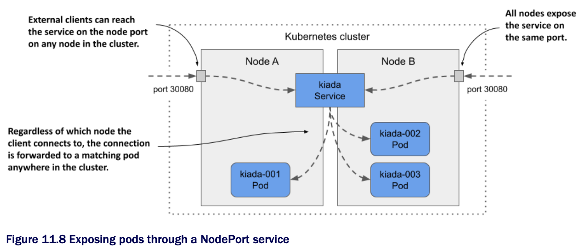
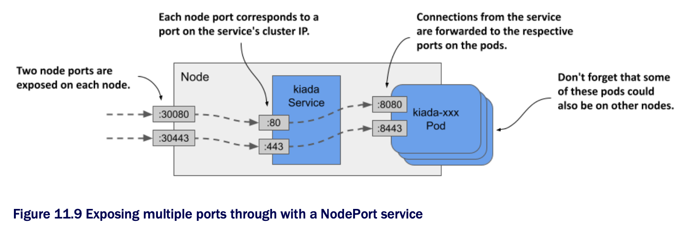

# Exposing pods through a NodePort service

* One way to make pods accessible to external clients is to expose them through a `NodePort` service

  * When you create such a service, the pods that match its selector are accessible through a specific port on all nodes in the cluster, as shown in the following figure

  * B/c this port is open on the nodes, it's called a node port



* Like a `ClusterIP` service, a `NodePort` service is accessible through its internal cluster IP, but also through the node port on each of the cluster nodes

  * In the example shown in the figure, the pods are accessible through port `30080`

  * As you can se, this port is open on both cluster nodes

* It doesn't matter which node a client connects to b/c all the nodes will forward the connection to a pod that belongs to the service, regadless of which node is running the pod

  * When the client connects to node A, a pod on either node A or B can receive the connection

  * The same is true when the client connects to the port on node B

## Creating a NodePort service

* To expose the kiada pods through a `NodePort` service, you create the service from the manifest shown in the following listing

  * A NodePort service exposing the kiada pods on two ports:

```yaml
apiVersion: v1
kind: Service
metadata:
  name: kiada
spec:
  type: NodePort          # ← A
  selector:
    app: kiada
  ports:
  - name: http            # ← B
    port: 80              # ← C
    nodePort: 30080       # ← D
    targetPort: 8080      # ← E
  - name: https           # ← F
      port: 443           # ← F
      nodePort: 30443     # ← F
      targetPort: 8443    # ← F

# ← A ▶︎ The service type is NodePort.
# ← B ▶︎ The service exposes two ports. This here is the HTTP port.
# ← C ▶︎ The port on the service's cluster IP.
# ← D ▶︎ The service is accessible through port 30080 of each of your cluster nodes.
# ← E ▶︎ This is the port that the pods listen on.
# ← F ▶︎ The service exposes another port for HTTPS.
```

* Compared to the `ClusterIP` services you created earlier the type of service in the listing is `NodePort`

  * Unlike the previous services, this service exposes two ports and defines the `nodePort` numbers for each of those ports

> [!NOTE]
> 
> You can omit the `nodePort` field to allow Kubernetes to assign the port number. This prevents port conflicts between different nodePort services.

* The service specifies six different port numbers, which might make it difficult to understand, but the following figure should help you make sense of it



## Examining your NodePort service

* After you create the service, inspect it w/ the `kubectl get` command as follows:

```zsh
$ kubectl get svc
NAME    TYPE        CLUSTER-IP      EXTERNAL-IP   PORT(S)                     AGE
kiada   NodePort    10.96.226.212   <none>        80:30080/TCP,443:30443/TCP  1m    # ← A
quiz    ClusterIP   10.96.173.186   <none>        80/TCP                      3h
quote   ClusterIP   10.96.161.97    <none>        80/TCP                      3h

# ← A This is the service you created
```

* Compare the `TYPE` and `PORT(S)` columns of the services you've created so far

  * Unlike the two `ClusterIP` services, the `kiada` service is a `NodePort` service that exposes node ports `30080` and `30443` in addition to ports `80` and `443` available on the service's cluster IP

## Accessing a NodePort service

* To find out all `IP:port` combinations over which the service is available, you need not only the node port number(s), but also the IPs of the nodes

  * You van get these by running `kubectl get nodes -o wide` and looking at the `INTERNAL-IP` and `EXTERNAL-IP` columns

  * Clusters running in the cloud usually have the external IP set for the nodes, whereas clusters running on bare metal may set only the internal IP of the nodes

  * You should be able to reach the node ports using these IPs, if there are no firewalls in the way

> [!NOTE]
> 
> To allow traffic to node ports when using GKE, run `gcloud compute firewall-rules create gke-allow-nodeports --allow=tcp:30000-32767`. If your cluster is running on a different cloud provider, check the provider's documentation on how to configure the firewall to allow access to node ports.

* In the cluster we provisioned w/ the kind tool, the internal IPs of the nodes are as follows:

```zsh
$ kubectl get nodes -o wide
NAME                  STATUS    ROLES                 ...   INTERNAL-IP   EXTERNAL-IP
kind-control-plane    Ready     control-plane,master  ...   172.18.0.3    <none>
kind-worker           Ready     <none>                ...   172.18.0.4    <none>
kind-worker2          Ready     <none>                ...   172.18.0.2    <none>
```

* The `kiada` service is available on all these IPs, even the IP of the node running the Kubernetes control plane

  * We can access the service at any of the following URLs:

    * `10.96.226.212:80` within the cluster (this is the cluster IP and the internal port),

    * `172.18.0.3:30080` from wherever the node `kind-control-plane` is reachable, as this is the node's IP address; the port is one of the node ports of the `kiada` service,

    * `172.18.0.4:30080` (the second node's IP address and the node port), and

    * `172.18.0.2:30080` (the third node's IP address and the node port).

* The service is also accessible via HTTPS on port `443` within the cluster and via node port `30443`

  * If our nodes also have external IPs, the service would also be available through the two node ports on those IPs

  * If you're using Minikube or another single-node cluster, you should use the IP of that node

> [!TIP]
> 
> If you're using Minikube, you can easily access your `NodePort` services through your browser by running `minikube service <service-name> [-n <namespace>]`.

* Use `curl` or your web browser to access the service

  * Select one of the nodes and find its IP address

  * Send the HTTP request to port 30080 of this IP

  * Check the end of the response to see which pod handled the request and which node the pod is running on

  * For example, here's the response we received to one of my requests:

```zsh
$ curl 172.18.0.4:30080
...
==== REQUEST INFO
Request processed by Kubia 1.0 running in pod "kiada-001" on node "kind-worker2".
Pod hostname: kiada-001; Pod IP: 10.244.1.90; Node IP: 172.18.0.2; Client IP:
       ::ffff:172.18.0.4
```

* Notice that we sent the request to `172.18.0.4`, which is the IP of the `kind-worker` node, but the pod that handled the request was running on the node `kind-worker2`

  * The first node forwarded the connection to the second node, as explained in the introduction to NodePort services

* Did you also notice where the pod thought the request came from?

  * Look at the `Client IP` at the end of the response

  * That's not the IP of the computer from which we sent the request

  * You may have noticed that it's the Ip of the node I sent the request to

  * We'll explain why this is and how you can prevent it in section 11.2.3

* Try sending the request to the other nodes as well

  * You'll see that they all forward the requests to a random kiada pod

  * If your nodes are reachable from the internet, the application is now accessible to users all over the world

  * You could use round robin DNS to distribute incoming connections across the nodes or put a proper Layer 4 load balancer in front of the nodes and point the clients to it

  * Or you could just let Kubernetes do this, as explained in the next section
