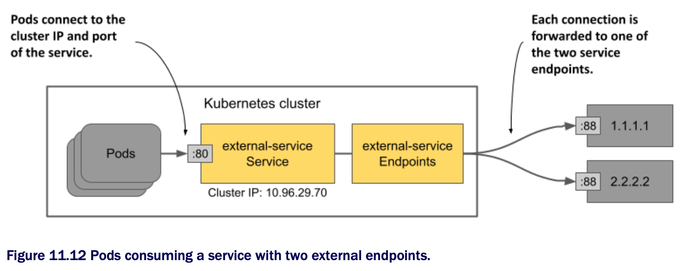

# Managing service endpoints manually

* When you create a Service object w/ a label selector, K8s automatically creates and manages the Endpoints and EndpointSlice objects and uses the selector to determine the service endpoints

  * However, you can also manage endpoints manually by creating the Service object w/o a label selector

  * In this case, you must create the Endpoints object yourself

  * You don't need to create the EndpointSlice objects b/c Kubernetes mirrors the Endpoints object to create corresponding EndpointSlices

* Typically, you manage service endpoints this way when you want to make an existing external service accessible to pods in your cluster under a different name

  * This way, the service can be found through the cluster DNS and environment variables

## Creating a service w/o a label selector

* The following listing shows an example of a Service object manifest that doesn't define a label selector

  * You'll manually configure the endpoints for this service

```yaml
apiVersion: v1
kind: Service
metadata:
name: external-service    # ← A
spec:                     # ← B
  ports:                  # ← B
  - name: http            # ← B
    port: 80              # ← B

# ← A ▶︎ The name of the service must match the name of the Endpoints object (see next listing).
# ← B ▶︎ No label selector is defined for this service.
```

* The manifest in the listing defines a service named `external-service` that accepts incoming connections on port 80

  * As explained in the first part of this chapter, pods in the cluster can use the service either through its cluster IP address, which is assigned when you create the service, or through its DNS name

## Creating an Endpoints object

* If a service doesn't define a pod selector, no Endpoints object is automatically created for it

  * The following listing shows the manifest of the Endpoints object for the service you created in the previous section

```yaml
apiVersion: v1
kind: Endpoints
metadata:
name: external-service  # ← A
subsets:
- addresses:
  - ip: 1.1.1.1         # ← B 
  - ip: 2.2.2.2         # ← B
  ports:
  - name: http          # ← C  
    port: 88            # ← C

# ← A ▶︎ The name of the Endpoints object must match the name of the service (see previous listing).
# ← B ▶︎ The IPs of the endpoints that the service will forward connections to.
# ← C ▶︎ The port on which the endpoints expose the service.
```

* The Endpoints object must have the same name as the service and contain the list of destination addresses and ports

  * In the listing, Ip addresses 1.1.1.1 and 2.2.2.2 represent the endpoints for the service

> [!NOTE]
> 
> You don't have to create the EndpointSlice object. K8s creates it from the Endpoints object.

* The creation of the Service and its associated Endpoints object allow pods to use this service in the same way as other services defined in the cluster

  * As shown in the following figure, traffic send to the service's cluster IP is distributed to the service's endpoints

  * These endpoints are outside the cluster but could also be internal



* If you later decide to migrate the external service to pods running inside the K8s cluster, you can add a selector to the service to redirect traffic to those pods instead of the endpoints you configured by hand

  * This is b/c K8s immediately starts managing the Endpoints object after you add the selector to the service

* You can also do the opposite: If you want to migrate an existing service from the cluster to an external location, remove the selector from the Service object so that K8s no longer updates the associated Endpoints object

  * From then on, you can manage the service's endpoints manually

* You don't have to delete the service to do this

  * By changing the existing Service object, the cluster IP address of the service remains constant

  * The clients using the service won't even notice that you've relocated the service
