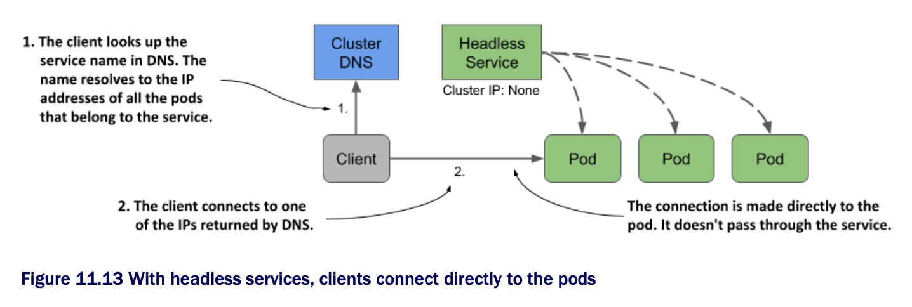

# Using headless services to connect to pods directly

* Services expose a set of pods at a stable IP address

  * Each connection to that IP address is forwarded to a random pod or other endpoint that backs the service

  * Connections to the service are automatically distributed across its endpoints

  * But what if you want the client to do the load balancing?

    * What if the client needs to decide which pod to connect to?

    * What if the pods are part of a service all need to connect directly to each other?

    * Connecting via the service's cluster IP clearly isn't the way to do this

    * What then?

* Instead of connecting to the service IP, clients could get the pod IPs from the K8s API, but it's better to keep them K8s-agnostic and use standard mechanisms like DNS

  * Fortunately, you can configure the internal DNS to return the pod IPs instead of the service's cluster IP by creating a _headless_ service

* For headless services, the cluster DNS returns not just a single `A` record pointing to the service's cluster IP, but multiple `A` records, one for each pod that's part of the service

  * Clients can therefore query the DNS to get the IPs of all the pods in the service

  * W/ this information, the client can then connect directly to the pods, as shown in the next figure:



## Creating a headless service

* To create a headless service, set the `clusterIP` field to `None`

  * Create another service for the quote pods but make this one headless

  * The following listing shows its manifest:

```yaml
apiVersion: v1
kind: Service
metadata:
  name: quote-headless
spec:
  clusterIP: None         # ← A
  selector:
    app: quote
  ports:
  - name: http
    port: 80
    targetPort: 80
    protocol: TCP

# ← A ▶︎ Setting the clusterIP to None makes this a headless service.
```

* After you create the service w/ `kubectl apply`, you can check it w/ `kubectl get`

  * You'll see that it has no cluster IP:

```zsh
$ kubectl get svc quote-headless -o wide
NAME            TYPE        CLUSTER-IP    EXTERNAL-IP   PORT(S)   AGE   SELECTOR
quote-headless  ClusterIP   None          <none>        80/TCP    2m    app=quote
```

* B/c the service doesn't have a cluster IP, the DNS server can't return it when you try to resolve the service name

  * Instead, it returns the IP addresses of the pods

  * Before you continue, list the IPs of the pods that match the service's label selector as follows:

```zsh
$ kubectl get po -l app=quote -o wide
NAME          READY   STATUS    RESTARTS  AGE   IP            NODE
quote-canary  2/2     Running   0         3h    10.244.2.9    kind-worker2
quote-001     2/2     Running   0         3h    10.244.2.10   kind-worker2
quote-002     2/2     Running   0         3h    10.244.2.8    kind-worker2
quote-003     2/2     Running   0         3h    10.244.1.10   kind-worker
```

* Note the IP addresses of these pods.

## Understanding DNS A records returned for a headless service

* To see what the DNS returns when you resolve the service, run the following command in the `dns-test` pod you created in the previous section:

```zsh
/ # nslookup quote-headless
Server:         10.96.0.10
Address:        10.96.0.10#53

Name: quote-headless.kiada.svc.cluster.local
Address: 10.244.2.9                           # ← A
Name: quote-headless.kiada.svc.cluster.local
Address: 10.244.2.8                           # ← B
Name: quote-headless.kiada.svc.cluster.local
Address: 10.244.2.10                          # ← C
Name: quote-headless.kiada.svc.cluster.local
Address: 10.244.1.10                          # ← D

# ← A ▶︎ The IP of the quote-canary pod
# ← B ▶︎ The IP of the quote-002 pod
# ← C ▶︎ The IP of the quote-001 pod
# ← D ▶︎ The IP of the quote-003 pod
```

* The DNS server returns the IP addresses of the four pods that match the service's label selector

  * This is different from what DNS returns for regular (non-headless) services such as the `quote` service, where the name resolves to the cluster IP of the service:

```zsh
/ # nslookup quote
Server:     10.96.0.10
Address:    10.96.0.10#53

Name:   quote.kiada.svc.cluster.local
Address: 10.96.161.97                   # ← A

# ← A ▶︎ The cluster IP of the quote service
```

## Understanding how clients use headless services

* Clients that wish to connect directly to pods that are part of a service, can do so by retrieving the `A` (or `AAAA`) records from the DNS

  * The client can then connect to one, some, or all the returned IP addresses

* Clients that don't perform the DNS lookup themselves, can use the service as they'd use a regular, non-headless service

  * B/c the DNS server rotates the list of IP addresses it returns, a client that simply uses the service's FQDN in the connection URL will get a different pod each time

  * Therefore, the client requests are distributed across all pods

* You can try this by sending multiple requests the `quote-headless` service w/ `curl` from the `dns-test` pod as follows:

```zsh
/ # while true; do curl http://quote-headless; done
This is the quote service running in pod quote-002
This is the quote service running in pod quote-001
This is the quote service running in pod quote-002
This is the quote service running in pod quote-canary
...
```

* Each request is handled by a different pod, just like when you use the regular service

  * The difference is that w/ a headless service you connect directly to the pod IP, while w/ regular services you connect to the cluster IP of the service, and your connection is forwarded to one of the pods

  * You can see this by running `curl` w/ the `--verbose` option and examining the IP it connects to:

```zsh
/ # curl --verbose http://quote-headless                  # ← A
* Trying 10.244.1.10:80...                                # ← A
* Connected to quote-headless (10.244.1.10) port 80 (#0)
...

/ # curl --verbose http://quote                           # ← B
* Trying 10.96.161.97:80...                               # ← B
* Connected to quote (10.96.161.97) port 80 (#0)
...

# ← A ▶︎ When you connect to the headless service, you connect directly to one of the pods.
# ← B ▶︎ When you connect to the regular service, you connect to its cluster IP.
```

## Headless services w/ no label selector

* To conclude this section on headless services, let's discuss that services w/ manually configured endpoints (services w/o a label selector) can also be headless

  * If you omit the label selector and set the `clusterIP` to `None`, the DNS will return an `A`/`AAAA` record for each endpoint, just as it does when the service endpoints are pods

  * To test this yourself, apply the manifest in the [`svc.external-service-headless.yaml`](svc.external-service-headless.yaml) file and run the following command in the `dns-test` pod:

```zsh
/ # nslookup external-service-headless
```
