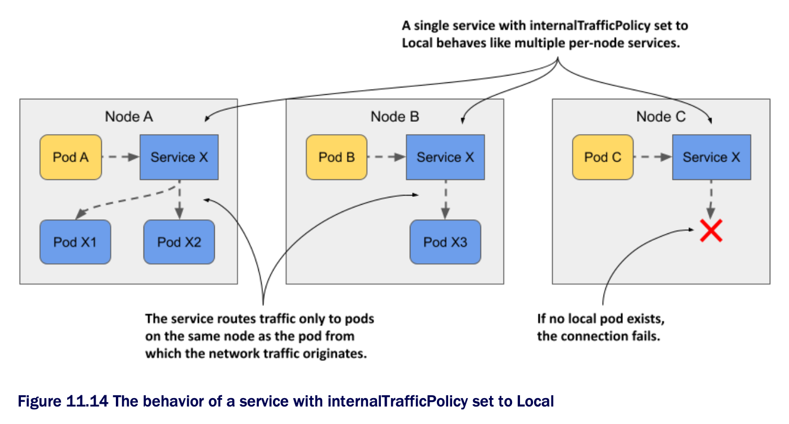

# Forwarding traffic only within the same node w/ internalTrafficPolicy

* If pods provide a service that's tied in some way to the node on which the pod is running, you must ensure that client pods running on a particular node ocnnect only to the endpoints on the same node

  * You can do this by creating a service w/ the `internalTrafficPolicy` set to Local

> [!NOTE]
> 
> You previously learned about the `externalTrafficPolicy` field, which is used to prevent unnecessary network hops between nodes when external traffic arrives in the cluster. The service's `internalTrafficPolicy` field is similar, but serves a different purpose.

* As shown in the following figure, if the service is configured w/ the `Local` traffic policy, traffic from pods on a given node is forwarded only to pods on the same node

  * If there are no node-local service endpoints, the connection fails



* Imagine a system pod running on each cluster node that manages communication w/ a device attached to the node

  * The pods don't use the device directly, but communicate w/ the system pod

  * Since pod IPs are fungible, while service IPs are stable, pods connect to the system pod through a Service

  * To ensure that pods connect only to the local system pod and not to those on other nodes, the service is configured to forward traffic only to local endpoints

  * You don't have any such pods in your cluster, but you can use the quote pods to try this feature

## Creating a service w/ a local internal traffic policy

* The following listing shows the manifest for a service named `quote-local`, which forwards traffic only to pods running on the same node as the client pod:

```yaml
apiVersion: v1
kind: Service
metadata:
  name: quote-local
spec:
  internalTrafficPolicy: Local  # ← A
  selector:
    app: quote
  ports:
  - name: http
    port: 80
    targetPort: 80
    protocol: TCP

# ← A ▶︎ This service forwards traffic from pods only to endpoints on the same node as the pod
```

* As you can see in the manifest, the service will forward traffic to all pods w/ the label `app: quote`, but since `internalTrafficPolicy` is set to `Local`, it won't forward traffic to all quote pods in the cluster, only to pods that are on the same node as the client pod

  * Create the service by applying the manifest w/ `kubectl apply`

## Observing node-local traffic routing

* Before you can see how the service routes traffic, you need to figure out when the client pods and the pods that are the endpoints of the service are located

  * List the pods w/ the `-o wide` option to see which node each pod is running on

* Select one of the `kiada` pods and note its cluster node

  * Use `curl` to connect to the `quote-local` service from that pod

  * For example, my `kiada-001` pod runs on the `kind-worker` node

  * If we run `curl` in it multiple times, all requests are handled by the quote pods on the same node:

```zsh
$ kubectl exec kiada-001 -c kiada -- sh -c "while :; do curl -s quote-local; done"
This is the quote service running in pod quote-002 on node kind-worker              # ← A
This is the quote service running in pod quote-canary on node kind-worker           # ← A
This is the quote service running in pod quote-canary on node kind-worker           # ← A
This is the quote service running in pod quote-002 on node kind-worker              # ← A

# ← A ▶︎ Both these pods run on the same node as the kiada-001 pod.
```

* No request is forwarded to the pods on the other node(s)

  * If we delete the two pods on the `kind-worker` node, the next connection attempt will fail:

```zsh
$ kubectl exec -it kiada-001 -c kiada -- curl http://quote-local
curl: (7) Failed to connect to quote-local port 80: Connection refused
```

* In this section, you learned how to forward traffic only to node-local endpoints when the semantics of the service require it

  * In other cases, you may want traffic to be forwarded preferentially to endpoints near the client pod, and only to more distant pods when needed
