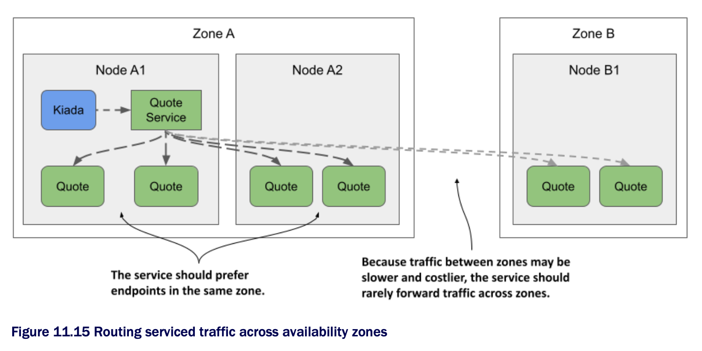

#  Topology-aware hints

* Imagine the Kiada suite running in a cluster w/ nodes spread across multiple data centers in different zones and regions, as shown in the following figure

  * You don't want a Kiada pod running in one zone to connect to Quote pods in another zone, unless there are no Quote pods in the local zone

  * Ideally, you want connections to be made within the same zone to reduce network traffic and associated costs



* What was just described and illustrated in the figure is called _topology-aware traffic routing_

  * K8s supports it by adding topology-aware hints to each endpoint in the EndpointSlice object

> [!NOTE]
> 
> As of this writing, topology-aware hints are an alpha-level feature, so this could still change or be removed in the future.

## Understanding how topology aware hints are calculated

* First all your cluster nodes must contain the `kubernetes.io/zone` label to indicate which zone each node is located in

  * To indicate that a service should use topology-aware hints, you must set the `service.kubernetes.io/topology-aware-hints` annotation to `Auto`

  * If the service has a sufficient number of endpoints, K8s adds the hints to each endpoint in the EndpointSlice object(s)

  * As you can see in the following listing, the `hints` field specifies the zones from which this endpoint is to be consumed | EndpointSlice w/ topology aware hints:

```yaml
apiVersion: discovery.k8s.io/v1
kind: EndpointSlice
endpoints:
- addresses:
  - 10.244.2.2
  conditions:
    ready: true
  hints:                                        # ← A
    forZones:                                   # ← A
      - name: zoneA                             # ← A
  nodeName: kind-worker
  targetRef:
    kind: Pod
    name: quote-002
    namespace: default
    resourceVersion: "944"
    uid: 03343161-971d-403c-89ae-9632e7cd0d8d
  zone: zoneA                                   # ← B
...

# ← A ▶︎ This endpoint should be consumed by clients running in zoneA.
# ← B ▶︎ This endpoint is located in zoneA.
```

* The listing shows only a single endpoint

  * The endpoint represents the pod `quote-002` running on node `kind-worker`, which is located in `zoneA`

  * For this reason, the `hints` for this endpoint indicate that it is to be consumed by pods in `zoneA`

  * In this particular case, only `zoneA` should use this endpoint, but the `forZones` array could contain multiple zones

* These hints are computed by the EndpointSlice controller, which is part of the K8s control plane

  * It assigns endpoints to each zone based on the number of CPU cores that can be allocated in the zone

  * If a zone has a higher number of CPU cores, it'll be assigned to a higher number of endpoints than a zone w/ fewer CPU cores

  * In most cases, the hints ensure that traffic is kept within a zone, but to ensure a more even distribution, this isn't always the case

## Understanding where topology aware hints are used

* Each node ensures that traffic sent to the service's cluster IP is forwarded to one of the service's endpoints

  * If there are no topology-aware hints in the EndpointSlice object, all endpoints, regardless of the node on which they reside, will receive traffic originating from a particular node

  * However, if all endpoints in the EndpointSlice object contain hints, each node processes only the endpoints that contain the node's zone in the hints and ignores the rest

  * Traffic originating from a pod on the node is therefore forwarded to only some endpoints

* Currently, you can't influence topology-aware routing except to turn it on or off, but that may change in the future
