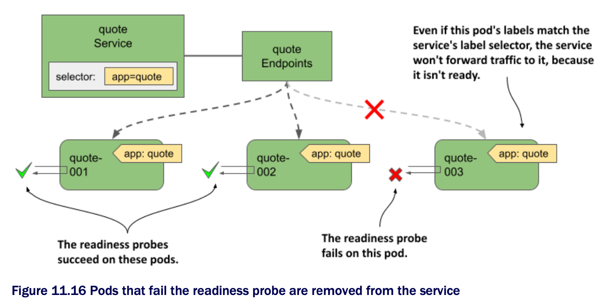
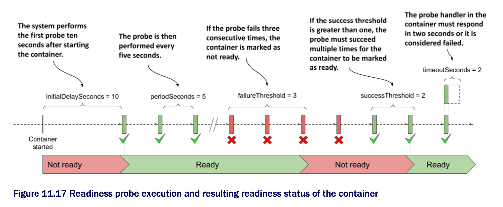

# Introducing readiness probes

* In chpt 6, you learned how to keep your applications healthy by letting K8s restart containers that fail their liveness probes

  * A similar mechanism called _readiness probes_ allows an application to signal that it's ready to accept connections

* Like liveness probes, the Kubelet also calls the readiness probe periodically to determine the readiness status of the pod

  * If the probe is successful, the pod is considered ready

  * The opposite is true if it fails

  * Unlike liveness probes, a container whose readiness probe fails isn't restarted; it's only removed as an endpoint from the services to which it belongs

* As you can see in the following figure, if a pod fails its readiness probe, the service doesn't forward connections to the pod even though its labels match the label selector defined in the service

* The notion of being ready is specific to each application

  * The application developer decides what readiness means in the context of their application

  * To do this, they expose an endpoint through which K8s asks the application whether it's ready or not

  * Depending on the type of endpoint, the correct readiness probe type must be used

## Understanding readiness probes

* As w/ liveness probes, K8s supports three types of readiness probes:

  1. An `exec` probe executes a process in the container

    * The exit code used to terminate the process determines whether the container is ready or not

  2. An `httpGet` probe sends a `GET` request to the container via HTTP or HTTPS

    * The response code determines the container's readiness status

  3. A `tcpSocket` probe opens a TCP connection to a specified port on the container

    * If the connection is established, the container is considered ready

## Configuring how often the probe is executed

* You may recall that you can configure when and how often the liveness probe runs for a given container using the following properties: `initialDelaySeconds`, `periodSeconds`, `failureThreshold`, and `timeoutSeconds`

  * These properties also apply to readiness probes, but they also support the additional `successThreshold` property, which specifies how many times the probe must succeed for the container to be considered ready

* These settings are best explained graphically

  * The following figure shows how the individual properties affect the execution of the readiness probe and the resulting readiness status of the container

> [!NOTE]
> 
> If the container defines a startup probe, the initial delay for the readiness probe begins when the startup probe succeeds. Startup probes are explained in chpt 6.

* When the container is ready, the pod becomes an endpoint of the services whose label selector it matches

  * When it's no longer ready, it's removed from those services
