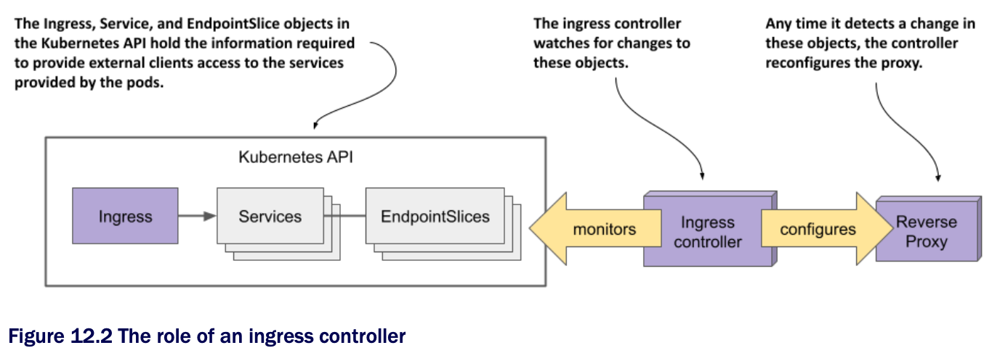
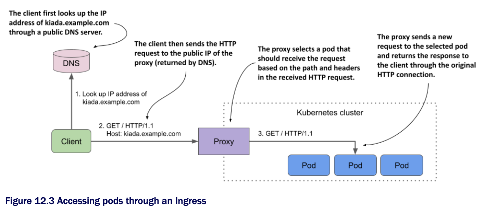

# Chapter 12. Exposing Services w/ Ingress

## Learning objectives

- [ ] Creating Ingress objects

- [ ] Deploying and understanding Ingress controllers

- [ ] Securing ingresses w/ TLS

- [ ] Adding additional configuration to an Ingress

- [ ] Using IngressClasses when multiple controllers are installed

- [ ] Using Ingresses w/ non-service backends

* In the previous chapter, you learned how to use the Service object to expose a group of pods at a stable IP address

  * If you use the LoadBalancer service type, the service is made available to clients outside the cluster through a load balancer

  * This approach is fine if you only need to expose a single service externally, but it becomes problematic w/ large numbers of services, since each service needs its own public IP address

* Fortunately, by exposing these services through an _Ingress_ object instead, you only need a single IP address

  * Additionally, the Ingress provides other features such as HTTP authentication, cookie-based session affinity, URL rewriting, and others that Service objects can't

## 12.1 Introducing Ingresses

> [!DEFINITION]
> 
> _Ingress_ (noun)-the act of going in or entering; the right to enter; a means or place of entering; entryway.

* In K8s, an Ingress is a way for external clients to access the services of applications running in the cluster

  * The Ingress function consists of the following three components:

    * The _Ingress API_ object, which is used to define and configure an ingress

    * An _L7 load balancer_ or _reverse proxy_ that routes traffic to the backend services

    * The _ingress controller_, which monitors the K8s API for Ingress objects and deploys and configures the load balancer or reverse proxy

> [!NOTE]
> 
> L4 and L7 refer to layer 4 (_Transport Layer; TCP, UDP_) and layer 7 (_Application Layer; HTTP_) of the Open Systems Interconnection Model (OSI Model).

> [!NOTE]
> 
> Unlike a forward proxy, which routes and filters outgoing traffic and is typically located in the same location as the clients it serves, a reverse proxy handles incoming traffic and routes it to one or more backend servers. A reverse proxy is located near those servers.

* In the most online context, the term _ingress controller_ is often used to refer to the load balancer/reverse proxy and the actual controller as one entity, but they're two different components

  * We refer to them separately in this chapter

* We also use the term _proxy_ for the L7 load balancer, so you don't confuse it w/ the L4 load balancer that handles the traffic for LoadBalancer-type services

### 12.1.1 Introducing the Ingress object kind

* When you want to expose a set of services externally, you create an Ingress object and reference the Service objects in it

  * K8s uses this Ingress object to configure an L7 load balancer (an HTTP reverse proxy) that makes the services accessible to external clients through a common entrypoint

> [!NOTE]
> 
> If you expose a Service through an Ingress, you can usually leave the Service `type` set to `ClusterIP`. However, some ingress implementations require the Service type to be `NodePort`. Refer to the ingress controller's documentation to see if this is the case.

#### Exposing services through an Ingress object

* While an Ingress object can be used to expose a single Service, it's typically used in combination w/ multiple Service objects, as shown in the following figure

  * The figure shows how a single Ingress object makes all three services in the Kiada suite accessible to external clients


* The Ingress object contains rules for routing traffic to the three services based on the information in the HTTP request

  * The public DNS entries for the services all point to the same Ingress

  * The Ingress determines which service should receive the request from the request itself

  * If the client request specifies the host `kiada.example.com`, the Ingress forwards it to the pods that belong to the `kiada` service, whereas requests that specify the host `api.example.com` are forwarded to the `quote` or `quiz` services, depending on which path is requested

#### Using multiple Ingress objects in a cluster

* An Ingress object typically handles traffic for all Service objects in a particular K8s namespace, but multiple Ingresses is also an option

  * Normally, each Ingress object gets its own IP address, but some ingress implementations use a shared entrypoint for all Ingress objects you create in the cluster

### 12.1.2 Introducing the Ingress controller and the reverse proxy

* Kubernetes clusters support for Ingresses is provided by a cluster add-on component called Ingress controller

  * This controller is the link between the Ingress object and the actual physical ingress (the reverse proxy)

  * Often the controller and the proxy run as two processes in the same container or as two containers in the same pod

    * That's why people use the term ingress controller to mean both

* Sometimes the controller or the proxy is located outside the cluster

  * For example, the Google K8s Engine provides its own Ingress controller that uses Google Cloud Platform's L7 load balancer to provide the Ingress functionality to the cluster

* If your cluster is deployed in multiple availability zones, a single ingress can handle traffic for all of them

  * It forwards each HTTP request to the best zone depending on where the client is located, for example

* There's a wide range of ingress controllers to choose from

  * The K8s community maintains a list at https://kubernetes.io/docs/concepts/services-networking/ingress- controllers/

  * Among the most popular are the Nginx ingress controller, Ambassador, Contour, and Traefik

  * Most of these ingress controllers us Nginx, HAProxy, or Envoy as the reverse proxy, but some use their own proxy implementation

#### Understanding the role of the Ingress Controller

* The ingress controller is the software component that brings the Ingress object to life

  * As shown in the following figure, the controller connects to the K8s API server and monitors the Ingress, Service, and Endpoints or EndpointSlice objects

  * Whenever you create, modify, or delete these objects, the controller is notified

  * It uses the information in these objects to provision and configure the reverse proxy for the ingress, as shown in the following figure:



* When you create the Ingress object, the controller reads its `spec` section and combines it w/ the information in the Service and EndpointSlice objects it references

  * The controller converts this information into the configuration for the reverse proxy

  * It then sets up a new proxy w/ this configuration and performs additional steps to ensure that the proxy is reachable from outside the cluster

  * If the proxy is running in a pod inside the cluster, this usually means that a `LoadBalancer` type service is created to expose the proxy externally

* When you make changes to the Ingress object, the controller updates the configuration of the proxy, and when you delete it, the controller stops and removes the proxy and any other objects it created alongside it

#### Understanding how the proxy forwards traffic to the services

* The reverse proxy (or L7 load balancer) is the component that handles incoming HTTP requests and forwards it to the services

  * The proxy configuration typically contains a list of virtual hosts and, for each, a list of endpoint IPs

  * This information is obtained from the Ingress, Service, and Endpoints/EndpointSlice objects

  * When clients connect to the proxy, the proxy uses his information to route the request to an endpoint such as a pod based on the request path and headers

* The following figure shows how a client accesses the Kiada service through the proxy

  * The client first performs a DNS lookup of `kiada.example.com`

  * The DNS server returns the public IP address of the reverse proxy

  * Then the client sends an HTTP request to the proxy where the `Host` header contains the value `kiada.example.com`

  * The proxy maps this host to the IP address of one of the Kiada pods and forwards the HTTP request to it

  * Note that the proxy doesn't send the request to the service IP, but directly to the pod

  * This is how most ingress implementations work



## 12.1.3 Installing an ingress controller

* Before you start creating Ingresses, you need to make sure that an ingress controller runs in your cluster

  * As you learned in the previous section, not all K8s clusters have one

* If you're using a managed cluster w/ one of the major cloud providers, an ingress controller is already in place

  * In Google K8s Engine, the ingress controller is GLBC (GCE L7 Load Balancer), in AWS the Ingress functionality is provided by the AWS Load Balancer Controller, while Azure provides AGIC (Application Gateway Ingress Controller)

  * Check your cloud provider's documentation to see if an ingress controller is provided and whether you need to enable it

  * Alternatively, you can install the ingress controller yourself

* As you already know, there are many different ingress implementations to choose from

  * They all provide the type of traffic routing explained in the previous section, but each provides different additional features

  * In all the examples in this chapter, we used the Nginx ingress controller

  * We suggest that you use it as well unless your cluster provides a different one

  * To install the Nginx ingress controller in your cluster, see the sibar

> [!NOTE]
> 
> There are two implementations of the Nginx ingress controller. One is provided by the K8s maintainers and the other is provided by the authors of Nginx itself. If you're new to K8s, you should start w/ the former. That's the one we used.

> #### Installing the Nginx ingress controller
> 
> Regardless of how you run your K8s cluster, you should be able to install the Nginx ingress controller by following the instructions at https://kubernetes.github.io/ingress-nginx/deploy/.
>
> If you created your cluster using the kind tool, you can install the controller by running the following command:
> 
>   ```zsh
>   $ kubectl apply -f https://raw.githubusercontent.com/kubernetes/ingress-
>   nginx/main/deploy/static/provider/kind/deploy.yaml
>   ```
> 
> If you run your cluster w/ Minikube, you can install the controller as follows:
> 
> 
>   ```zsh
>   $ minikube addons enable ingress
>   ```

## 12.2 [Creating and using Ingress objects](create-ingress-objects/README.md)

## 12.3 [Configuring TLS for an Ingress](ingress-tls/README.md)

## 12.4 [Additional Ingress configuration options](additional-ingress-configuration-options/README.md)

## 12.5 [Using multiple ingress controllers](use-multiple-ingress-controllers/README.md)

## 12.6 [Using custom resources instead of services as backends](use-custom-resources-as-backends/README.md)

## Learning summary

* In this chpt, you learned how to create Ingress objects to make one or more services accessible to external clients. You learned that:

  * An Ingress controller configures an L7 load balancer or reverse proxy based on the configuration in the Ingress object.

  * While a Service is an abstraction over a set of Pods, an ingress is an abstraction over a set of Services.

  * An Ingress requires a single public IP regardless of the number of services it exposes, whereas each LoadBalancer service requires its own public IP

  * External clients must resolve the hostnames specified in the Ingress object to the IP address of the ingress proxy

    * To accomplish this, you must add the necessary records to the DNS server responsible for the domain to which the host belongs

    * Alternatively, for development purposes, you can modify the `/etc/hosts` file on your local machine

  * An Ingress operates ay Layer 7 of the OSI model and can therefore provide HTTP-related functionality that Services operating at Layer 4 cannot

  * An Ingress proxy usually forwards HTTP requests directly to the backend pod w/o going through the service IP, but this depends on the ingress implementation

  * The Ingress object contains rules that specify to which service the HTTP request received by the ingress proxy should be forwarded based on the host and path in the request

    * Each rule can specify an exact host or one w/ a wildcard and either an exact path or path prefix

  * The default backend is a catch-all rule that determines which service should handle requests that don't match any rule

  * An Ingress can be configured to expose services over TLS

    * The Ingress proxy can terminate the TLS connection and forward the HTTP request to the backend pod unencrypted

    * Some ingress implementations support TLS passthrough

  * Ingress configuration options that are specific to a particular ingress implementation are set via annotations of the Ingress object or through custom K8s object kinds that the controller provides

  * A K8s cluster can run multiple ingress controller implementations simultaneously

    * When you create an Ingress object, you specify the IngressClass
  
    * The IngressClass object specifies which controller should process the Ingress object

    * Optionally, the IngressClass can also specify parameters for the controller

* You now understand how to expose groupd of pods both internally and externally

  * In the next chpt, you'll learn how to manage these pods as a unit and replicate them via a Deployment object
