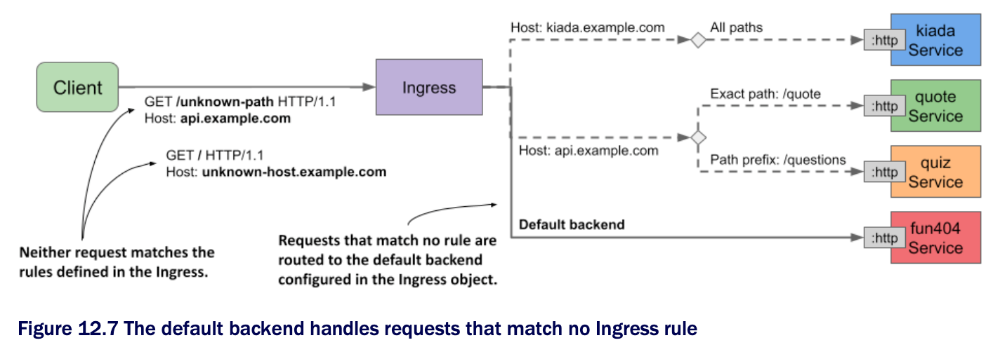

# Setting the default backend

* If the client request doesn't match any rules defined in the Ingress object, the response `404 Not Found` is normally returned

  * However, you can also define a default backend to which the ingress should forward the request if no rules are attached

  * The default backend serves as a catch-all rule

* The following figure shows the default backend in the context of the other rules in the Ingress object



* As you can see in the figure, a service named `fun404` is used as the default backend

  * Let's add it to the `kiada` Ingress object

## Specifying the default backend in an Ingress object

* You specify the default backend in the `spec.defaultBackend` field, as shown in the following listing ([`ing.kiada.defaultBackend.yaml`](ing.kiada.defaultBackend.yaml)) | **Specifying the default backend in the Ingress object:**

```yaml
apiVersion: networking.k8s.io/v1
kind: Ingress
metadata:
  name: kiada
spec:
  defaultBackend:                   # ← A
    service:                        # ← A
      name: fun404                  # ← A
      port:                         # ← A
        name: http                  # ← A
  rules:
  ...

# ← A ▶︎ The request is forwarded to the default backend if it doesn't match any rules.
```

* In the listing, you can see that setting the default backend isn't much different from setting the backend in the rules

  * Just as you specify the name and port of the backend service in each rule, you also specify the `name` and `port` of the default backend service in the `service` field under `spec.defaultBackend`

## Creating the service and pod for the default backend

* The `kiada` Ingress object is configured to forward requests that don't match any rules to a service called `fun404`

  * You need to create this service and the underlying pod

  * You can find an object manifest w/ both object definitions in the file [`all.my-default-backend.yaml`](all.fun404.yaml)

  * **The pod and Service object manifests for the default ingress backend:**

```yaml
apiVersion: v1
kind: Pod
metadata:
  name: fun404                                        # ← A
  labels:
    app: fun404                                       # ← B
spec:
  containers:
  - name: server
    image: luksa/static-http-server                   # ← C
    args:                                             # ← D
    - --listen-port=8080                              # ← D
    - --response-code=404                             # ← D
    - --text=This isn't the URL you're looking for.   # ← D
    ports:
    - name: http                                      # ← E
      containerPort: 8080                             # ← E
---
apiVersion: v1
kind: Service
metadata:
  name: fun404                                        # ← F
  labels:
    app: fun404
spec:
  selector:                                           # ← G
    app: fun404
  ports:
  - name: http                                        # ← H
    port: 80                                          # ← H
    targetPort: http                                  # ← I
#G
#H #H

# ← A ▶︎ The Pod's name is fun404.
# ← B ▶︎ This label must match the Service object's label selector.
# ← C ▶︎ The container runs an HTTP server that always returns the same response.
# ← D ▶︎ The HTTP response is configured via command-line arguments.
# ← E ▶︎ The container listens on port 8080.
# ← F ▶︎ The Service is also called fun404.
# ← G ▶︎ The label selector defines the pods that belong to this service.
# ← H ▶︎ The service port name is http. The port number is 80.
# ← I ▶︎ The service forwards connections to the port named http on the pod.
```

* After applying both the Ingress object manifest and the Pod and Service object manifest, you can test the default backend by sending a request that doesn't match any of the rules in the ingress

  * For example:

```zsh
$ curl api.example.com/unknown-path --resolve api.example.com:80:11.22.33.44  # ← A
This isn't the URL you're looking for.                                        # ← B

# ← A ▶︎ This request doesn't match any host/path combinations in the Ingress object.
# ← B ▶︎ This response came from the fun404 pod.
```

* As expected, the response text matches what you configured in the `fun404` pod

  * Of course, instead of using the default backend to return a custom `404` status, you can use it to forward all requests to default to a service of your choice

* You can even create an Ingress object w/ only a default backend and no rules to forward all external traffic to a single service

  * If you're wondering why you'd do this using an Ingress object and not by simply setting the service type to LoadBalancer, it's b/c ingresses can provide additional HTTP features that services can't

  * One example is securing the communication between the client and the service w/ Transport Layer Security (TLS), which is explained next
