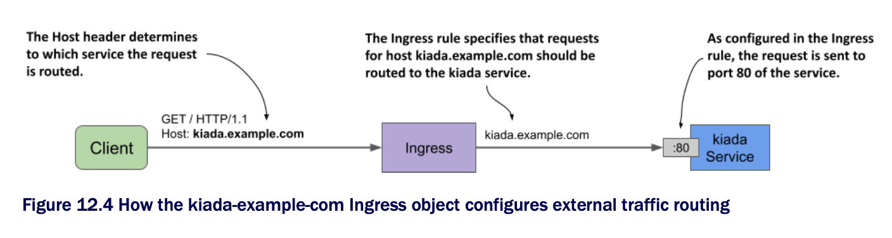

# Exposing a service through an Ingress

* An Ingress object references one or more Service objects

  * Your first Ingress object exposes the `kiada` service, which you created in the previous chapter

  * Before you create the Ingress, refresh your memory by looking at the service manifest in the following listing | The kiada service manifest:

```yaml
apiVersion: v1
kind: Service
metadata:
  name: kiada           # ← A
spec:
  type: ClusterIP       # ← B
  selector:
    app: kiada
  ports:
  - name: http          # ← C
    port: 80            # ← C
    targetPort: 8080    # ← C
  - name: https
    port: 443
    targetPort: 8443

# ← A ▶︎ Note the service name, as the Ingress object will reference the service by name.
# ← B ▶︎ This is a ClusterIP service, so it's only accessible from within the cluster.
# ← C ▶︎ The Ingress will expose port 80 of this service. Connections accepted on this port are forwarded to port 8080 of the matching pods.
```

* The Service type is `ClusterIP` b/c the service itself doesn't need to be directly accessible to clients outside the cluster, since the Ingress will take care of that

  * Although the service exposes ports `80` and `443`, the Ingress will forward traffic to port `80`

## Creating the Ingress object

* The Ingress object manifest is shown in the following listing

  * You can find it in the file [`ing.kiada-example-com.yaml`] | An Ingress object exposing the kiada service at kiada.example.com:

```yaml
apiVersion: networking.k8s.io/v1
kind: Ingress
metadata:
  name: kiada-example-com           # ← A
spec:
  rules:
    - host: kiada.example.com       # ← B
      http:
        paths:
          - path: /                 # ← C
            pathType: Prefix        # ← C
            backend:                # ← D
              service:              # ← D
                name: kiada         # ← D
                port:               # ← D
                  number: 80        # ← D

# ← A ▶︎ Although the name of this object matches the host, it doesn't have to. You can name the object whatever you want.
# ← B ▶︎ This Ingress rule matches all HTTP requests where the Host header is set to kiada.example.com.
# ← C ▶︎ The rule matches all requests, regardless of the the path in the request.
# ← D ▶︎ The requests are forwarded to port 80 of the kiada service.
```

* The manifest in the listing defines an Ingress object named `kiada-example-com`

  * While you can give the object any name you want, it's recommended that the name reflect the host and/or path(s) specified in the ingress rules

> [!WARNING]
> 
> In Google K8s Engine, the Ingress name mustn't contain dots, otherwise the following error message will be displayed in the events associated w/ the Ingress object: `Error syncing to GCP: error running load balancer syncing routine: invalid loadbalancer name.`

* The Ingress object in the listing defines a single rule

  * The rule states that all requests for the host `kiada.example.com` should be forwarded to port `80` of the `kiada` service, regardless of the requested path (as indicated by the `path` and `pathType` fields)

  * This is illustrated in the following figure:



## Inspecting an Ingress object to get its public IP address

* After creating the Ingress object w/ `kubectl apply`, you can see its basic information by listing Ingress objects in the current namespace w/ `kubectl get ingresses` as follows:

```zsh
$ kubectl get ingresses
NAME                CLASS   HOSTS               ADDRESS       PORTS   AGE
kiada-example-com   nginx   kiada.example.com   11.22.33.44   80      30s
```

> [!NOTE]
> 
> You can use `ing` as a shorthand for `ingress`.

* To see the Ingress object in detail, use the `kubectl describe` command as follows:

```zsh
$ kubectl describe ing kiada-example-com

Name:             kiada-example-com                                                 # ← A
Namespace:        default                                                           # ← A
Address:          11.22.33.44                                                       # ← B
Default backend: default-http-backend:80 (172.17.0.15:8080)                         # ← C
Rules:                                                                              # ← D
  Host                Path Backends                                                 # ← D
  ----                ---- --------                                                 # ← D
  kiada.example.com                                                                 # ← D
                      / kiada:80 (172.17.0.4:8080,172.17.0.5:8080,172.17.0.9:8080)  # ← D
Annotations:          <none>
Events:
  Type    Reason  Age                   From                        Message
  ----    ------  ----                  ----                        -------
  Normal  Sync    5m6s (x2 over 5m28s)  nginx-ingress-controller    Scheduled for sync
  
# ← A ▶︎ The name and namespace of the Ingress object.
# ← B ▶︎ The IP address of the load balancer that handles requests for the ingress.
# ← C ▶︎ If the request doesn't match any rules, it's forwarded to this service. Explained in section 12.2.4.
# ← D ▶︎ For each rule, the host, path, target service, and its endpoints are displayed.
```

* As you can see, the `kubectl describe` command lists all the rules in the Ingress object

  * For each rule, not only is the name of the target service shown, but also its endpoints

  * If you see an error message related to the default backend, ignore it for now; you'll fix it later

* Both `kubectl get` and `kubectl describe` display the IP address of the ingress

  * This is the IP address of the L7 load balancer or reverse proxy to which clients should send requests

  * In the example output, the IP address is `11.22.33.44` and the port is `80`

> [!NOTE]
> 
> The address may not be displayed immediately. This is very common when the cluster is running in the cloud. If the address isn't displayed after several minutes, it means that no Ingress controller has processed the Ingress object. Check if the controller is running. Since a cluster can run multiple ingress controllers, it's possible that they'll ignore your ingress object if you don't specify which of them should process it. Check the documentation of your chosen ingress controller to find out if you need to add the `kubernetes.io/ingress.class` annotation or set the `spec.ingressClassName` field in the ingress object. You'll learn more about this field later.

* You can also find the IP address in the Ingress object's `status` field as follows:

```zsh
$ kubectl get ing kiada -o yaml
...
status:
  loadBalancer:
    ingress:
    - ip: 11.22.33.44           # ← A

# ← A ▶︎ The address of the ingress is either a hostname or an IP address.
```

> [!NOTE]
> 
> Sometimes the displayed address can be misleading. For example, if you use Minikube and start the cluster in a VM, the ingress address will show up as `localhost`, but that's only true from the VM's perspective. The actual ingress address is the IP address of the VM, which you can get w/ the `minikube ip` command.

## Adding the Ingress IP to the DNS

* After you add an Ingress to a production cluster, the next step is to add a record to your Internet domain's DNS server

  * In these examples, we assume that you own the domain `example.com`

  * To allow external clients to access your service through the ingress, you configure the DNS server to resolve the domain name `kiada.example.com` to the ingress IP `11.22.33.44`

* In a local development cluster, you don't have to deal w/ DNS servers

  * Since you're only accessing the service from your own computer, you can get it to resolve the address by other means

## Accessing services through the Ingress

* Since ingresses use virtual hosting to figure out where to forward the request, you won't get the desired result by simply sending an HTTP request to the Ingress' IP address and port

  * You need to make sure that the `Host` header in the HTTP request matches one of the rules in the Ingress object

* To achieve this, you must tell the HTTP client to send the request to the host `kiada.example.com`

  * However, this requires resolving the host to the Ingress IP

  * If you use `curl`, you can do this w/o having to configure your DNS server or your local `/etc/hosts` file

  * Let's take `11.22.33.44` as the ingress IP

  * You can access the `kiada` service through the ingress w/ the following command:

```zsh
$ curl --resolve kiada.example.com:80:11.22.33.44 http://kiada.example.com -v
* Added kiada.example.com:80:11.22.33.44 to DNS cache                           # ← A
* Hostname kiada.example.com was found in DNS cache                             # ← B
* Trying 11.22.33.44:80...                                                      # ← B
* Connected to kiada.example.com (11.22.33.44) port 80 (#0)                     # ← B
> GET / HTTP/1.1
> Host: kiada.example.com                                                       # ← C
> User-Agent: curl/7.76.1
> Accept: */*
...

# ← A ▶︎ The --resolve option adds the hostname to the DNS cache.
# ← B ▶︎ Curl connects to the IP address of the ingress.
# ← C ▶︎ The Host header allows the ingress to forward the request to the correct service.
```

* The `--resolve` option adds the hostname `kiada.example.com` to the DNS cache

  * This ensures that `kiada.example.com` resolves to the ingress IP

  * Curl then open the connection to the ingress and sends the HTTP request

  * The `Host` header in the request is set to `kiada.example.com` and this allows the ingress to forward the request to the correct service.

* Of course, if you want to use your web browser instead, you can't use the `--resolve` option

  * Instead, you can add the following entry to your `/etc/hosts` file

```zsh
11.22.33.44 kiada.example.com   # ← A

# ← A ▶︎ Replace 11.22.33.44 with your ingress IP address.
```

* You can now access the service at http://kiada.example.com w/ your web browser or `curl` w/o having to use the `--resolve` option to map the hostname to the IP
