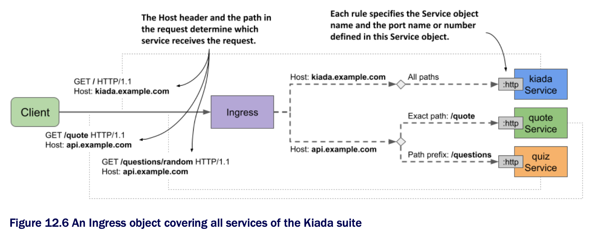

# Using multiple rules in an Ingress object

* In the previous sections you created two Ingress objects to access the Kiada suite services

  * In most Ingress implementations, each Ingress object requires its own public Ip address, so you're now probably using two public IP addresses

  * Since this is potentially costly, it's better to consolidate the Ingress objects into one

## Creating an Ingress object w/ multiple rules

* B/c an Ingress object can contain multiple rules, it's trivial to combine multiple objects into one

  * All you have to do is take the rules and put them into the same Ingress object, as shown in the following listing ([`ing.kiada.yaml`](ing.kiada.yaml)) | Ingress exposing multiple services on different hosts:

```yaml
apiVersion: networking.k8s.io/v1
kind: Ingress
metadata:
  name: kiada
spec:
  rules:
  - host: kiada.example.com       # ← A
    http:                         # ← A
      paths:                      # ← A
      - path: /                   # ← A
        pathType: Prefix          # ← A
        backend:                  # ← A
          service:                # ← A
            name: kiada           # ← A
            port:                 # ← A
              name: http          # ← A
  - host: api.example.com         # ← B
    http:                         # ← B
      paths:                      # ← B
      - path: /quote              # ← B
        pathType: Exact           # ← B
        backend:                  # ← B
          service:                # ← B
            name: quote           # ← B
            port:                 # ← B
              name: http          # ← B
      - path: /questions          # ← B
        pathType: Prefix          # ← B
        backend:                  # ← B
          service:                # ← B
            name: quiz            # ← B
            port:                 # ← B
              name: http          # ← B

# ← A ▶︎ The first rule matches the host kiada.example.com. This rule was copied from the kiada-example-com Ingress object.
# ← B ▶︎ The second rule matches the host api.example.com. It was copied from api-example-com Ingress object.
```

* This single Ingress object handles all traffic for all services in the Kiada suite yet only requires a single public IP address

* The Ingress object uses virtual hosts to route traffic to the backend services

  * If the value of the `Host` header in the request is `kiada.example.com`, the request is forwarded to the `kiada` service

  * If the header values is `api.example.com`, the request is routed to one of the other two services, depending on the requested path

  * The Ingress and the associated Service objects are shown in the next figure:



* You can delete the two Ingress objects you created earlier and replace them w/ the one in the previous listing

  * Then you can try to access all three services through this ingress

  * Since this is a new Ingress object, its IP address is most likely not the same as before

  * So you need to update the DNS, the `/etc/hosts` file, or the `--resolve` option when you run the `curl` command again

## Using wildcards in the Host field

* The `host` field in the ingress rules supports the use of wildcards

  * This allows you to capture all requests sent to a host that matches `*.example.com` and forward them to your services

  * Examples of using wildcards in the ingress rule's host field:

| **Host**            | **Matches request hosts**                                     | **Doesn't match**                                             |
|---------------------|---------------------------------------------------------------|---------------------------------------------------------------|
| `kiada.example.com` | `kiada.example.com`                                           | `example.com`<br>`api.example.com`<br>`foo.kiada.example.com` |
| `*.example.com`     | `kiada.example.com`<br>`api.example.com`<br>`foo.example.com` | `example.com`<br>`foo.kiada.example.com`                      |

* Look at the example w/ the wildcard

  * As you can see, `*.example.com` matches `kiada.example.com`, but it doesn't match `foo.kiada.example.com`

  * This is b/c a wildcard only covers a single element of the DNS name

* As w/ rule paths, a rule that exactly matches the host in the request takes precedence over rules w/ host wildcards

> [!NOTE]
> 
> You can also omit the `host` field altogether to make the rule match any host.
