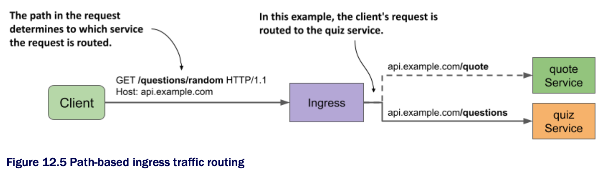

# Path-based ingress traffic routing

* An Ingress object can contain many rules and therefore map multiple hosts and paths to multiple services

  * You've already created an Ingress for the `kiada` service

  * Now, you'll create one for the `quote` and `quiz` services

* The Ingress object for these two services makes them available through the same host: `api.example.com`

  * The path in the HTTP request determines which service receives each request

  * As you can see in the following figure, all requests w/ the path `/quote` are forwarded to the `quote` service, and all requests whose path starts w/ `/questions` are forwarded to the `quiz` service



* The following listing shows the Ingress manifest | Ingress mapping request paths to different services:

```yaml
apiVersion: networking.k8s.io/v1
kind: Ingress
metadata:
  name: api-example-com
spec:
  rules:
  - host: api.example.com         # ← A
    http:
      paths:
      - path: /quote              # ← B
        pathType: Exact           # ← B
        backend:                  # ← B
          service:                # ← B
            name: quote           # ← B
            port:                 # ← B
              name: http          # ← B
      - path: /questions
      - pathType: Prefix
        backend:                  # ← C
          service:                # ← C
            name: quiz            # ← C
            port:                 # ← C
              name: http          # ← C

# ← A ▶︎ Both services are exposed through the host api.example.com.
# ← B ▶︎ Requests w/ the path /quote are forwarded to the quote service.
# ← C ▶︎ Requests whose path starts w/ /questions are forwarded to the quiz service.
```

* In the Ingress object shown in the listing, a single rule w/ two paths is defined

  * The rule matches HTTP requests w/ the host `api.example.com`

  * In this rule, the `paths` array contains two entries

  * The first matches requests that ask for the `/quote` path and forwards them to the port named `http` in the `quote` Service object

  * The second entry matches all requests whose first path element is `/questions` and forwards them to the port `http` of the `quiz` service

> [!NOTE]
> 
> By default, no URL rewriting is performed by the ingress proxy. If the client requests the path `/quote` the path in the request that the proxy makes to the backend service is also `/quote`. In some Ingress implementations, you can change this by specifying a URL rewrite rule in the Ingress object.

* After you create the Ingress object from the manifest in the previous listing, you can access the two services it exposes as follows (replace the IP w/ that of your ingress):

```zsh
$ curl --resolve api.example.com:80:11.22.33.44 api.example.com/quote               # ← A
$ curl --resolve api.example.com:80:11.22.33.44 api.example.com/questions/random    # ← B

# ← A ▶︎ Calls the quote service.
# ← B ▶︎ Calls the quiz service.
```

* If you want to access these services w/ your web browser, add `api.example.com` to the line you added earlier to your `/etc/hosts` file

  * It should now look like this:

```zsh
11.22.33.44 kiada.example.com api.example.com   # ← A

# ← A ▶︎ Replace 11.22.33.44 w/ your ingress IP address.
```

## Understanding how the path is matched

* Did you notice the difference between the `pathType` fields in the two entries in the previous listing?

  * The `pathType` field specifies how the path in the request is matched w/ the paths in the ingress rule

  * The three supported values are summarized in the following table | **Supported values in the pathType field:**

| **PathType**             | **Description**                                                                              |
|--------------------------|----------------------------------------------------------------------------------------------|
| `Exact`                  | The requested URL path must exactly match the path specified in the ingress rule.            |
| `Prefix`                 | The requested path must begin w/ the path specified in the ingress rule, element by element. |
| `ImplementationSpecific` | Path matching depends on the implementation of the ingress controller.                       |

* If multiple paths are specified in the ingress rule and the path in the request matches more that one path in the rule, priority is given to paths w/ the `Exact` path type

## Matching paths using the Exact path type

* The following table shows examples of how matching works when `pathType` is set to `Exact` | **Request paths matched when pathType is Exact:**

| **Path in rule** | **Matches request path** | **Doesn't match**              |
|------------------|--------------------------|--------------------------------|
| `/`              | `/`                      | `/foo`<br>`/bar`               |
| `/foo`           | `/foo`                   | `/foo/`<br>`/bar`              |
| `/foo/`          | `/foo/`                  | `/foo`<br>`/foo/bar`<br>`/bar` |
| `/FOO`           | `/FOO`                   | `/foo`                         |

* As you can see from the examples in the table, the matching works as you'd expect

  * It's case-sensitive, and the path in the request must exactly match the `path` specified in the ingress rule

## Matching paths using the Prefix path type

* When `pathType` is set to `Prefix`, things aren't as you might expect

  * **Request paths matched when pathType is Prefix:**

| **Path in rule** | **Matches request path**                                | **Doesn't match**   |
|------------------|---------------------------------------------------------|---------------------|
| `/`              | **All paths; for example:**<br>`/`<br>`/foo`<br>`/foo/` |                     |
| `/foo`           | `/foo`<br>`/foo/`<br>`/foo/bar`                         | `/foobar`<br>`/bar` |
| `/FOO`           | `/FOO`                                                  | `/foo`              |

* The request path isn't treated as a string and checked to see if it begins w/ the specified prefix

  * Instead, both the path in the rule and the request path are split by `/` and then each element of the request path is compared to the corresponding element of the prefix

  * Take the path `/foo`, for example-it matches the request path `/foo/bar`, but not `/foobar`

    * It also doesn't match the request path `/fooxyz/bar`

* When matching, it doesn't matter if the path in the rule or the one in the request ends w/ a forward slash

  * As w/ the `Exact` path type, matching is case sensitive

## Matching paths using the ImplementationSpecific path type

* The `ImplementationSpecific` path type is, as the name implies, dependent on the implementation of the ingress controller

  * W/ this path type, each controller can set its own rules for matching the request path

  * For example, in GKE you can use wildcards in the path

  * Instead of using the `Prefix` type and setting the path to `/foo`, you can set the type to `ImplementationSpecific` and the path to `/foo/*`
