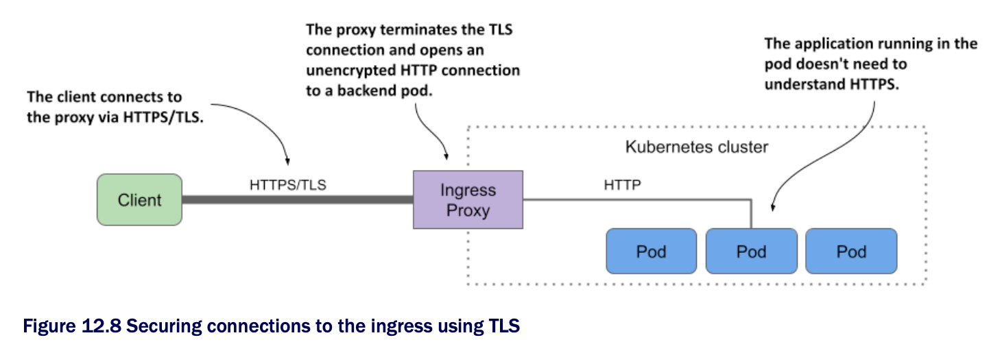

# Terminating TLS at the ingress

* Most, if not all, ingress controller implementations support TLS termination at the ingress proxy

  * The proxy terminates the TLS connection between the client and itself and forwards the HTTP request unencrypted to the backend pod, as shown in the next figure:



* To terminate the TLS connection, the proxy needs a TLS certificate and a private key

  * You provide them via a Secret that you reference in the Ingress object

## Creating a TLS secret for the Ingress

* For the `kiada` Ingress, you can either create the Secret from the manifest file [`secret.tls-example-com.yaml`](secret.tls-example-com.yaml) or generate the private key, certificate, and Secret w/ the following commands:

```zsh
$ openssl req -x509 -newkey rsa:4096 -keyout example.key -out example.crt \       # ← A
  -sha256 -days 7300 -nodes \                                                     # ← A
  -subj '/CN=*.example.com' \                                                     # ← A
  -addext 'subjectAltName = DNS:*.example.com'                                    # ← A

$ kubectl create secret tls tls-example-com --cert=example.crt --key=example.key  # ← B
secret/tls-example-com created                                                    # ← B

# ← A ▶︎ Generates the private key and certificate.
# ← B ▶︎ Creates the secret from the key and certificate.
```

* The certificate and the private key are now stored in a Secret named `tls-example-com` under the keys `tls.crt` and `tls.key`, respectively

## Adding the TLS Secret to the Ingress

* To add the Secret to the Ingress object, either edit the object w/ `kubectl edit` and add the lines highlighted in the next listing or apply the [`ing.kiada.tls.yaml`](ing.kiada.tls.yaml) file w/ `kubectl apply` | Adding a TLS secret to an Ingress:

```yaml
on: networking.k8s.io/v1
kind: Ingress
metadata:
  name: kiada
spec:
  tls:                            # ← A
  - secretName: tls-example-com   # ← B
    hosts:                        # ← C
    - "*.example.com"             # ← C
  rules: 
  ...

# ← A ▶︎ The TLS field is an array, so you can add multiple TLS secrets to the Ingress.
# ← B ▶︎ The name of the secret containing the TLS certificate and private key.
# ← C ▶︎ The list of hosts contained in the TLS certificate.
```

* As you can see in the listing, the `tls` field can contain one or more entries

  * Each entry specifies the `secretName` where the TLS certificate/key pair is stored and a list of `hosts` to which the pair applies

> [!WARNING]
> 
> The hosts specified in `tls.hosts` must match the names used in the certificate in the secret.

## Accessing the Ingress through TLS

* After you update the Ingress object, you can access the service via HTTPS as follows:

```zsh
$ curl https://kiada.example.com --resolve kiada.example.com:443:11.22.33.44 -k -v
* Added kiada.example.com:443:11.22.33.44 to DNS cache
* Hostname kiada.example.com was found in DNS cache
* Trying 11.22.33.44:443...
* Connected to kiada.example.com (11.22.33.44) port 443 (#0) ...
* Server certificate:                                                                   # ← A
* subject: CN=*.example.com                                                             # ← A
* start date: Dec 5 09:48:10 2021 GMT                                                   # ← A
* expire date: Nov 30 09:48:10 2041 GMT                                                 # ← A
* issuer: CN=*.example.com                                                              # ← A
...
> GET / HTTP/2
> Host: kiada.example.com
...

# ← A ▶︎ The ingress uses the TLS certificate that you configured in the Ingress object.
```

* The command's output shows that the server certificate matches the one you configured the Ingress w/

* By adding the TLS secret to the Ingress, you've not only secured the `kiada` service, but also the `quote` and `quiz` services, since they're all included in the Ingress object

  * Try to access them through the Ingress using HTTPS

  * Remember that the pods that provide these two services don't provide HTTPS themselves

  * The Ingress does that for them
