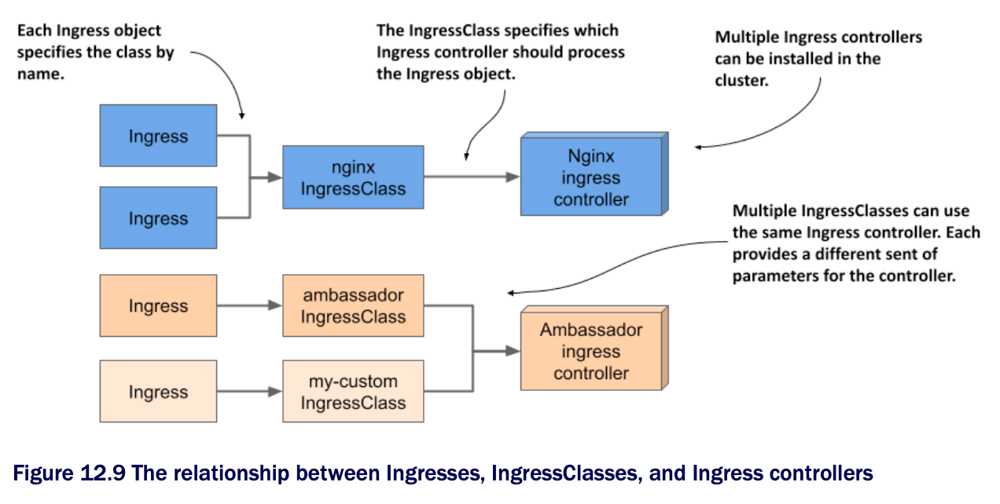

# Using multiple ingress controllers

* Since different ingress implementations provide different additional functionality, you may want to install multiple ingress controllers in a cluster

  * In this case, each Ingress object needs to indicate which ingress controller should process it

* To specify the controller, use IngressClass objects

  * One or more IngressClass objects are usually created when you install an Ingress controller

* When you create an Ingress object, you specify the ingress class by specifying the name of the IngressClass object in the Ingress object's `spec` field

  * Each IngressClass specifies the name of the controller and optional parameters

  * Thus, the class you reference in your Ingress object determines which ingress proxy is provisioned and how it's configured

  * As you can see in the next figure, different Ingress objects can reference different IngressClasses which in turn reference different ingress controllers



## 12.5.1 Introducing the IngressClass object kind

* If the Nginx ingress controller is running in your cluster, an IngressClass object named `nginx` was created when you installed the controller

  * If other ingress controllers are deployed in your cluster, you may also find other IngressClasses

### Finding IngressClasses in your cluster

* To see which ingress classes your cluster offers, you can list them w/ `kubectl get`:

```zsh
$ kubectl get ingressclasses
NAME    CONTROLLER            PARAMETERS  AGE
nginx   k8s.io/ingress-nginx  <none>      10h   # ← A

# ← A ▶︎ The IngressClass specifies the ingress controller and parameters passed to it.
```

* The output of the command shows that a single IngressClass named `nginx` exists in the cluster

  * Ingresses that use this class are processed by the `k8s.io/ingress-nginx` controller

  * You can also see that this class doesn't specify any controller parameters

### Inspecting the YAML manifest of an IngressClass object

* Let's take a closer look at the `nginx` IngressClass object by examining its YAML definition:

```zsh
$ kubectl get ingressclasses nginx -o yaml
apiVersion: networking.k8s.io/v1            # ← A
kind: IngressClass                          # ← A
metadata:
  name: nginx                               # ← B
spec:
  controller: k8s.io/ingress-nginx          # ← C

# ← A ▶︎ IngressClass objects belong to this API group and version.
# ← B ▶︎ The class name.
# ← C ▶︎ The controller that should process ingresses of this class.
```

* As you can see, this IngressClass object specifies nothing more than the name of the controller

  * Later, you'll see how you can also add parameters for the controller to the object

## 12.5.2 [Specifying the IngressClass in the Ingress object](specify-ingressclass-in-ingress-object/README.md)

* When you create an Ingress object, you can specify the class of the ingress using the `ingressClassName` field in the `spec` section of the Ingress object, as in the following listing | **Ingress object referencing a specific IngressClass:**

```yaml
apiVersion: networking.k8s.io/v1
kind: Ingress
metadata:
  name: kiada
spec:
  ingressClassName: nginx         # ← A
  rules:
  ...

# ← A ▶︎ This is where the class of this Ingress object is specified.
```

* The Ingress object in the listing indicates that its class should be `nginx`

  * Since this IngressClass specifies `k8s.io/ingress-nginx` as the controller, the Ingress from this listing is processed by the Nginx ingress controller

## 12.5.3 [Adding parameters to an IngressClass](add-parameters-to-an-ingressclass/README.md)