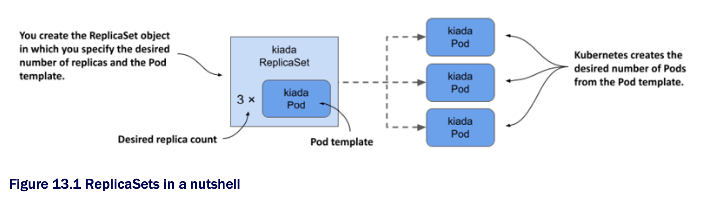
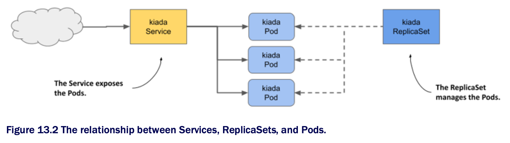
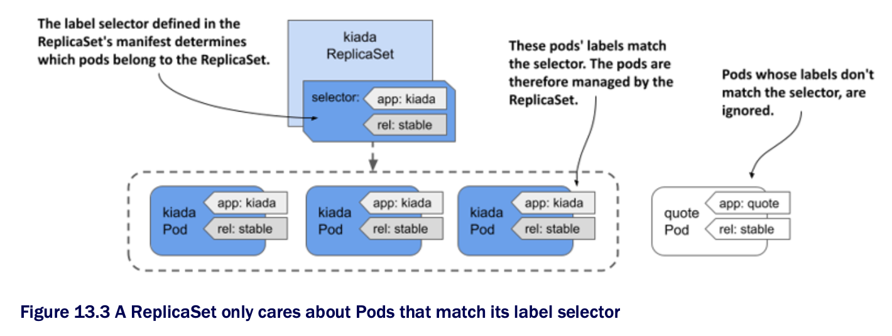

# Chapter 13. Replicating Pods w/ ReplicaSets

## Learning objectives

- [ ] Replicating Pods w/ the ReplicaSet object

- [ ] Keeping Pods running when the cluster nodes fail

- [ ] The reconciliation control loop in K8s controllers

- [ ] API Object ownership and garbage collection

* So far in this book, you've deployed workloads by creating Pod objects directly

  * In a production cluster, you might need to deploy dozens or even hundreds of copies of the same Pod, so creating and managing those pods would be difficult

  * Fortunately, in K8s, you can automate the creation and management of Pod replicas w/ ReplicaSet object

> [!NOTE]
> 
> Before ReplicaSets were introduced, similar functionality was provided by the ReplicationController object type, which is now deprecated. A ReplicationController behaves exactly like a ReplicaSet, so everything that's explained in this chapter also applies to ReplicationControllers.

* Before you begin, make sure that the Pods, Services, and other objects of the Kiada suite are present in your cluster

  * If you followed the exercises in the previous chapter, they should already be there

  * If not, you can create them by creating the `kiada` namespace and applying all the manifests in the [`SETUP`](./SETUP) directory w/ the following command:

```zsh
$ kubectl apply -f SETUP -R
```

## 13.1 Introducing ReplicaSets

* A ReplicaSet represents a group of Pod replicas (exact copies of a Pod)

  * Instead of creating Pods one by one, you can create a ReplicaSet object in which you specify a Pod template and the desired number of replicas, and then have K8s create the Pods, as shown in the following figure:



* The RepicaSet allows you to manage the Pods as a single unit, but that's about it

  * If you want to expose these Pods as one, you still need a Service object
  
  * As you can see in the following figure, each set of Pods that provides a particular service usually needs both a ReplicaSet and a Service object:



* Just as w/ services, the ReplicaSet's label selector and Pod labels determine which Pods belong to the ReplicaSet

  * As shown in the following figure, a ReplicaSet only cares about the Pods that match its label selector and ignores the rest:



* Even if you only need to create a single Pod, it's better to do it through a ReplicaSet than to create it directly, b/c the ReplicaSet ensures that the Pod is always there to do its job

* Imagine creating a Pod directly for an important service, and then the node running the Pod fails when you're not there

  * Your service is down until you recreate the Pod

  * If you'd deployed the Pod via a ReplicaSet, it would automatically recreate the Pod

  * It's clearly better to create Pods via a ReplicaSet than directly

* However, at some point, you'll want to upgrade the workload to a newer version, and that's where ReplicaSets fall short

  * For this reason, applications are typically deployed not through ReplicaSets, but through Deployments that let you update them decoratively

  * Most of the functionality that a Deployment provides is provided by the ReplicaSets that K8s creates underneath it

  * Deployments take care of updates, but everything else is handled by the underlying ReplicaSets

### 13.1.1 Creating a ReplicaSet

* Let's start by creating the ReplicaSet object for the Kiada service

  * The service currently runs in three Pods that you created directly from three separate Pod manifests, which you'll replace w/ a single ReplicaSet manifest

  * Before you create the manifest, let's look at what fields you need to specify in the `spec` section

#### Introducing the ReplicaSet

* A ReplicaSet is a relatively simple object

  * The following table explains the three main key fields you specify in the ReplicaSet's `spec` section:

| **Field name** | **Description**                                                                                                                                                                                                                          |
|----------------|------------------------------------------------------------------------------------------------------------------------------------------------------------------------------------------------------------------------------------------|
| `replicas`     | The desired number of replicas. When you create the ReplicaSet object, Kubernetes creates this many Pods from the Pod template. It keeps this number of Pods until you delete the ReplicaSet.                                            |
| `selector`     | The label selector contains either a map of labels in the `matchLabels` subfield or a list of label selector requirements in the `matchExpressions` subfield. Pods that match the label selector are considered part of this ReplicaSet. |
| `template`     | The Pod template for the ReplicaSet's Pods. When a new Pod needs to be created, the object is created using this template.                                                                                                               |

* The `selector` and `template` fields are required, but you can omit the `replicas` field

  * If you do, a single replica is created

#### Creating a ReplicaSet object manifest

* Create a ReplicaSet object manifest for the Kiada Pods

  * The following listing shows what it looks like

  * You can find the manifest in the file [`rs.kiada.yaml`](./rs.kiada.yaml) | The kiada ReplicaSet object manifest:

```yaml
apiVersion: apps/v1               # ← A
kind: ReplicaSet                  # ← A
metadata:
  name: kiada                     # ← B
spec:
  replicas: 5                     # ← B
  selector:                       # ← D
    matchLabels:                  # ← D
      app: kiada                  # ← D
      rel: stable                 # ← D
  template:                       # ← E
    metadata:                     # ← E
      labels:                     # ← E
        app: kiada                # ← E
        rel: stable               # ← E
    spec:                         # ← E
      containers:                 # ← E
      - name: kiada               # ← E
        image: luksa/kiada:0.5    # ← E
        ...                       # ← E
      volumes:                    # ← E
      - ...                       # ← E
  
# ← A ▶︎ ReplicaSets are in the `apps` API group, version `v1`.
# ← B ▶︎ Like all other objects, the ReplicaSet name is specified in the metadata section.
# ← C ▶︎ This specifies the number of Pods this ReplicaSet should contain.
# ← D ▶︎ As w/ Services, a ReplicaSet uses a label selector to define which Pods belong to this ReplicaSet.
# ← E ▶︎ The ReplicaSet creates Pod objects from this template.
```

* ReplicaSets are part of the `apps` API group, version `v1`

  * As explained in the previous table, the `replicas` field specifies that this ReplicaSet should create three copies of the Pod using the template in the `template` field

* You'll notice that the `labels` in the Pod template match those in the `selector` field

  * If they don't, the K8s API will reject the ReplicaSet b/c the Pods created w/ the template won't count against the desired number of replicas, which would result in the creation of an infinite number of Pods

* Did you notice there's no Pod name in the template?

  * That's b/c the Pod names are generated from the ReplicaSet name

* The rest of the template exactly matches the manifests of the kiada Pods you created in the previous chapters

  * To create the ReplicaSet, you use the `kubectl apply` command that you've used many times before. The command is as follows:

```zsh
$ kubectl apply -f rs.kiada.yaml
replicaset.apps/kiada created
```

### 13.1.2 Inspecting a ReplicaSet and its Pods

* To display basic information about the ReplicaSet you just created, use the `kubectl get` command like so:

```zsh
$ kubectl get rs kiada
NAME    DESIRED   CURRENT   READY   AGE
kiada   5         5         5       1m
```

> [!NOTE]
> 
> The shorthand for replicaset is rs.

* The output of the command shows the desired number of replicas, the current number of replicas, and the number of replicas that are considered ready as reported by their readiness probes

  * This information is read from the `replicas`, `fullyLabeledReplicas`, and `readyReplicas` status fields of the ReplicaSet object, respectively

  * Another status field called `availableReplicas` indicates how many replicas are available, but its value isn't displayed by the `kubectl get` command

* If you run the `kubectl get replicasets` command w/ the `-o wide` option, some additional very useful information is displayed

  * Run the following command:

```zsh
$ kubectl get rs -o wide
NAME    ...   CONTAINERS    IMAGES                                      SELECTOR
kiada   ...   kiada,envoy   luksa/kiada:0.5,envoyproxy/envoy:v1.14.1    app=kiada,rel=stable
```

* In addition to the columns displayed previously, this expanded output shows not only the label selector, but also the container names and images used in the Pod template

  * Considering how important this information is, it's surprising that it's not displayed when listing the Pods w/ `kubectl get pods`

> [!TIP]
> 
> To see container and image names, list ReplicaSets w/ the `-o wide` option instead of trying to get this information from the Pods.

* To see all the information about a ReplicaSet, use the `kubectl describe` command:

```zsh
$ kubectl describe rs kiada
```

* The output shows the label selector used in the ReplicaSet, the number of Pods and their status, and the full template used to create those Pods

#### Listing the pods in a ReplicaSet

* Kubectl doesn't provide a direct way to list the Pods in a ReplicaSet, but you can take the ReplicaSet's label selector and use it in the `kubectl get pods` command as follows:

```zsh
$ kubectl get po -l app=kiada,rel=stable

NAME          READY   STATUS    RESTARTS  AGE
kiada-001     2/2     Running   0         12m   # ← A
kiada-002     2/2     Running   0         12m   # ← A
kiada-003     2/2     Running   0         12m   # ← A
kiada-86wzp   2/2     Running   0         8s    # ← B
kiada-k9hn2   2/2     Running   0         8s    # ← B

# ← A ▶︎ The three kiada Pods you created in the previous chapters.
# ← B ▶︎ Two new kiada Pods.
```

* Before you created the ReplicaSet, you had three kiada Pods from the previous chapters and now you have five, which is the desired number of replicas defined in the ReplicaSet

  * The labels of the existing Pods matched the ReplicaSet's label selector and were adopted by the ReplicaSet

  * Two additional pods were created to ensure that the number of Pods in the set matched the desired number of replicas

#### Understanding how Pods in a ReplicaSet are named

* As you can see, the names of the two new Pods contain five random alphanumeric characters instead of continuing the sequence of numbers you used in your Pod names

  * It's typical for Kubernetes to assign random names to the objects it creates

* There's even a special `metadata` field that lets you create objects w/o giving the full name

  * Instead of the `name` field, you specify the name prefix in the `generateName` field

  * You first used this field in chapter 8, when you ran the `kubectl create` command several times to create multiple copies of a Pod and gave each a unique name

  * The same approach is used when K8s creates Pods for a ReplicaSet

* When Kubernetes creates Pods for a ReplicaSet, it sets the `generateName` field to match the ReplicaSet name

  * The K8s API server then generates the full name and puts it in the `name` field

  * To see this, select one of the two additional Pods that were created and check its metadata section as follows:

```zsh
$ kubectl get po kiada-86wzp -o yaml
apiVersion: v1
kind: Pod
metadata:
  generateName: kiada-    # ← A
  labels:
    ...
  name: kiada-86wzp       # ← B
  ...

# ← A ▶︎ This field's value matches the name of the ReplicaSet. The presence of this field tells the K8s API to generate the name for this Pod, using this field's value as the prefix.
# ← B ▶︎ The Pod's name generated by the K8s API.
```

* In the case of ReplicaSet Pods, giving the Pods random names makes sense b/c these Pods are exact copies of each other and therefore fungible

  * There's also no concept of order between these Pods, so the use of sequential numbers is nonsensical

  * Even though the Pod names look reasonable now, imagine what happens if you delete some of them

  * If you delete them out of order, the numbers are no longer consecutive

  * However, for stateful workloads, it may make sense to number the Pods sequentially

  * That's what happens when you use a StatefulSet object to create the Pods

  * You'll learn more about StatefulSets in chapter 16

#### Displaying the logs of the ReplicaSet's Pods

* The random names of ReplicaSet Pods make them somewhat difficult to work w/

  * For example, to view the logs of one of these Pods, it's relatively tedious to type the name of the Pod when you run the `kubectl logs` command

  * If the ReplicaSet contains only a single Pod, entering the full name seems unnecessary

  * Fortunately, in this case, you can print the Pod's logs as follows:

```zsh
$ kubectl logs rs/kiada -c kiada
```

* So instead of specifying the Pod name, you type `rs/kiada`, where `rs` is the abbreviation for ReplicaSet and `kiada` is the name of the ReplicaSet object

  * The `-c kiada` option tells `kubectl` to print the log of the `kiada` container

  * You need to use this option only if the Pod has more than one container

  * If the ReplicaSet has multiple Pods, as in your case, only the logs of one of the Pods will be displayed

* If you want to see the logs of all the Pods, you can run the `kubectl logs` command w/ a label selector instead

  * For example, to stream the logs of the `envoy` containers in all `kiada` pods, run the following command:

```zsh
$ kubect logs -l app=kiada -c envoy
```

* To display the logs of all containers, use the `--all-containers` option instead of specifying the container name

  * Of course, if you're displaying the logs of multiple Pods or containers, you can't tell where each line came from

  * Use the `--prefix` option to prefix each log line w/ ethe name of the Pod and container it came from, like so:

```zsh
$ kubectl logs -l app=kiada --all-containers --prefix
```

* Viewing logs from multiple Pods is very useful when traffic is split between Pods and you want to view every request received, regardless of which Pod handled it

  * For example, try streaming the logs w/ the following command:

```zsh
$ kubectl logs -l app=kiada -c kiada --prefix -f
```

* Now open the application in your web browser or w/ `curl`

  * Use the Ingress, LoadBalancer, or NodePort service as explained in the previous two chapters

### 13.1.3 Understanding Pod ownership

* K8s created the two new Pods from the template you specified in the ReplicaSet object

  * They're owned and controlled by the ReplicaSet, just like the three Pods you created manually

  * You can use the `kubectl describe` command to inspect the Pods

  * For example, check the `kiada-001` Pod as follows:

```zsh
$ kubectl describe po kiada-001
Name:         kiada-001
Namespace:    kiada
...
Controlled By: ReplicaSet/kiada   # ← A
...

# ← A ▶︎ This Pod is now controlled by the kiada ReplicaSet.
```

* The `kubectl describe` command gets this information from the `metadata` section of the Pod's manifest

  * Let's take a closer look by running the following command:

```yaml
$ kubectl get po kiada-001 -o yaml
apiVersion: v1
kind: Pod
metadata:
  labels:
    app: kiada
    rel: stable
  name: kiada-001
  namespace: kiada
  ownerReferences:                              # ← A
  - apiVersion: apps/v1                         # ← A
    blockOwnerDeletion: true                    # ← A
    controller: true                            # ← A
    kind: ReplicaSet                            # ← A
    name: kiada                                 # ← A
    uid: 8e19d9b3-bbf1-4830-b0b4-da81dd0e6e22   # ← A
  resourceVersion: "527511"
  uid: d87afa5c-297d-4ccb-bb0a-9eb48670673f
spec:
  ...

# ← A ▶︎ An object's metadata section may contain a list of the object's owners.
```

* The `metadata` section in an object manifest sometimes contains the `ownerReferences` field, which contains references to the owner(s) of the object

  * This field can contain multiple owners, but most object have only a single owner, just like the `kiada-001` Pod

  * In the case of this Pod, the `kiada` ReplicaSet is the _owner_, and the Pod is the so-called _dependent_

* K8s has a garbage collector that automatically deletes dependent objects when their owner is deleted

  * If an object has multiple owners, the object is deleted when all its owners are gone

  * If you delete the ReplicaSet object that owns the `kiada-001` and the other Pods, the garbage collector would also delete the Pods

* An owner reference can also indicate which owner is the controller of the object

  * The `kiada-001` Pod is controlled by the `kiada` ReplicaSet, as indicated by the `controller: true` line in the manifest

  * This means that you should no longer control the three Pods directly, but through the ReplicaSet object

## 13.2 [Updating a ReplicaSet](update-replicaset/README.md)

## 13.3 [Understanding the operation of the ReplicaSet controller](replicaset-controller/README.md)

## 13.4 [Deleting a ReplicaSet](delete-replicaset/README.md)

## Learning summary

* In this chapter, you learned that:

  * A ReplicaSet represents a group of identical Pods that you manage as a unit

    * In the ReplicaSet, you specify a Pod template, the desired number of replicas, and a label selector

  * Almost all Kubernetes API object types have an associated controller that processes objects of that type

    * In each controller, a reconciliation control loop runs that constantly reconciles the actual state w/ the desired state

  * The ReplicaSet controller ensures that the actual number of Pods always matches the desired number specified in the ReplicaSet

    * When these two numbers diverge, the controller immediately reconciles them by creating or deleting Pod objects

  * You can change the number of replicas you want at any time and the controller will take the necessary steps to honor your request

    * However, when you update the Pod template, the controller won't update the existing Pods

  * Pods created by a ReplicaSet are owned by that ReplicaSet

    * If you delete the owner, the dependents are deleted by the garbage collector, but you can tell `kubectl` to orphan them instead
