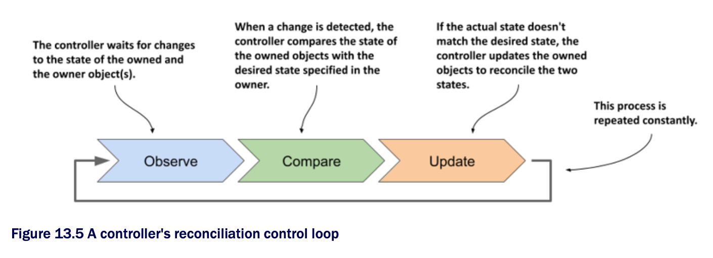
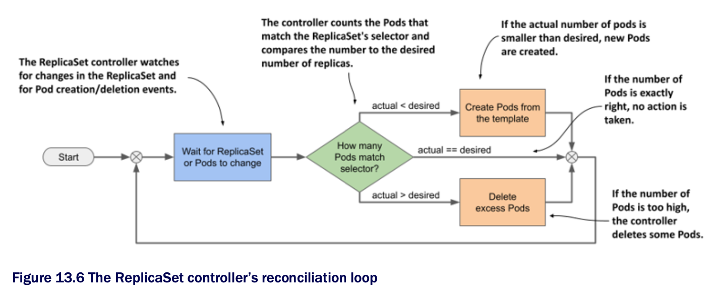

# 13.3.1 Introducing the reconciliation control loop

* As shown in the following figure, a controller observes the state of both the owner and the dependent objects

  * After each change in this state, the controller compares the state of the dependent objects w/ the desired state specified in the owning object

  * If these two states differ, the controller makes changes to the dependent object(s) to reconcile the two states

  * This is the so-called reconciliation control loop that you'll find in all controllers:

* The ReplicaSet controller's reconciliation control loop consists of observing ReplicaSets and Pods

  * Each time a ReplicaSet or Pod changes, the controller checks the list of Pods associated w/ the ReplicaSet and ensures that the actual number of Pods matches the desired number specified in the ReplicaSet

  * If the actual number of Pods is lower than the desired number, it creates new replicas from the Pod template

  * If the number of Pods is higher than desired, it deletes the excess replicas

  * The flowchart in the following figure explains the entire process

