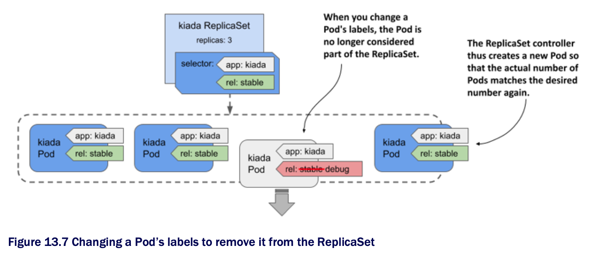

# 13.3.3 Removing a Pod from the ReplicaSet's control

* You already know that the ReplicaSet controller is constantly making sure that the number of Pods that match the ReplicaSet's label selector matches the desired number of replicas

  * So, if you remove a Pod from the set of Pods that match the selector, the controller replaces it

  * To do this, you simply change the labels of the faulty Pod, as shown in the following figure:



* The ReplicaSet controller replaces the Pod w/ a new one, and from that point on, no longer pays attention to the faulty Pod

  * You can calmly figure out what's wrong w/ it while the new Pod takes over the traffic

* Let's try this w/ the Pod whose readiness probe you failed in the previous section

  * For a Pod to match the ReplicaSet's label selector, it must have the labels `app=kiada` and `rel=stable`

  * Pods w/o these labels aren't considered part of the ReplicaSet

  * So, to remove the broken Pod from the ReplicaSet, you need to remove or change at least one of these two labels

  * One way is to change the value of the `rel` label to `debug` as follows:

```zsh
$ kubectl label po kiada-78j7m rel=debug --overwrite
```

* Since only two Pods now match the label selector, one less than the desired number of replicas, the controller immediately creates another Pod, as shown in the following output:

```zsh
$ kubectl get pods -l app=kiada -L app,rel
NAME          READY   STATUS    RESTARTS    AGE   APP     REL
kiada-78j7m   1/2     Running   0           60m   kiada   debug   # ← A
kiada-98lmx   2/2     Running   0           60m   kiada   stable
kiada-wk99p   2/2     Running   0           60m   kiada   stable
kiada-xtxcl   2/2     Running   0           9s    kiada   stable  # ← B

# ← A ▶︎ The broken Pod that no longer matches the ReplicaSet's label selector.
# ← B ▶︎ This Pod was created to replace the broken Pod.
```

* As you can see from the values in the `APP` and `REL` columns, three Pods match the selector, while the broken Pod doesn't

  * This Pod is no longer managed by the ReplicaSet

  * Therefore, when you're done inspecting the Pod, you need to delete it manually

> [!NOTE]
> 
> When you remove a Pod from a ReplicaSet, the reference to the ReplicaSet object is removed from the Pod's `ownerReferences` field.

* Now that you've seen how the ReplicaSet controller responds to all the events shown in this and previous sections, you understand everything you need to know about this controller
