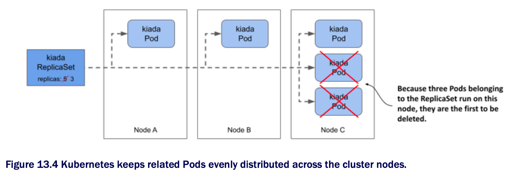

# 13.2.1 Scaling a ReplicaSet

* In the ReplicaSet, you've set the desired number of replicas to five, and that's the number of Pods currently owned by the ReplicaSet

  * However, you can now update the ReplicaSet object to change this number

  * You can do this either by changing the value in the manifest file and reapplying it, or by editing the object directly w/ the `kubectl edit` command

  * However, the easiest way to scale a ReplicaSet is to use the `kubectl scale` command

## Scaling a ReplicaSet using the Kubectl scale command

* Let's increase the number of kiada Pods to six. To do this, execute the following command:

```zsh
$ kubectl scale rs kiada --replicas 6
replicaset.apps/kiada scaled
```

* Now check the ReplicaSet again to confirm that it now has six Pods:

```zsh
$ kubectl get rs kiada
NAME    DESIRED   CURRENT   READY   AGE
kiada   6         6         5       10m
```

* The columns indicate that the ReplicaSet is now configured w/ six Pods, and this is also the current number of Pods

  * One of the Pods isn't yet ready, but only b/c it was just created

  * List the Pods again to confirm that an additional Pod instance has been created:

```zsh
$ kubectl get po -l app=kiada,rel=stable
NAME          READY   STATUS    RESTARTS    AGE
kiada-001     2/2     Running   0           22m
kiada-002     2/2     Running   0           22m
kiada-003     2/2     Running   0           22m
kiada-86wzp   2/2     Running   0           10m
kiada-dmshr   2/2     Running   0           11s   # ← A
kiada-k9hn2   2/2     Running   0           10m
    
# ← A ▶︎ The AGE column indicates that this Pod has just been created.
```

* As expected, a new Pod was created, bringing the total number of Pod to the desired six

  * If this application served actual users and you needed to scale to a hundred Pods or more due to increased traffic, you could do so in a snap w/ the same command

  * However, your cluster may not be able to handle that many Pods

## Scaling down

* Just as you scale up a ReplicaSet, you can also scale it down w/ the same command

  * You can also scale a ReplicaSet by editing its manifest w/ `kubectl edit`

  * Let's scale it to four replicas using this method

  * Run the following command:

```zsh
$ kubectl edit rs kiada
```

* This should open the ReplicaSet object manifest in your text editor

  * Find the `replicas` field and change the value to `4`

  * Save the file and close the editor so `kubectl` can post the updated manifest to the K8s API

  * Verify that you now have four Pods:

```zsh
# kubectl get pods -l app=kiada,rel=stable
NAME          READY   STATUS        RESTARTS    AGE
kiada-001     2/2     Running       0           28m
kiada-002     2/2     Running       0           28m
kiada-003     2/2     Running       0           28m
kiada-86wzp   0/2     Terminating   0           16m   # ← A
kiada-dmshr   2/2     Terminating   0           125m  # ← A
kiada-k9hn2   2/2     Running       0           16m

# ← A ▶︎ Two Pods have been marked for deletion and will disappear when all their containers terminate.
```

* As expected, two of the Pods are being terminated and should disappear when the processes in their containers stop running

  * But how does K8s decide which Pods to remove?

  * Does it just select them randomly?

## Understanding which Pods are deleted first when a ReplicaSet is scaled down

* When you scale down a ReplicaSet, K8s follows some well-thought-out rules to decide which Pod(s) to delete first

  * It deletes Pods in the following order:

    1. Pods that aren't yet assigned to a node

    2. Pods whose phase is unknown

    3. Pods that aren't ready

    4. Pods that have a lower deletion cost

    5. Pods that are collocated w/ a greater number of related replicas

    6. Pods that have been ready for a shorter time

    7. Pods w/ a greater number of container restarts

    8. Pods that were created later than the other Pods

* These rules ensure that Pods that haven't been scheduled yet, and defective Pods are deleted first, while the well-functioning ones are left alone

  * You can also influence which Pod is deleted first by setting the annotation `controller.kubernetes.io/pod-deletion-cost` on your Pods

  * The value of the annotation must be a string that can be parsed into a 32-bit integer

  * Pods w/o this annotation and those w/ a lower value will be deleted before Pods w/ higher values

* K8s also tries to keep the Pods evenly distributed across the cluster nodes

  * The following figure shows an example where the ReplicaSet is scaled from five to three replicas

  * B/c the third node runs two collocated replicas more than the other two nodes, the Pods on the third node are deleted first

  * If this rule didn't exist, you could end up w/ three replicas on a single node



### Scaling down to zero

* In some cases, it's useful to scale the number of replicas down to zero

  * All Pods managed by the ReplicaSet will be deleted, but the ReplicaSet object itself will remain and can be scaled back up at will

  * You can try this now by running the following commands:

```zsh
$ kubectl scale rs kiada --replicas 0           # ← A
replicaset.apps/kiada scaled

$ kubectl get po -l app=kiada                   # ← B
No resources found in kiada namespace.          # ← B

$ kubectl scale rs kiada --replicas 2           # ← C
replicaset.apps/kiada scaled

$ kubectl get po -l app=kiada
NAME          READY   STATUS    RESTARTS  AGE   # ← D
kiada-dl7vz   2/2     Running   0         6s    # ← D
kiada-dn9fb   2/2     Running   0         6s    # ← D

# ← A ▶︎ Scale the kiada ReplicaSet to zero.
# ← B ▶︎ All the Pods have been deleted.
# ← C ▶︎ Scale the ReplicaSet to two replicas.
# ← D ▶︎ Two Pods are now running.
```

* As you'll see in the next chapter, a ReplicaSet scaled to zero is very common when the ReplicaSet is owned by a Deployment object

> [!TIP]
> 
> If you need to temporarily shut down all instances of your workload, set the desired number of replicas to zero instead of deleting the ReplicaSet object.
