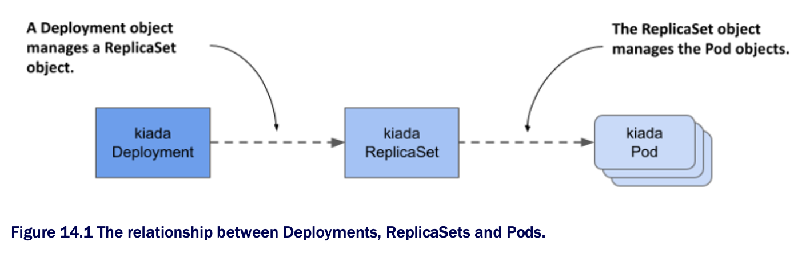
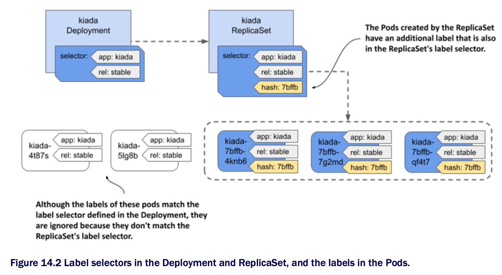

# Chapter 14. Managing Pods w/ Deployments

## Learning objectives

- [ ] Deploying stateless workloads w/ the Deployment object

- [ ] Horizontally scaling Deployments

- [ ] Updating workloads declaratively

- [ ] Preventing rollouts of faulty workloads

- [ ] Implementing various deployment strategies

* In the previous chapter, we learned how to deploy Pods via ReplicaSets

  * However, workloads are rarely deployed this way b/c ReplicaSets don't provide the functionality necessary to easily update these Pods

  * This functionality is provided by the Deployment object type

  * By the end of this chapter, each of the three services in the Kiada suite will have its own Deployment object

* Before you begin, make sure that the Pods, Services, and other objects of the Kiada suite are present in your cluster

  * If you followed the exercises in the previous chapter, they should already be there

  * If not, you can create them by creating the `kiada` namespace and applying all the manifests in the [`SETUP`](SETUP) directory w/ the following command:

```zsh
$ kubectl apply -f SETUP -R
```

## 14.1 Introducing Deployments

* When you deploy a workload to K8s, you typically do so by creating a Deployment object

  * A Deployment object doesn't directly manage the Pod objects, but manages them through a ReplicaSet object that's automatically created when you create the Deployment object

  * As shown in the next figure, the Deployment controls the ReplicaSet, which in turn controls the individual Pods



* A Deployment allows you to update the application declartively

  * This means that rather than manually performing a series of operations to replace a set of Pods w/ ones running an updated version of your application, you just update the configuration in the Deployment object and let K8s automate the update

* As w/ ReplicaSets, you specify a Pod template, the desired number of replicas, and a label selector in a Deployment

  * The Pods created based on this Deployment are exact replicas of each other and are fungible

  * For this and other reasons, Deployments are mainly used for stateless workloads, but you can also use them to run a single instance of a stateful workload

  * However, b/c there's no built-in way to prevent users from scaling the Deployment to multiple instances, the application itself must ensure that only a single instance is active when multiple replicas are running simultaneously

> [!NOTE]
> 
> To run replicated stateful workloads, a StatefulSet is the better option. You'll learn about them in the next chapter.

### 14.1.1 Creating a Deployment

* In this section, you'll replace the kiada ReplicaSet w/ a Deployment

  * Delete the ReplicaSet w/o deleting the Pods as follows:

```zsh
$ kubectl delete rs kiada --cascade=orphan
```

* Let's see what you need to specify in the `spec` section of a Deployment and how it compares to that of the ReplicaSet

#### Introducing the Deployment spec

* The `spec` section of a Deployment object isn't much different from a ReplicaSet's

  * As you can see in the following table, the main fields are the same as the ones in a ReplicaSet, w/ only one additional field | The main fields you specify in a Deployment's spec section:

| **Field name** | **Description**                                                                                                                                                                                                                          |
|----------------|------------------------------------------------------------------------------------------------------------------------------------------------------------------------------------------------------------------------------------------|
| `replicas`     | The desired number of replicas. When you create the ReplicaSet object, Kubernetes creates this many Pods from the Pod template. It keeps this number of Pods until you delete the Deployment.                                            |
| `selector`     | The label selector contains either a map of labels in the `matchLabels` subfield or a list of label selector requirements in the `matchExpressions` subfield. Pods that match the label selector are considered part of this Deployment. |
| `template`     | The Pod template for the ReplicaSet's Pods. When a new Pod needs to be created, the object is created using this template.                                                                                                               |
| `strategy`     | The update strategy defines how Pods in this Deployment are replaced when you update the Pod template.                                                                                                                                   |

* The `replicas`, `selector`, and `template` fields serve the same purpose as those in ReplicaSets

  * In the additional `strategy` field, you can configure the update strategy to be used when you update this Deployment

#### Creating a Deployment manifest from scratch

* When we need to create a new Deployment manifest, most of us usually copy an existing manifest file and modify it

  * However, if you don't have an existing manifest handy, there's a clever way to create the manifest file from scratch

* You may remember that you first created a Deplyoment in chapter 3 of this book

  * This is the command you used then:

```zsh
$ kubectl create deployment kiada --image=luksa/kiada:0.1
```

* But since this command creates the object directly instead of creating the manifest file, it's noy quite what you want

  * However, you may recall that you learned in chapter 5 that you can pass the `--dry-run=client` and `-o yaml` options to the `kubectl create` command if you want to create an object manifest w/o posting it to the API

  * So, to create a rough version of a Deployment manifest file, you can use the following command:

```zsh
$ kubectl create deployment my-app --image=my-image --dry-run=client -o yaml > deploy.yaml
```

* You can then edit the manifest file to make your final changes, such as adding additional containers and volumes or changing the existing container definition

  * However, since you already have a manifest file for the kiada ReplicaSet, the fastest option is to turn it into a Deployment manifest

#### Creating a Deployment object manifest

* Creating a Deployment manifest is trivial if you already have the ReplicaSet manifest

  * You just need to copy the `rs.kiada.versionLabel.yaml` file to [`deploy.kiada.yaml`](scale-deployment/deploy.kiada.yaml), for example, and then edit it to change the `kind` field from `ReplicaSet` to `Deployment`

  * While you're at it, please also change the number of replicas from two to three

  * Your Deployment manifest should look like the following listing:

```yaml
apiVersion: apps/v1
kind: Deployment      # ← A
metadata:
  name: kiada 
spec:
  replicas: 3         # ← B
  selector:           # ← C
    matchLabels:      # ← C
      app: kiada      # ← C
      rel: stable     # ← C
  template:           # ← D
    metadata:         # ← D
      labels:         # ← D
        app: kiada    # ← D
        rel: stable   # ← D
        ver: '0.5'    # ← D
    spec:             # ← D
      ...             # ← D

# ← A ▶ Instead of ReplicaSet, the object kind is Deployment.︎
# ← B ▶ ︎You want the Deployment to run three replicas.
# ← C ▶ ︎The label selector matches the one in the kiada ReplicaSet you created in the previous chapter.
# ← D ▶ The Pod template also matches the one in the ReplicaSet.
```

### Creating and inspecting the Deployment object

* To create the Deployment object from the manifest file, use the `kubectl apply` command

  * You can use the usual commands like `kubectl get deployment` and `kubectl describe deployment` to get information about the Deployment you created

  * For example:

```zsh
$ kubectl get deploy kiada
NAME    READY   UP-TO-DATE  AVAILABLE   AGE
kiada   3/3     3           3           25s
```

> [!NOTE]
> 
> The shorthand for `deployment` is `deploy`.

* The Pod number information that the `kubectl get` command displays is read from the `readyReplicas`, `replicas`, `updatedReplicas`, and `availableReplicas` fields in the `status` section of the Deployment object

  * Use the `-o yaml` option to see the full status

> [!NOTE]
> 
> Use the wide output option (`-o wide`) w/ `kubectl get deploy` to display the label selector and the container names and images used in the Pod template.

* If you just want to know if the Deployment rollout was successful, you can also use the following command:

```zsh
$ kubectl rollout status deployment kiada
Waiting for deployment "kiada" rollout to finish: 0 of 3 updated replicas are available...
Waiting for deployment "kiada" rollout to finish: 1 of 3 updated replicas are available...
Waiting for deployment "kiada" rollout to finish: 2 of 3 updated replicas are available...
deployment "kiada" successfully rolled out
```

* If you run this command immediately after creating the Deployment, you can track how the deployment of Pods is progressing

  * According to the output of the command, the Deployment has successfully rolled out the three Pod replicas

* Now list the Pods that belong to the Deployment

  * It uses the same selector as the ReplicaSet from the previous chapter, so you should see three Pods, right?

  * To check, list the Pods w/ the label selector `app=kiada,rel=stable` as follows:

```zsh
$ kubectl get pods -l app=kiada,rel=stable
NAME                      READY   STATUS    RESTARTS   AGE
kiada-4t87s               2/2     Running   0           16h   # ← A
kiada-5lg8b               2/2     Running   0           16h   # ← A
kiada-7bffb9bf96-4knb6    2/2     Running   0           6m    # ← B
kiada-7bffb9bf96-7g2md    2/2     Running   0           6m    # ← B
kiada-7bffb9bf96-qf4t7    2/2     Running   0           6m    # ← B

# ← A ▶︎ These two Pods are older than the other three Pods.
# ← B ▶︎ Given the age of these Pods, these look like the Pods created by the Deployment.
```

* Surprisingly, there are five Pods that match the selector

  * The first two are those created by the ReplicaSet from the previous chapter, while the last three were created by the Deployment

  * Although the label selector in the Deployment matches the two existing Pods, they weren't picked up like you would expect

  * How come?

* At the beginning of this chapter, we saw that the Deployment doesn't directly control the Pods but delegates this task to an underlying ReplicaSet

  * Let's take a quick look at this ReplicaSet:

```zsh
$ kubectl get rs
NAME              DESIRED   CURRENT   READY   AGE
kiada-7bffb9bf96  3         3         3       17m
```

* You'll notice that the name of the ReplicaSet isn't simply `kiada`, but also contains an alphanumeric suffix (`-7bffb9bf96`) that seems to be randomly generated like the names of the Pods

  * Let's find out what it is

  * Take a closer look at the ReplicaSet as follows:

```zsh
$ kubectl describe rs kiada                                           # ← A
Name:             kiada-7bffb9bf96
Namespace:        kiada
Selector:         app=kiada,pod-template-hash=7bffb9bf96,rel=stable   # ← B
Labels:           app=kiada
                  pod-template-hash=7bffb9bf96                        # ← C
                  rel=stable
                  ver=0.5
Annotations:      deployment.kubernetes.io/desired-replicas: 3
                  deployment.kubernetes.io/max-replicas: 4
                  deployment.kubernetes.io/revision: 1
Controlled By:    Deployment/kiada                                    # ← D
Replicas:         3 current / 3 desired
Pods Status:      3 Running / 0 Waiting / 0 Succeeded / 0 Failed
Pod Template:
  Labels: app=kiada
          pod-template-hash=7bffb9bf96                                # ← C
          rel=stable
          ver=0.5
  Containers:
    ...
    
# ← A ▶︎ The kubectl describe command doesn't require you to type the full name of an object, so just typing part of the name suffices.
# ← B ▶︎ The ReplicaSet's label selector doesn't quite match the one in the Deployment.
# ← C ▶︎ An additional pod-template-hash label appears in both the ReplicaSet's labels and the Pod labels.
# ← D ▶ This ReplicaSet is owned and controlled by the kiada Deployment.
```

* The `Controlled By` line indicates that this ReplicaSet has been created and is owned and controlled by the `kiada` Deployment

  * You'll notice that the Pod template, selector, and the ReplicaSet itself contain an additional key `pod-template-hash` that you never defined in the Deployment object

  * The value of this label matches the last part of the ReplicaSet's name

  * This additional label is why the two existing Pods weren't acquired by this ReplicaSet

  * List the Pods w/ all their labels to see how they differ:

```zsh
$ kubectl get pods -l app=kiada,rel=stable --show-labels
NAME                    ...   LABELS
kiada-4t87s             ...   app=kiada,rel=stable,ver=0.5                                # ← A
kiada-5lg8b             ...   app=kiada,rel=stable,ver=0.5                                # ← A
kiada-7bffb9bf96-4knb6  ...   app=kiada,pod-template-hash=7bffb9bf96,rel=stable,ver=0.5   # ← B
kiada-7bffb9bf96-7g2md  ...   app=kiada,pod-template-hash=7bffb9bf96,rel=stable,ver=0.5   # ← B
kiada-7bffb9bf96-qf4t7  ...   app=kiada,pod-template-hash=7bffb9bf96,rel=stable,ver=0.5   # ← B

# ← A ▶︎ The two Pods that exissted before do not have the pod-template-hash label.
# ← B ▶︎ The three that were created by the Deployment do.
```

* As you can see in the following figure, when the ReplicaSet was created, the ReplicaSet controller couldn't find any Pods that matched the label selector, so it created three new Pods

  * If you had added this label to the existing Pods before creating the Deployment, they'd have been picked up by the ReplicaSet



* The value of the `pod-template-hash` label isn't random but calculated from the contents of the Pod template

  * B/c the same value is used for the ReplicaSet name, the name depends on the contents of the Pod template

  * It follows that every time you change the Pod template, a new ReplicaSet is  created

  * You'll learn more about this in section 14.2, which explains Deployment updates

* You can now delete the two kiada Pods that aren't part of the Deployment

  * To do this, use the `kubectl delete` command w/ a label selector that selects only the Pods that have the labels `app=kiada` and `rel=stable` and don't have the label `pod-template-hash`

  * This is what the full command looks like:

```zsh
$ kubectl delete po -l 'app=kiada,rel=stable,!pod-template-hash'
```

> #### Troubleshooting Deployments that fail to produce any Pods
> 
> * Under certain circumstances, when creating a Deployment, Pods may not appear
> 
>   * Troubleshooting in this case is easy if you know where to look
> 
>   * To try this out for yourself, apply the manifest file [`deploy.where-are-the-pods.yaml`](deploy.where-are-the-pods.yaml)
> 
>   * This will create a Deployment object called `where-are-the-pods`
> 
>   * You'll notice that no Pods are created for the Deployment, even though the desired number of replicas is three
>
>   * To troubleshoot, you can inspect the Deployment object w/ `kubectl describe`
> 
>     * The Deployment's events don't show anything useful, but its Conditions do:
> 
>     ```zsh
>     $ kubectl describe deploy where-are-the-pods
>     ...
>     Conditions:
>     Type            Status   Reason
>     ----            ------   ------ 
>     Progressing     True     NewReplicasSetCreated
>     Available       False    MinimumReplicasUnavailable
>     ReplicaFailure  True     FailedCreate                  # ← A
>
>     # ← A ▶︎ The ReplicaFailure conditions indicates that a replica failed to be created.
>     ```
>     
> * The `ReplicaFailure` condition is `True`, indicating an error
> 
>   * The reason for the error is `FailedCreate`, which doesn't mean much
> 
>   * However, if you look at the conditions in the status section of the Deployment's YAML manifest, you'll notice that the `message` field of the ReplicaFailure condition tells you exactly what happened
> 
>   * Alternatively, you can examine the ReplicaSet and its events to see the same message as follows:
> 
>   ```zsh
>   $ kubectl describe rs where-are-the-pods-67cbc77f88
>   ...
>   Events:
>     Type      Reason         Age        From            Message
>     ----      ------         ---        ----            -------
>     Warning FailedCreate 61s (x18 over 11m) replicaset-controller Error creating:
>   pods "where-are-the-pods-67cbc77f88-" is forbidden: error looking up service
>   account default/missing-service-account: serviceaccount "missing-service-account"
>   not found
>   ```
>   
> * There are many possible reasons why the ReplicaSet controller can't create a Pod, but they're usually related to user privileges
> 
>   * In this example, the ReplicaSet controller couldn't create the Pod b/c a service account is missing
> 
>   * You'll learn more about service accounts in chapter 25
> 
>   * The most important conclusion from this exercise is that if Pods don't appear after you create (or update) a Deployment, you should look for the cause in the underlying ReplicaSet

### 14.1.2 [Scaling a Deployment](scale-deployment/README.md)

### 14.1.3 [Deleting a Deployment](delete-deployment/README.md)

## 14.2 [Updating a Deployment](update-deployment/README.md)

## 14.3 [Implementing other deployment strategies](other-deployment-strategies/README.md)

## Learning summary

* A Deployment is an abstraction layer over ReplicaSets

  * In addition to all the functionality that a ReplicaSet provides, Deployments also allow you to update Pods declaratively

  * When you update the Pod template, the old Pods are replaced w/ new Pods created using the updated template

* During an update, the Deployment controller replaces Pods based on the strategy configured in the Deployment

  * In the `Recreate` strategy, all Pods are replaced at once, while in the `RollingUpdate` strategy, they're replaced gradually

* Pods created by a ReplicaSet are owned by that ReplicaSet

  * The ReplicaSet is usually owned by a Deployment

  * If you delete the owner, the dependents are deleted by the garbage collector, but you can tell `kubectl` to orphan them instead

* Other deployment strategies aren't directly supported by K8s, but can be implemented by appropriately configured Deployments, Services, and the Ingress

* Deployments are typically used to run stateless applications

  * In the next chapter, you'll learn about StatefulSets, which are tailored to run stateful applications
