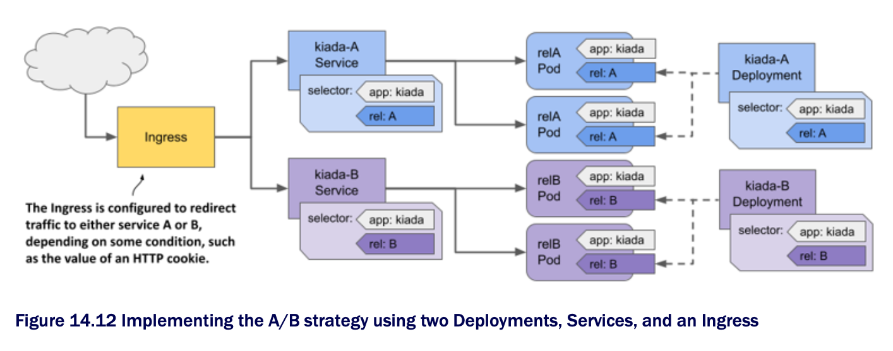

# 14.3.2 The A/B strategy

* If you want to implement the A/B deployment strategy to roll out a new version only to specific users based on a specific condition such as location, language, user agent, HTTP cookie, or header, you create two Deployments and two Services

  * You configure the Ingress object to route traffic to one Service or the other based on the selected condition, as shown in the following figure:

* As of this writing, K8s doesn't provide a native way to implement this deployment strategy, but some Ingress implementations do

  * See the documentation for your chosen Ingress implementation for more information
