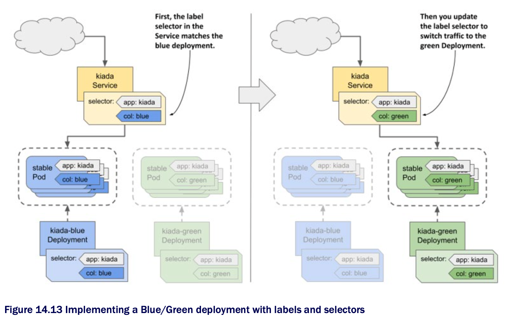

# 14.3.3 The Blue/Green strategy

* In the Blue/Green strategy, another Deployment, called the Green Deployment, is created alongside the first Deployment, called the Blue Deployment

  * The Service is configured to forward traffic only to the Blue Deployment until you decide to switch all traffic to the Green Deployment

  * The two groups of Pods thus use different labels, and the label selector in the Service matches one group at a time

  * You switch the traffic from one group to the other by updating the label selector in the Service, as shown in the following figure:

* As you know, K8s provides everything you need to implement this strategy

  * No additional tools are needed
