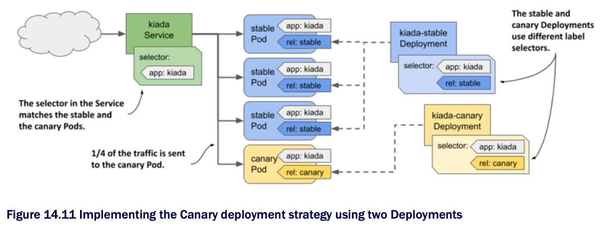

# 14.3.1 The Canary deployment strategy

* If you set the `minReadySeconds` parameter to a high enough value, the update process resembles a Canary deployment in that the process is paused until the first new Pods prove their worthiness

  * The difference w/ a true Canary deployment is that this pause applies not only to the first Pod(s), but to every step of the update process

* Alternatively, you can use the `kubectl rollout pause` command immediately after creating the first Pod(s) and manually check those canary Pods

  * When you're sure that the new version is working as expected, you continue the update w/ the `kubectl rollout resume` command

* Another way to accomplish the same thing is to create a separate Deployment for the canary Pods and set the desired number of replicas to a much lower number than in the Deployment for the stable version

  * You configure the Service to forward traffic to the Pods in both Deployments

  * B/c the Service spreads the traffic evenly across the Pods and b/c the canary Deployment has much fewer Pods than the stable Deployment, only a small amount of traffic is sent to the canary Pods, while the majority is sent to the stable Pods

  * This approach is illustrated in the following figure:

* When you're ready to update the other Pods, you can perform a regular rolling update of the old Deployment and delete the canary Deployment
