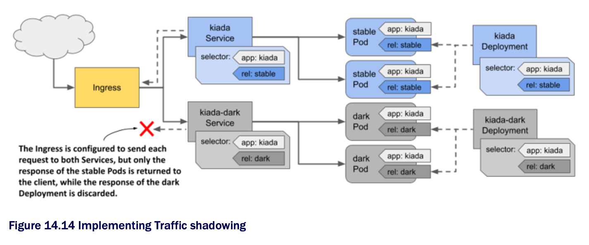

# 14.3.4 Traffic shadowing

* Sometimes you're not quite sure if the new version of your application will work properly in the actual production environment, or if it can handle the load

  * In this case, you can deploy the new version alongside the existing version by creating another Deployment object and configuring the Pod labels so that the Pods of this Deployment don't match the label selector in the Service

* You configure the Ingress or proxy that sits in front of the Pods to send traffic to the existing Pods, but also mirror it to the new Pods

  * The proxy sends the response from the existing Pods to the client and discards the response from the new Pods, as shown in the following figure:

* As w/ A/B testing, K8s doesn't natively provide the necessary functionality to implement traffic shadowing, but some implementations do
