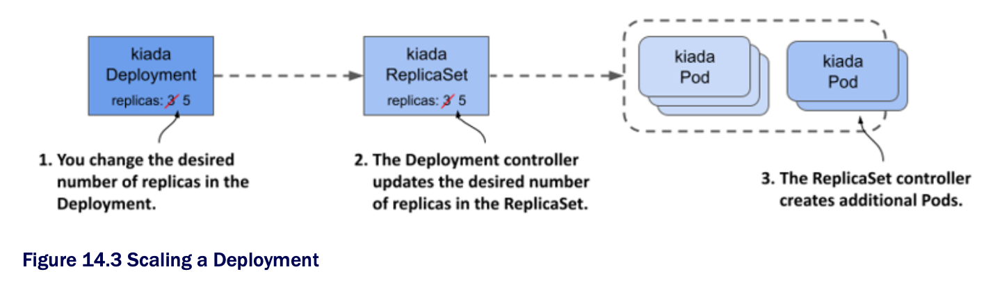

# 14.1.2 Scaling a Deployment

* Scaling a Deployment is no different from scaling a ReplicaSet

  * When you scale a Deployment, the Deployment controller does nothing but scale the underlying ReplicaSet, leaving the ReplicaSet controller to do the rest, as shown in the following figure:



## Scaling a Deployment

* You can scale a Deployment by editing the object w/ the `kubectl edit` command and changing the value of the `replicas` field, by changing the value in the manifest file and reapplying it, or by using the `kubectl scale` command

  * For example, scale the `kiada` Deployment to 5 replicas as follows:

```zsh
$ kubectl scale deploy kiada --replicas 5
deployment.apps/kiada scaled
```

* If you list the Pods, you'll see that there are now five `kiada` Pods

  * If you check the events associated w/ the Deployment using the `kubectl describe` command, you'll see that the Deployment controller has scaled the ReplicaSet

```zsh
$ kubectl describe deploy kiada
...
Events:
  Type    Reason              Age   From                    Message
  ----    ------              ----  ----                    -------
  Normal  ScalingReplicaSet   4s    deployment-controller   Scaled up replica set kiada-
                                                            7bffb9bf96 to 5
```

* If you check the events associated w/ the ReplicaSet using `kubectl describe rs kiada`, you'll see that it was indeed the ReplicaSet controller that created the Pods

* Everything you learned about ReplicaSet scaling and how the ReplicaSet controller ensures that the actual number of Pods always matches the desired number of replicas also applies to Pods deployed via a Deployment

## Scaling a ReplicaSet owned by a Deployment

* You might wonder what happens when you scale a ReplicaSet object owned and controlled by a Deployment

  * Let's find out

  * First, start watching ReplicaSets by running the following command:

```zsh
$ kubectl get rs -w
```

* Now scale the `kiada-7bffb9bf96` ReplicaSet by running the following command in another terminal:

```zsh
$ kubectl scale rs kiada-7bffb9bf96 --replicas 7
replicaset.apps/kiada-7bffb9bf96 scaled
```

* If you look at the output of the first command, you'll see that the desired number of replicas goes up to seven but is soon reverted to five

  * This happens b/c the Deployment controller detects that the desired number of replicas in the ReplicaSet no longer matches the number in the Deployment object and so it changes it back

> [!IMPORTANT]
> 
> If you make changes to an object that is owned by another object, you should expect that your changes will be undone by the controller that manges the object.

* Depending on whether the ReplicaSet controller noticed the change before the Deployment controller undid it, it may have created two new Pods

  * But when the Deployment controller then reset the desired number of replicas back to fve, the ReplicaSet controller deleted the Pods

* As you might expect, the Deployment controller will undo any changes you make to the ReplicaSet, not just when you scale it

  * Even if you delete the ReplicaSet object, the Deployment controller will recreate it

## Inadvertently scaling a Deployment

* To conclude this section on Deployment scaling, beware of accidentally scaling a Deployment w/o meaning to

* In the Deployment manifest you applied to the cluster, the desired number of replicas was three

  * Then you changed it to five w/ the `kubectl scale` command

  * Imagine doing the same thing in a production cluster

  * For example, b/c you need five replicas to handle all the traffic that the application is receiving

* Then you notice that you forgot to add the `app` and `rel` labels to the Deployment object

  * You added them to the Pod template inside the Deployment object, but not to the object itself

  * This doesn't affect the operation of the Deployment, but you want all your objects to be nicely labelled, so you decide to add the labels now

  * You could use the `kubectl label` command, but you'd rather fix the original manifest file and reapply it

  * This way, when you use the file to create the Deployment in the future, it'll contain the labels you want

* To see what happens in this case, apply the manifest file [`deploy.kiada.labelled.yaml`](deploy.kiada.labelled.yaml)

  * The only difference between from the original manifest file [`deploy.kiada.yaml`](deploy.kiada.yaml) are the labels added to the Deployment

  * If you list the Pods after applying the manifest, you'll see that you no longer have five Pods in your Deployment

  * Two of the Pods have been deleted:

```zsh
$ kubectl get pods -l app=kiada
NAME                    READY   STATUS        RESTARTS  AGE
kiada-7bffb9bf96-4knb6  2/2     Running       0         46m
kiada-7bffb9bf96-7g2md  2/2     Running       0         46m
kiada-7bffb9bf96-lkgmx  2/2     Terminating   0         5m    # ← A
kiada-7bffb9bf96-qf4t7  2/2     Running       0         46m
kiada-7bffb9bf96-z6skm  2/2     Terminating   0         5m    # ← A

# ← A ▶︎ Two Pods are being deleted.
```

* To see why two Pods were being removed, check the Deployment object:

```zsh
$ kubectl get deploy
NAME    READY   UP-TO-DATE  AVAILABLE   AGE
kiada   3/3     3           3           46m
```

* The Deployment is now configured to have only three replicas, instead of the five it had before you applied the manifest

  * However, you never intended to change the number of replicas, only to add labels to the Deployment object

  * So, what happened?

* The reason that applying the manifest changed the desired number of replicas is that the `replicas` field in the manifest file is set to `3`

  * You might think that removing this field from the updated manifest would have prevented the problem, but in fact it would make the problem worse

  * Try applying the [`deploy.kiada.noReplicas.yaml`](deploy.kiada.noReplicas.yaml) manifest file that doesn't contain the `replicas` field to see what happens

* If you apply the file, you'll only have one replica left

  * That's b/c the K8s API sets the value to `1` when the `replicas` field is omitted

  * Even if you explicitly set the value to `null`, the effect is the same

* Imagine this happening in your production cluster when the load on your application is so high that dozens or hundreds of replicas are needed to handle the load

  * An innocuous update like the one in this example would severely disrupt the service

* You can prevent this by not specifying the `replicas` field in the original manifest when you create the Deployment object

  * If you forgot to do this, you can still repair the existing Deployment object by running the following command:

```zsh
$ kubectl apply edit-last-applied deploy kiada
```

* This opens the contents of the `kubectl.kubernetes.io/last-applied-configuration` annotation of the Deployment object in a text editor and allows you to remove the `replicas` field

  * When you save the file and close the editor, the annotation in the Deployment object is updated

  * From that point on, updating the Deployment w/ `kubectl apply` no longer overwrites the desired number of replicas, as long as you don't include the `replicas` field

> [!NOTE]
> 
> When you `kubectl apply`, the value of the `kubectl.kubernetes.io/last-applied-configuration` is used to calculate the changes needed to be made to the API object.

> [!TIP]
> 
> To avoid accidentally scaling a Deployment each time you reapply its manifest file, omit the `replicas` field in the manifest when you create the object. You initially only get one replica, but you can easily scale the Deployment to suit your needs.
