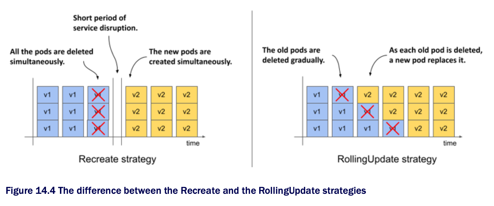

# 14.2 Updating a Deployment

* In the previous section where you learned bout the basics of Deployments, you probably didn't see any advantage in using a Deployment instead of a ReplicaSet

  * The advantage only becomes clear when you update the Pod template in the Deployment

  * You may recall that this has no immediate effect w/ a ReplicaSet

  * The updated template is only used when the ReplicaSet controller creates a new Pod

  * However, when you update the Pod template in a Deployment, the Pods are replaced immediately

* THe kiada Pods are currently running version 0.5 of the application, which you'll now update to version 0.6

  * You can find the files for this new version in the directory [kiada-0.6](kiada-0.6)

  * You can build the container image yourself or use the image `luksa/kiada:0.6` that we created

### Introducing the available update strategies

* When you update the Pod template to use the new container image, the Deployment controller stops the Pods running w/ the old image and replaces them w/ the new Pods

  * The way the Pods are replaced depends on the update strategy configured in the Deployment

  * At the time of writing, K8s supports the two update strategies described in the following table:

| **Strategy type** | **Description**                                                                                                                                                                                                                                                                                                                                                                                                                        |
|-------------------|----------------------------------------------------------------------------------------------------------------------------------------------------------------------------------------------------------------------------------------------------------------------------------------------------------------------------------------------------------------------------------------------------------------------------------------|
| `Recreate`        | In the `Recreate` strategy, all Pods are deleted at the same time, and then, when all their containers are finished, the new Pods are created at the same time. For a short time, while the old Pods are being terminated and before the new Pods are ready, the service is unavailable. Use this strategy if your application doesn't allow you to run the old and new versions at the same time and service downtime isn't an issue. |
| `RollingUpdate`   | The `RollingUpdate` strategy causes old Pods to be gradually removed and replaced w/ new ones. When a Pod is removed, K8s waits until the new Pod is ready before removing the next Pod. This way, the service provided by the Pods remains available throughout the upgrade process. This is the default strategy.                                                                                                                    |

* The following figure illustrates the difference btwn the two strategies

  * It shows how the Pods are replaced over time for each of the strategies

* The `Recreate` strategy has no configuration options, while the `RollingUpdate` strategy lets you configure how many Pods Kubernetes replaces at a time

## 14.2.1 [The Recreate strategy](recreate-strategy/README.md)

## 14.2.2 [The RollingUpdate strategy](rolling-update-strategy/README.md)

## 14.2.3 [Configuring how many Pods are replaced at a time](maxsurge-and-maxunavailable/README.md)

## 14.2.4 [Pausing the rollout process](pause-rollout/README.md)

## 14.2.5 [Updating to a faulty version](update-to-faulty-version/README.md)

## 14.2.6 [Rolling back a Deployment](rollback-deployment/README.md)
