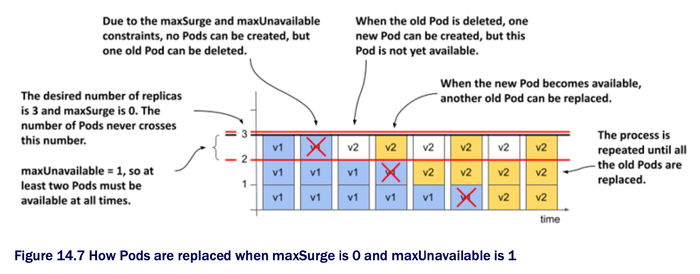
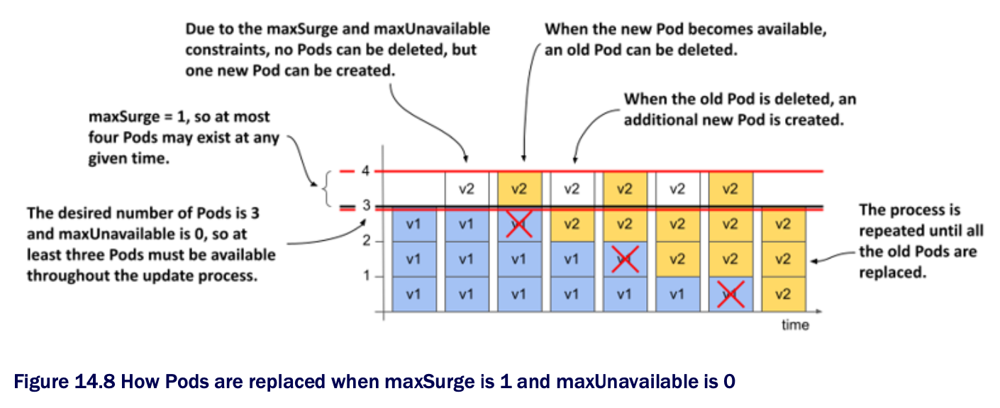
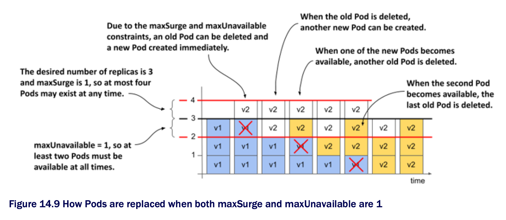

# 14.2.3 Configuring how many Pods are replaced at a time

* In the rolling update shown in the previous section, the Pods were replaced one by one

  * You can change this by changing the parameters of the rolling update strategy

## Introducing the MaxSurge and MaxUnavailable configuration options

* The two parameters that affect how fast Pods ar replaced during a rolling update are `maxSurge` and `maxUnavailable`

  * YOu can set these parameters in the `rollingUpdate` subsection of the Deployment's `strategy` field, as shown in the following listing ▶︎ Specifying the parameters for the `rollingUpdate` strategy:

```yaml
spec:
  strategy:
    type: RollingUpdate
    rollingUpdate:
      maxSurge: 0           # ← A
      maxUnavailable: 1     # ← A

# ← A ▶︎ Parameters of the rolling update strategy
```

* About the `maxSurge` and `maxUnavailable` configuration options:

| **Property**     | **Description**                                                                                                                                                                                                |
|------------------|----------------------------------------------------------------------------------------------------------------------------------------------------------------------------------------------------------------|
| `maxSurge`       | The maximum number of Pods above the desired number of replicas that the Deployment can have during the rolling update. The value can be an absolute number or a percentage of the desired number of replicas. |
| `maxUnavailable` | The maximum number of Pods relative to the desired replica count that can be unavailable during the rolling update. The value can be an absolute number or a percentage of the desired number of replicas.     |

* The most important thing about these two parameters is that their values are relative to the desired number of replicas

  * For example, if the desired number of replicas is three, `maxUnavailable` is one, and the current number of Pods is five, the number of Pods that must be available is two, not four

* Let's look at how these two parameters affect how the Deployment controller performs the update

  * This is best explained by going through the possible combinations one by one

## maxSurge=0, maxUnavailable=1

* When you performed the rolling update in the previous section, the desired number of replicas was three, `maxSurge` eas zero and `maxUnavailable` was one

  * The following figure shows how the Pods were updated over time



* B/c `maxSurge` was set to `0`, the Deployment controller wasn't allowed to ass Pods beyond the desired number of replicas

  * Therefore, there were never more than 3 Pods associated w/ the Deployment

  * B/c `maxUnavailable` was set to `1`, the Deployment controller had to keep the number of available replicas above two and therefore could only delete one Pod at a time

  * It couldn't delete the next Pod until the new Pod that replaced the deleted Pod became available

## maxSurge=1, maxUnavailable=0

* What happens if you reverse the two parameters and set `maxSurge` to `1` and `maxUnavailable` to `0`?

  * If the desired number of replicas is three, there must be at least three replicas available throughout the process

  * B/c the `maxSurge` parameter is set to `1`, there should never be more than four Pods total

  * The following figure shows hot the update unfolds:



* First, the Deployment controller can't scale the old ReplicaSet down b/c that would cause the number of available Pods to fall below the desired number of replicas

  * But the controller can scale the new ReplicaSet up by one Pod, b/c the `maxSurge` parameter allows the Deployment to have one Pod above the desired number of replicas

* At this point, the Deployment has three old Pods and one new Pod
  
  * When the new Pod is available, the traffic is handled by all four Pods for a moment

  * The Deployment controller can now scale down the old ReplicaSet by one Pod, since there would still be three Pods available

  * The controller can then scale up the new ReplicaSet

  * This process is repeated until the new ReplicaSet has three Pods and the old ReplicaSet has none

* At all times during the update, the desired number of Pods was available and the total number of Pods never exceeded one over the desired replica count

> [!NOTE]
> 
> You can't set both `maxSurge` and `maxUnavailble` to zero, as this wouldn't allow the Deployment to exceed the desired number of replicas or remove Pods, as one Pods would then be unavailable.

## maxSurge=1, maxUnavailable=1

* If you set both `maxSurge` and `maxUnavailable` to `1`, the total number of replicas in the Deployment can be up to four, and two must always be unavailable

  * The following figure shows the progression over time:



* The Deployment controller immediately scales the new ReplicaSet up by one replica and the old ReplicaSet down the same amount

  * As soon as the old ReplicaSet reports that it has marked one of the old Pods for deletion, the Deployment controller scales the new ReplicaSet up by another Pod

* Each ReplicaSet is now configured w/ two replicas

  * The two Pods in the old ReplicaSet are still running and available, while the two new Pods are starting

  * When one of the new Pods is available, another old Pod is deleted and another new Pod is created

  * This continues until all the old Pods are replaced

  * The total number of Pods never exceeds four, and at least two Pods are available at any given time

> [!NOTE]
> 
> B/c the Deployment controller doesn't count the Pods itself, but gets the information about the number of Pods from the status of the underlying ReplicaSets, and b/c the ReplicaSet never counts the Pods that are being terminated, the total number of Pods may actually exceed 4 if you count the Pods that are being terminated.

## Using higher values of maxSurge and maxUnavailable

* If `maxSurge` is set to a value higher than one, the Deployment controller is allowed to add even more Pods at a time

  * If `maxUnavailable` is higher than one, the controller is allowed to remove more Pods

## Using percentages

* Instead of setting `maxSurge` and `maxUnavailable` to an absolute number, you can set them to a percentage of the desired number of replicas

  * The controller calculates the absolute `maxSurge` number by rounding up, and `maxUnavailable` by rounding down

* Consider a case where `replicas` is set to `10` and `maxSurge` and `maxUnavailable` are set to `25%`

  * If you calculate the absolute values, `maxSurge` becomes `3`, and `maxUnavailable` becomes `2`

  * So, during the update process, the Deployment may have up to 13 Pods, at least 8 of which are always available and handling the traffic

> [!NOTE]
> 
> The default value for `maxSurge` and `maxUnavailable` is 25%.
