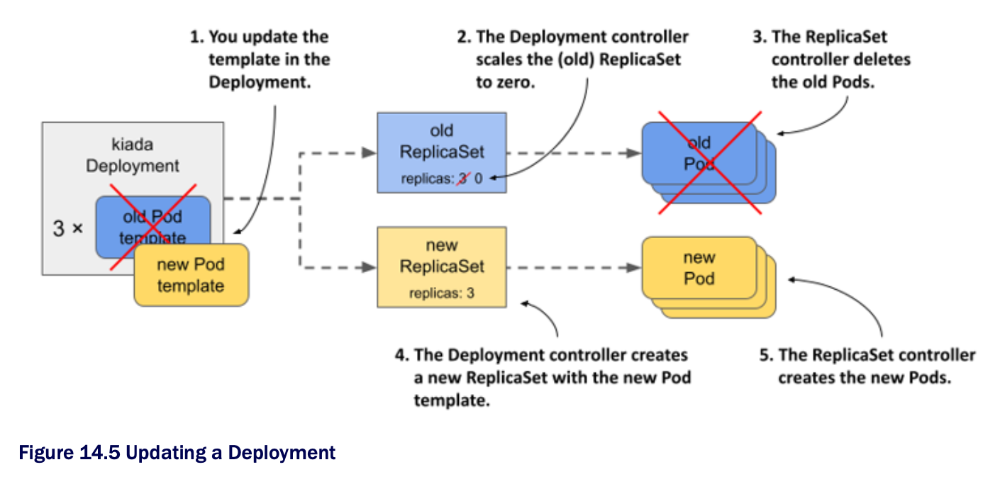

# 14.2.1 The Recreate strategy

* The `Recreate` strategy is much simpler than `RollingUpdate`, so we'll cover it first

  * Since you didn't specify the strategy in the Deployment object, it defaults to `RollingUpdate`, so you need to change it before triggering the update

## Configuring the Deployment to use the Recreate strategy

* To configure a Deployment to use the Recreate update strategy, you must include the lines highlighted in the following listing your Deployment manifest

  * You can find this manifest in the [`deploy.kiada.recreate.yaml`](deploy.kiada.recreate.yaml) file ▶︎ enabling the recreate update strategy in a Deployment:

```yaml
...
spec:
  strategy:           # ← A
    type: Recreate    # ← A
  replicas: 3
  ...

# ← A ▶︎ This is how you enable the Recreate update strategy in Deployment.
```

* You can add these lines to the Deployment object by editing it w/ the `kubectl edit` command or by applying the updated manifest file w/ `kubectl apply`

  * Since this change doesn't affect the Pod template, it doesn't trigger an update

  * Changing the Deployment's labels, annotations, or the desired number of replicas also doesn't trigger it

## Updating the container image w/ `kubectl set image`

* To update the Pods to the new version of the Kiada container image, you need to update the `image` field in the `kiada` container definition within the Pod template

  * You can do this by updating the manifest w/ `kubectl edit` or `kubectl apply`, but for a simple image change you can also use the `kubectl set image` command

  * W/ this command, you can change the image name of any container of any API object that contains containers

  * This includes Deployments, ReplicaSets, and even Pods

  * For example, you could use the following command to update the `kiada` container in your `kiada` Deployment to use version `0.6` of the `luksa/kiada` container image like so:

```zsh
$ kubectl set image deployment kiada kiada=luksa/kiada:0.6
```

* However, since the Pod template in your Deployment also specifies the application version in the Pod labels, changing the image w/o also changing the label value would result in inconsistency

## Updating the container image and labels using kubectl patch

* To change the image name and label value at the same time, you can use the `kubectl patch` command, which allows you to update multiple manifest fields w/o having to manually edit the manifest or apply an entire manifest file

  * To update both the image name and the label value, you could run the following command:

```zsh
$ kubectl patch deploy kiada --patch '{"spec": {"template": {"metadata": {"labels": {"ver":
        "0.6"}}, "spec": {"containers": [{"name": "kiada", "image": "luksa/kiada:0.6"}]}}}}'
```

* This command may be hard for you to parse b/c the patch is given as a single-line JSON string

  * In this string, you'll find a partial Deployment manifest that contains only the fields you want to change

  * If you specify the patch in a multi-line YAML string, it'll be much clearer

  * The complete command then looks as follows:

```yaml
$ kubectl patch deploy kiada --patch '    # ← A
spec:                                     # ← B
  template:                               # ← B
    metadata:                             # ← B
      labels:                             # ← B
        ver: "0.6"                        # ← B
    spec:                                 # ← B
      containers:                         # ← B
      - name: kiada                       # ← B
        image: luksa/kiada:0.6'           # ← B

# ← A ▶︎ Note the single quote at the end of this line.
# ← B ▶︎ A partial Deployment manifest that only specifies the fields you want to update.
```

> [!NOTE]
> 
> You can also write this partial manifest to a file and use `--patch-file` instead of `--patch`.

* Now run one of the `kubectl patch` commands to update the Deployment, or apply the manifest file [`deploy.kiada.0.6.recreate.yaml`](deploy.kiada.0.6.recreate.yaml) to get the same result

## Observing the Pod state changes during an update

* Immediately after you update the Deployment, run the following command repeatedly to observe what happens to the Pods:

```zsh
$ kubectl get po -l app=kiada -L ver
```

* This command lists the `kiada` Pods and displays the value of their version label in the `VER` column

  * You'll notice that the status of all these Pods changed to `Terminating` at the same time, as shown here:

```zsh
NAME                    READY   STATUS        RESTARTS  AGE     VER
kiada-7bffb9bf96-7w92k  0/2     Terminating   0         3m38s   0.5
kiada-7bffb9bf96-h8wnv  0/2     Terminating   0         3m38s   0.5
kiada-7bffb9bf96-xgb6d  0/2     Terminating   0         3m38s   0.5
```

* The Pods soon disappear, but are immediately replaced by Pods that run the new version:

```zsh
NAME                    READY   STATUS              RESTARTS  AGE   VER
kiada-5d5c5f9d76-5pghx  0/2     ContainerCreating   0         1s    0.6   # ← A
kiada-5d5c5f9d76-qfkts  0/2     ContainerCreating   0         1s    0.6   # ← A
kiada-5d5c5f9d76-vkdrl  0/2     ContainerCreating   0         1s    0.6   # ← A

# ← A ▶︎ These Pods run the new version of the application.
```

* After a few seconds, all new Pods are ready

  * The whole process is very fast, but you can repeat it as many times as you want

  * Revert the Deployment by applying the previous version of the manifest in the [`deploy.kiada.recreate.yaml`](deploy.kiada.recreate.yaml) file, wait until the Pods are replaced, and then update to version 0.6 by applying the [`deploy.kiada.0.6.recreate.yaml`](deploy.kiada.0.6.recreate.yaml) file again

## Understanding how an update using the Recreate strategy affects service availability

* When you list the Pods, you'll notice that the names of the Pods that ran version 0.5 are different from those that run version 0.6

  * The names of the old Pods start w/ `kiada-7bffb9bf96`, while the names of the new Pods start w/ `kiada-5d5c5f9d76`

  * You amy recall that Pods created by a ReplicaSet get their names from that ReplicaSet

  * The name change indicates that these new Pods belong to a different ReplicaSet

  * List the ReplicaSets to confirm this as follows:

```zsh
$ kubectl get rs -L ver
NAME                DESIRED   CURRENT   READY   AGE   VER
kiada-5d5c5f9d76    3         3         3       13m   0.6   # ← A
kiada-7bffb9bf96    0         0         0       16m   0.5   # ← B

# ← A ▶︎ This is the ReplicaSet that manages the Pods running the new application version.
# ← B ▶ This is the ReplicaSet that manged the Pods w/ the old version. It now has no Pods.
```

> [!NOTE]
> 
> The labels you specify in the Pod template in a Deployment are also applied to the ReplicaSet. So if you add a label w/ the version number of the application, you can see the version when you list the ReplicaSets. This way you an easily distinguish between different ReplicaSets since you can't do that by looking at their names.

* When you originally created the Deployment, only one ReplicaSet was created and all Pods belonged to it

  * When you updated the Deployment, a new ReplicaSet was created

  * Now all the Pods of this Deployment are controlled by this ReplicaSet, as shown in the following figure:



## Understanding how the Deployment's Pods transitioned from one ReplicaSet to the other

* If you'd been watching the ReplicaSets when you triggered the update, you'd have seen the following progression

  * At the beginning, only the old ReplicaSet was present:

```zsh
NAME              DESIRED   CURRENT   READY   AGE   VER
kiada-7bffb9bf96  3         3         3       16m   0.5   # ← A

# ← A ▶︎ This is the only ReplicaSet. All three Pods are part of it.
```

* The Deployment controller then scaled the ReplicaSet to zero replicas, causing the ReplicaSet controller to delete all the Pods:

```zsh
NAME              DESIRED   CURRENT   READY   AGE   VER
kiada-7bffb9bf96  0         0         0       16m   0.5   # ← A

# ← A ▶︎ All the Pod counts are zero.
```

* Next, the Deployment controller created the new ReplicaSet and configured it w/ three replicas

```zsh
NAME                DESIRED   CURRENT   READY   AGE   VER
kiada-5d5c5f9d76    3         0         0       0s    0.6   # ← A
kiada-7bffb9bf96    0         0         0       16m   0.5   # ← B

# ← A ▶︎ The desired numebr of replicas is three, but there are no Pods yet.
# ← B ▶︎ The old ReplicaSet is still here but has no Pods.
```

* The ReplicaSet controller creates the three new Pods, as indicated by the number in the `CURRENT` column

  * When the containers in these Pods start and begin accepting connections, the value in the `READY` column also changes to three

```zsh
NAME                DESIRED   CURRENT   READY   AGE   VER
kiada-5d5c5f9d76    3         3         0       1s    0.6   # ← A
kiada-7bffb9bf96    0         0         0       16m   0.5
  
# ← A ▶︎ The new ReplicaSet has three replicas, but none are ready yet. They become ready moments after.
```

> [!NOTE]
> 
> You can see what the Deployment controller and the ReplicaSet controller did by looking at the events associated w/ the Deployment object and the two ReplicaSets.

* The update is now complete

  * If you open the Kiada service in your web browser, you should see the updated version

  * In the lower right corner, you'll see four boxes indicating the version of the Pod that processed the browser's request for each of the HTML, CSS, JavaScript, and the main image file

  * These boxes will be useful when you perform a rolling update to version 0.7 in the next section
