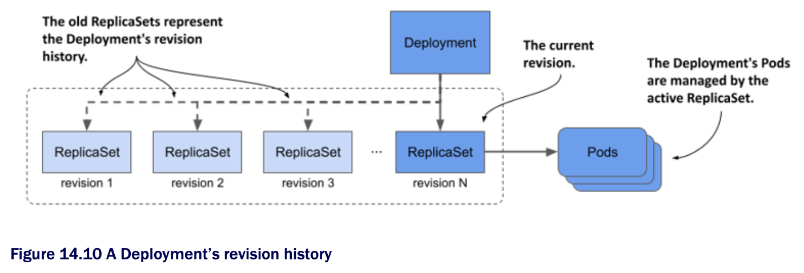

# 14.2.6 Rolling back a Deployment

* If you update a Deployment and the update fails, you can use the `kubectl apply` command to reapply the previous version of the Deployment manifest or tell K8s to roll back the last update

## Rolling back a Deployment

* You can rollback the Deployment to the previous version by running the `kubectl rollout undo` command as follows:

```zsh
$ kubectl rollout undo deployment kiada
deployment.apps/kiada rolled back
```

* Running this command has a similar effect to applying the previous version of the object manifest file

  * The undo process follows the same steps as a normal update

  * It does so by respecting the update strategy specified in the Deployment object

  * Thus, if the `RollingUpdate` strategy is used, the Pods are rolled back gradually

> [!TIP]
> 
> The `kubectl rollout undo` command can be used while the rollout process is running to cancel the rollout, or after the rollout is complete to undo it.

> [!NOTE]
> 
> When a Deployment is paused w/ `kubectl pause` command, the `kubectl rollout undo` command does nothing until you resume the Deployment w/ `kubectl rollout resume`.

## Displaying a Deployment's rollout history

* Not only can you use the `kubectl rollout undo` command to revert to the previous version, but you can also revert to one of the previous versions

  * Of course, you may want to see what those versions looked like first

  * You can do that w/ the `kubectl rollout history` command and the `--revision` option

    * For example, to inspect the second revision, run the following command:

```zsh
$ kubectl rollout history deploy kiada --revision 2
deployment.apps/kiada with revision #2
Pod Template:
  Labels:       app=kiada
                pod-template-hash=7bffb9bf96
                rel=stable
  Containers:
    kiada:
      Image:    luksa/kiada:0.6
      ...
```

* You may wonder where the revision history is stored

  * You won't find it in the Deployment object

  * Instead, the history of a Deployment is represented by the ReplicaSets associated w/ the Deployment, as shown in the following figure

  * Each ReplicaSet represents one revision

  * This is the reason why the Deployment controller doesn't delete the old ReplicaSet object after the update process is complete



> [!NOTE]
> 
> The size of the revision history, and thus the number of ReplicaSets that the Deployment controller keeps for a given Deployment, is determined by the `revisionHistoryLimit` field in the Deployment's `spec`. The default value is 10.

* As an exercise, try to find the revision number in which version 0.6 of the Kiada service was deployed

  * You'll need this revision number in the next section

> [!TIP]
> 
> Instead of using `kubectl rollout history` to view the history of a Deployment, listing ReplicaSets w/ `-o wide` is a better option, b/c it shows the image tags used in the Pod. To find the revision number for each ReplicaSet, look at the ReplicaSet's annotations.

## Rolling back to a specific Deployment revision

* You used the `kubectl rollout undo` command to revert from the faulty version 0.8 to version 0.7

  * But the yellow background for the "Tip of the day" and "Pop quiz" sections of the user interface doesn't look as nice as the white background in version 0.6, so let's roll back to this version

* You can revert to a specific revision by specifying the revision number in the `kubectl rollout undo` command

  * For example, if you want to revert to the first revision, run the following command:

```zsh
$ kubectl rollout undo deployment kiada --to-revision=1
```

* If you found the revision number that contains version 0.6 of the Kiada service, please use the `kubectl rollout undo` command to revert to it

## Understanding the difference between rolling back and applying an older version of the manifest file

* You might think that using `kubectl rollout undo` to revert to the previous version of the Deployment manifest is equivalent to applying the previous manifest file, but that's not the case

  * The `kubectl rollout undo` command reverts only the Pod template and preserves any other changes you made to the Deployment manifest

  * This includes changes to the update strategy and the desired number of replicas

  * The `kubectl apply` command, on the other hand, overwrites these changes

> ## Restarting Pods w/ kubectl rollout restart
> 
> In addition to the `kubectl rollout` commands explained in this and previous sections, there's one more command I should mention.
> 
> At some point, you may want to restart all the Pods that belong to a Deployment. You can do that w/ the `kubectl rollout restart` command. This command deletes and replaces the Pods using the same strategy used for updates.
> 
> If the Deployment is configured w/ the `RollingUpdate` strategy, the Pods are recreated gradually so that service availability is maintained throughout the process. If the `Recreate` strategy is used, all Pods are deleted and recreated simultaneously.
