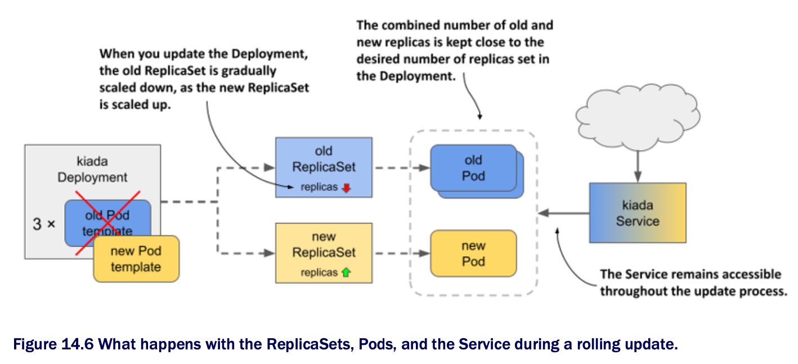

# The RollingUpdate strategy

* The service disruption associated w/ the `Recreate` strategy is usually not acceptable

  * That's why the default strategy in Deployments is `RollingUpdate`

  * When you use this strategy, the Pods are replaced gradually, by scaling down the old ReplicaSet and simultaneously scaling up the new ReplicaSet by the same number of replicas

  * The Service is never left w/ no Pods to which to forward traffic



## Configuring the Deployment to use the RollingUpdate strategy

* To configure a Deployment to use the `RollingUpdate` update strategy, you must set its `strategy` field as shown in the following listing

  * You can find this manifest in the file [`deploy.kiada.0.7.rollingUpdate.yaml`](deploy.kiada.0.7.rollingUpdate.yaml) ▶︎ Enabling the Recreate update strategy in a Deployment:

```yaml
apiVersion: apps/v1
kind: Deployment
metadata:
  name: kiada
spec:
  strategy:
    type: RollingUpdate   # ← A
    rollingUpdate:        # ← B
      maxSurge: 0         # ← B
      maxUnavailable: 1   # ← B
  minReadySeconds: 10
  replicas: 3
  selector:
    ...

# ← A ▶︎ The RollingUpdate strategy is enabled through this field.
# ← B ▶︎ The parameters for the strategy are configured here. These two parameters are explained later.
```

* In the `strategy` section, the `type` field sets the strategy to `RollingUpdate`, while the `maxSurge` and `maxUnavailable` parameters in the `rollingUpdate` subsection configure how the update should be performed

  * You could omit this entire subsection and set only the `type`, but since the default values of the `maxSurge` and `maxUnavailable` parameters make it difficult to explain the update process, you set them to the values shown in the listing to make it easier to follow the update process

  * Don't worry about these two parameters for now, b/c they'll be explained later

* You may have noticed that the Deployment's `spec` in the listing also includes the `minReadySeconds` field

  * Although this field isn't part of the update strategy, it affects how fast the update progresses

  * By setting this field to 10, you'll be able to follow the progression of the rolling update even better

  * You'll learn what this attribute does by the end of this chapter

## Updating the image name in the manifest

* In addition to setting the `strategy` and `minReadySeconds` in the Deployment manifest, let's also set the image name to `lukda/kiada:0.7` and update the version label, so that when you apply this manifest file, you immediately trigger the update

  * This is to show that you can change the strategy and trigger an update in a single `kubectl apply` operation

  * You don't have to change the strategy beforehand for it to be used in the update

## Triggering the update and observing the rollout of the new version

* To start the rolling update, apply the manifest file [`deploy.kiada.0.7.rollingUpdate.yaml`](deploy.kiada.0.7.rollingUpdate.yaml)

  * You can track the progress of the rollout w/ the `kubectl rollout status` command, but it only shows the following:

```zsh
$ kubectl rollout status deploy kiada
Waiting for deploy "kiada" rollout to finish: 1 out of 3 new replicas have been updated...
Waiting for deploy "kiada" rollout to finish: 2 out of 3 new replicas have been updated...
Waiting for deploy "kiada" rollout to finish: 2 of 3 updated replicas are available...
deployment "kiada" successfully rolled out
```

* To see exactly how the Deployment controller performs the update, it's best to look at how the state of the underlying ReplicaSets changes

  * First, the ReplicaSet w/ version 0.6 runs all three Pods

  * The ReplicaSet for version 0.7 doesn't exist yet

  * The ReplicaSet for the previous version 0.5 is also there, but let's ignore it, as it's not involved in this update

  * The initial state of 0.6 ReplicaSet is as follows:

```zsh
NAME              DESIRED   CURRENT   READY   AGE   VER
kiada-5d5c5f9d76  3         3         3       53m   0.6   # ← A

# ← A ▶︎ All three Pods are managed by the 0.6 ReplicaSet.
```

* When the update begins, the ReplicaSet running version 0.6 is scaled down by one Pod, while the ReplicaSet for version 0.7 is created and configured to run a single replica:

```zsh
NAME                DESIRED   CURRENT   READY   AGE   VER
kiada-58df67c6f6    1         1         0       2s    0.7   # ← A
kiada-5d5c5f9d76    2         2         2       53m   0.6   # ← B

# ← A ▶︎ The replica for version 0.7 appears, configured to run one replica.
# ← B ▶︎ The replica for version 0.6 now runs two replicas.
```

* B/c the old ReplicaSet has been scaled down, the ReplicaSet controller has marked one of the old Pods for deletion

  * This Pod is not terminating and is no longer considered ready, while the other two old Pods take over all the service traffic

  * The Pod that's part of the new ReplicaSet is just starting up and therefore isn't ready

  * The Deployment controller waits until this new Pod is ready before resuming the update process

  * When this happens, the state of the ReplicaSets is as follows:

```zsh
NAME              DESIRED   CURRENT   READY   AGE   VER
kiada-58df67c6f6  1         1         1       6s    0.7   # ← A
kiada-5d5c5f9d76  2         2         2       53m   0.6

# ← A ▶︎ The new Pod is ready and is receiving traffic.
```

* At this point, traffic is again handled by three Pods

  * Two are still running version 0.6 and one is running version 0.7

  * B/c you set `minReadySeconds` to 10, the Deployment controller waits that many seconds before proceeding w/ the update

  * It then scales the old ReplicaSet down by one replica, while scaling the new ReplicaSet up by one replica

  * The ReplicaSets now look as follows:

```zsh
NAME              DESIRED   CURRENT   READY   AGE   VER
kiada-58df67c6f6  2         2         1       16s   0.7   # ← A
kiada-5d5c5f9d76  1         1         1       53m   0.6   # ← B

# ← A ▶︎ The new ReplicaSet is scaled up by one.
# ← B ▶ The old ReplicaSet is scaled down by one.
```

* The last remaining old Pod is terminated and no longer receives traffic

  * All client traffic is now handled by the new version of the application

  * When the third new Pod is ready, the rolling update is complete

* At no time during the update was the service unavailable

  * There were always at least two replicas handling the traffic

  * You can see for yourself by reverting to the old version and triggering the update again

  * To do this, reapply the [`deploy.kiada.0.6.recreate.yaml`](../recreate-strategy/deploy.kiada.0.6.recreate.yaml)

  * B/c this manifest uses the `Recreate` strategy, all the Pods are deleted immediately and then the Pods w/ the version 0.6 are started simultaneously

* Before you trigger the update to 0.7 again, run the following command to track the update process from the clients' point of view:

```zsh
$ kubectl run -it --rm --restart=Never kiada-client --image curlimages/curl -- sh -c \
  'while true; do curl -s http://kiada | grep "Request processed by"; done'
```

* When you run this command, you create a Pod called `kiada-client` that uses `curl` to continuously send requests to the `kiada` service

  * Instead of printing the entire response, it prints only the line w/ the version number and the Pod and node names

* While the client is sending requests to the service, trigger another update by reapplying the manifest file [`deploy.kiada.0.7.rollingUpdate.yaml`](deploy.kiada.0.7.rollingUpdate.yaml)

  * Observe how the output of the `curl` command changes during the rollout update

  * Here's a short summary:

```zsh
Request processed by Kiada 0.6 running in pod "kiada-5d5c5f9d76-qfx9p" ...  # ← A
Request processed by Kiada 0.6 running in pod "kiada-5d5c5f9d76-22zr7" ...  # ← A
...
Request processed by Kiada 0.6 running in pod "kiada-5d5c5f9d76-22zr7" ...  # ← B
Request processed by Kiada 0.7 running in pod "kiada-58df67c6f6-468bd" ...  # ← B
Request processed by Kiada 0.6 running in pod "kiada-5d5c5f9d76-6wb87" ...  # ← B
Request processed by Kiada 0.7 running in pod "kiada-58df67c6f6-468bd" ...  # ← B
Request processed by Kiada 0.7 running in pod "kiada-58df67c6f6-468bd" ...  # ← B
...
Request processed by Kiada 0.7 running in pod "kiada-58df67c6f6-468bd" ...  # ← C
Request processed by Kiada 0.7 running in pod "kiada-58df67c6f6-fjnpf" ...  # ← C
Request processed by Kiada 0.7 running in pod "kiada-58df67c6f6-lssdp" ...  # ← C

# ← A ▶︎ Initially, all requests are processed by the Pods running version 0.6.
# ← B ▶︎ Then, some requests are processed by Pods running version 0.7 and some by the ones running the older version.
# ← C ▶︎ Eventually, all the requests are processed by the Pods running the new version.
```

* During the rolling update, some client requests are handled by the new Pods that run version 0.6, while other s are handled by the Pods w/ version 0.6

  * Due to the increasing share of the new Pods, more and more responses come from the new version of the application

  * When the update is complete, the responses come only from the new version
