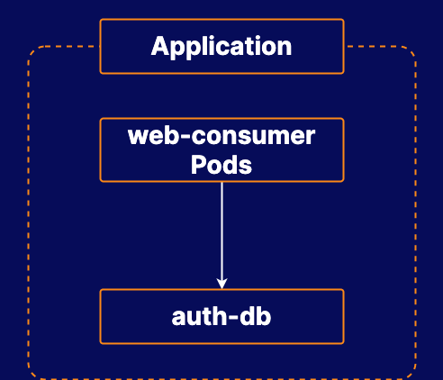

# Troubleshooting a Broken Kubernetes Application

## About this lab

Kubernetes administrators need to be able to fix issues with applications running in a cluster. This lab will allow you to test your skills when it comes to fixing broken Kubernetes applications. You will be presented with a cluster running a broken application and asked to identify and correct the problem.

## Learning objectives

[ ] Identify What is Wrong with the Application

[ ] Fix the Problem

## Additional resources

Your company, BeeBox, is building some applications for Kubernetes. Your developers have recently deployed an application to your cluster, but it is having some issues.

A set of Pods managed by the `web-consumer` deployment regularly make requests to a service that provides authentication data. Your developers are reporting that the containers are not behaving as expected.

Your task is to look at the application in question, determine the problem, and fix it.

* **Kubernetes cluster:** You can interact w/ the cluster by logging in to the control plane server.

* Identify what is wrong w/ the application.

* Fix the problem.
